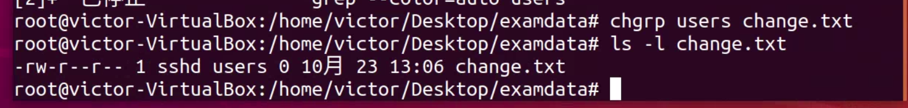
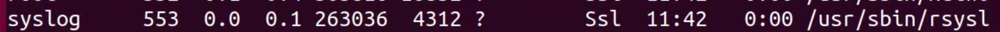
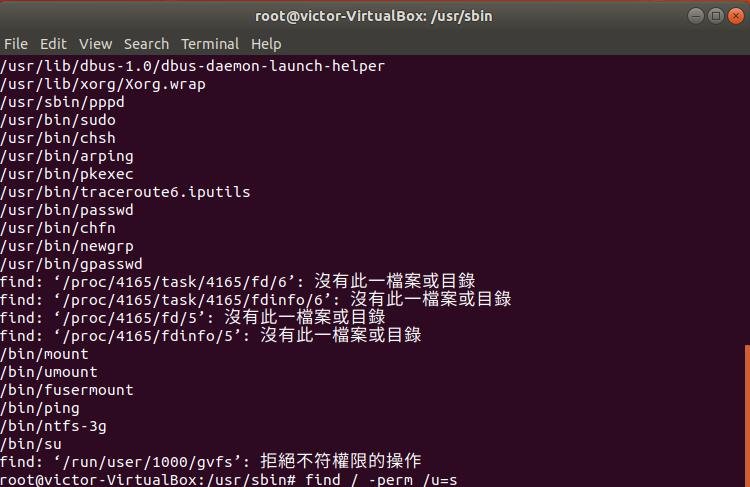
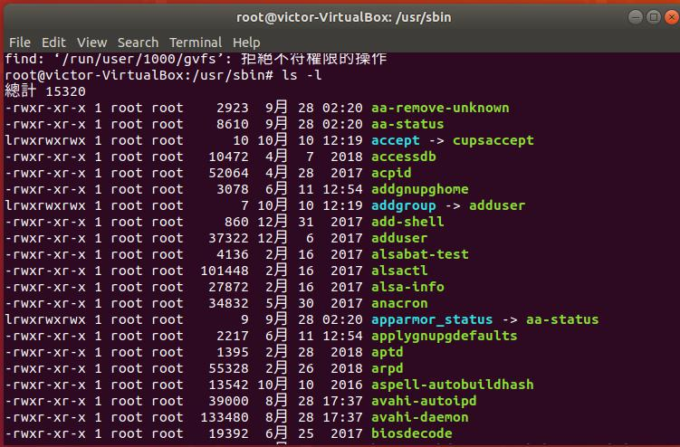
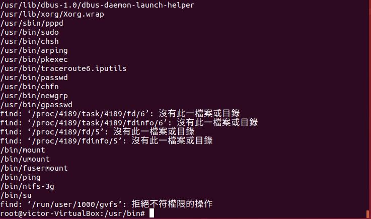
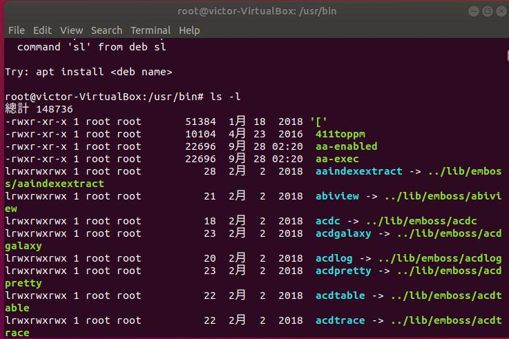

<strong>第一大題</strong> 
<em>1.<em> 
用addgroup分別建立2個群組 
 

<em>2.<em> 
用useradd分別建立3個user後 再用usermod -a -G指定群組 
 
 

<em>3.<em> 
用useradd -G分別建立3個user同時指定群組 

<em>4.<em> 
使用chgrp指定群組  再用chmod設定權限 
 

<em>5.<em> 
按指示切換身分並新增檔案 
 

<em>7.<em> 
 
 
 
 
 

<strong>第二大題</strong> 
用ps aux 找出syslog 
 
 

<strong>第三大題</strong> 
使用find / -perm /u=s個別找出含有SUID的特殊檔名 
 
 
 
 
 
 

