<strong>第一大題</strong> 
<em>1.<em> 
用adduser passwd 分別建立三個使用者 
 
 
 
 

<em>2.<em> 
使用userdel -r指令可連同家目錄一併刪除 
 

<em>3.<em> 
先背起來examuser1的UID後，再用userdel刪除，接著adduser -u 加上背起來的UID參數 
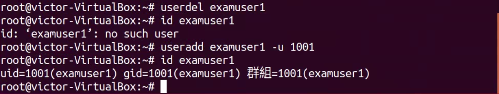 

<strong>第二大題</strong> 
<em>1.<em> 
建立examuser4 
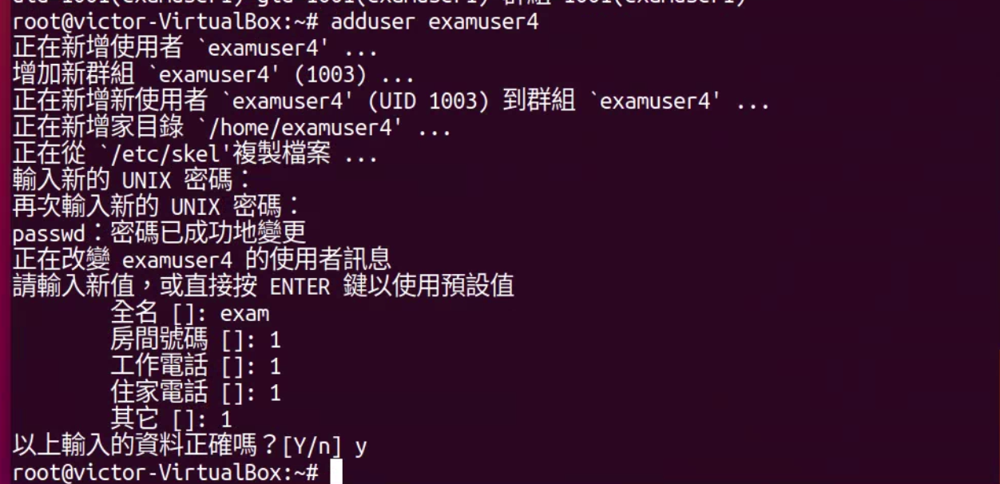 
<em>2.<em> 
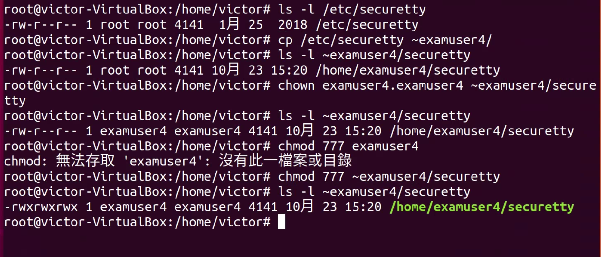 
<em>3.<em> 
按題目要求建立資料夾及檔案，建立一個名為sshd的使用者及名為users的group，分別用chown及chgrp指派權限，最後用touch -t 加時間參數修改時間 
 
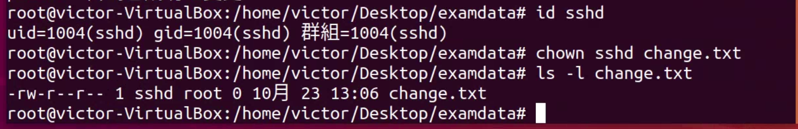 
 
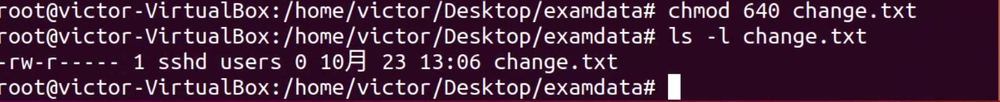 
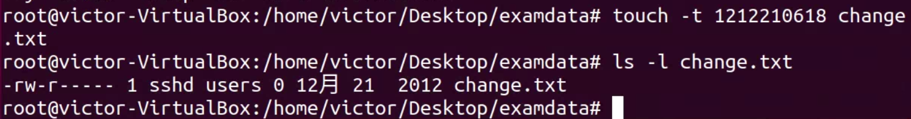 

<strong>第三大題</strong> 
<em>1.<em> 
按題目要求建立目錄及檔案，並使用chmod更改權限 
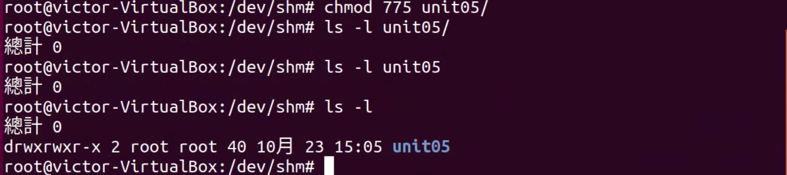 
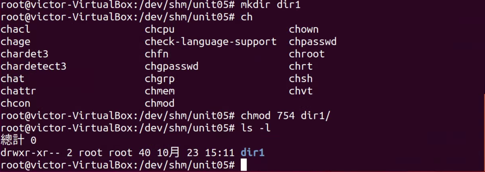 
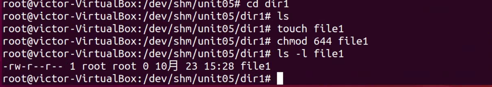 
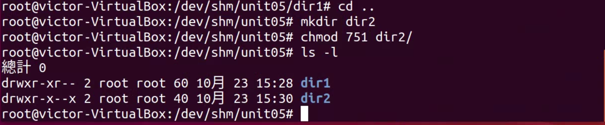 
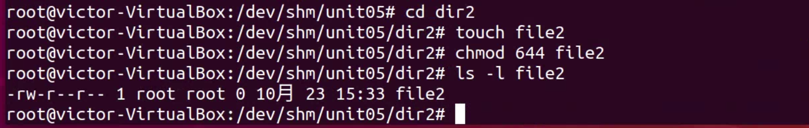 
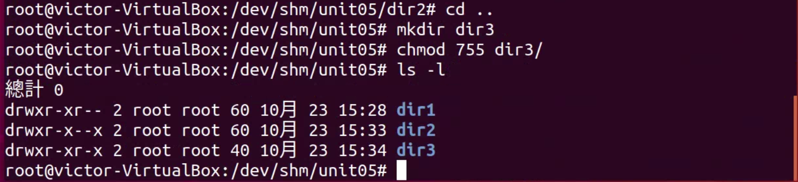 
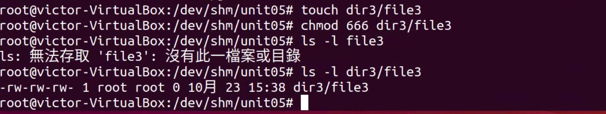 
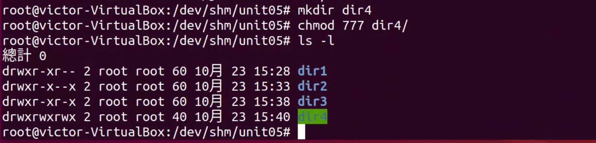 
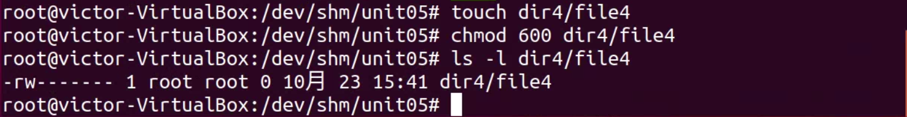 
<em>2.<em> 
dir1無法存取，dir2無法開啟，dir3  dir4可看到權限狀態 
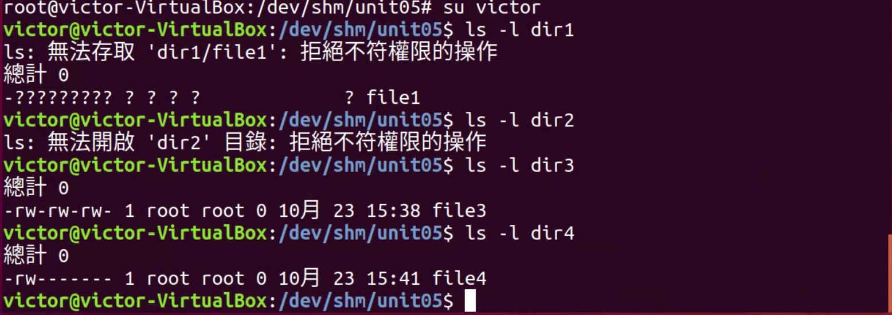 
<em>3.<em> 
只有dir1無法存取，其他的都可以看到權限狀態 
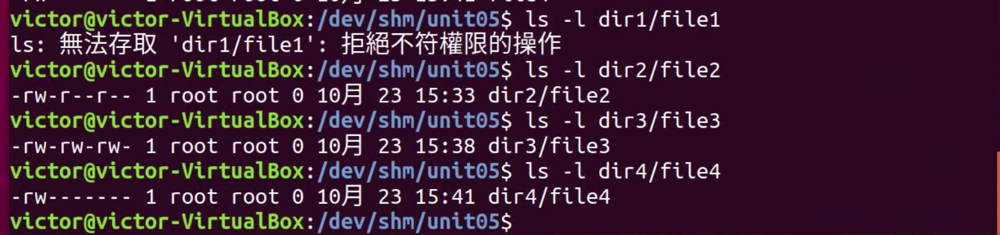 
<em>4.<em> 
file1的權限不足無法修改 
 

file2只能讀不讓你存檔 
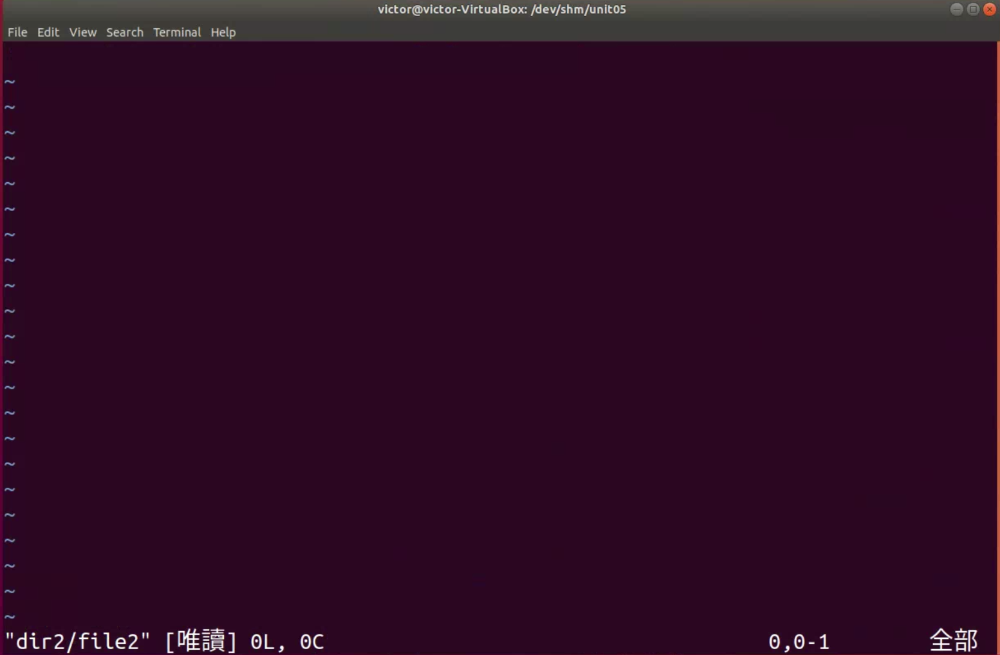 

file3可以寫 
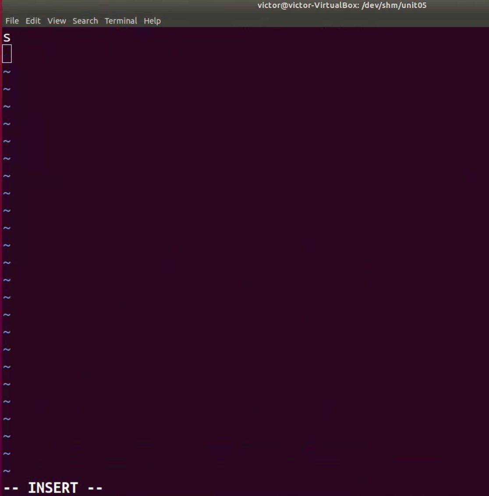 

file4也是權限不足無法讀寫 
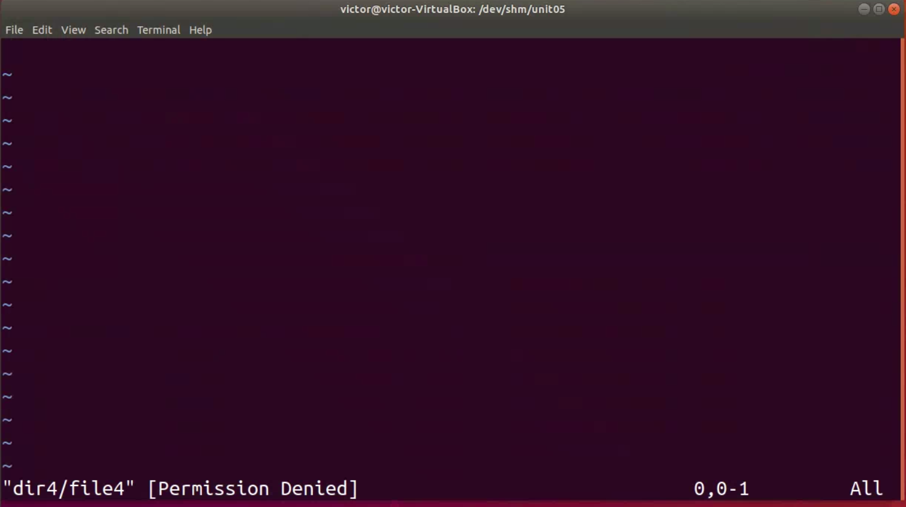 

