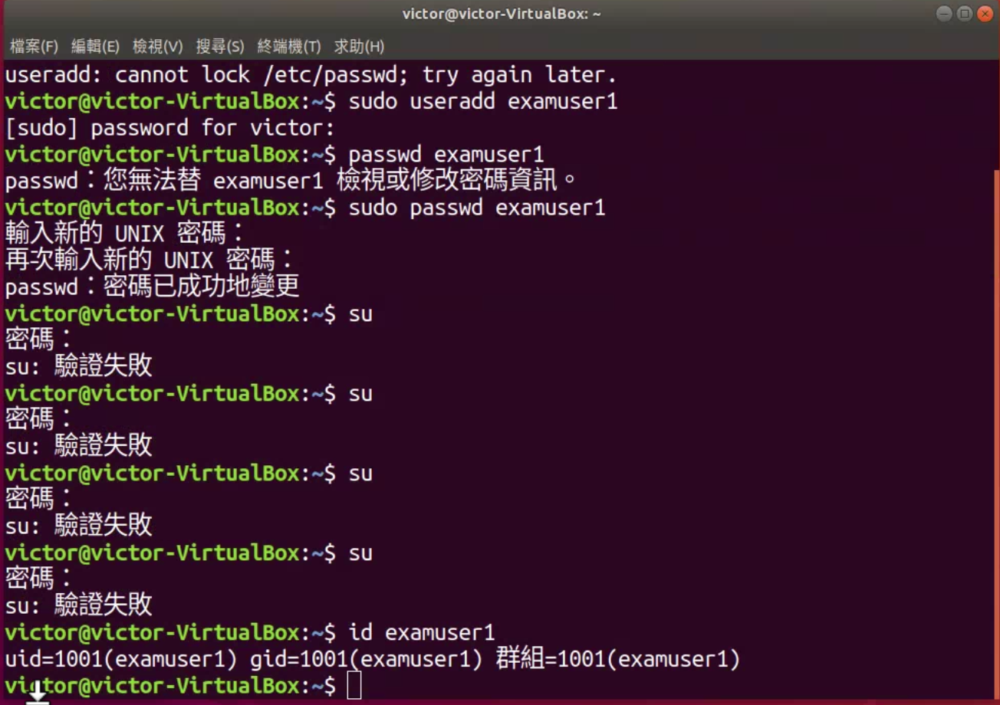
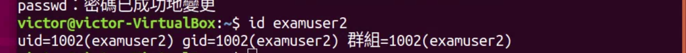
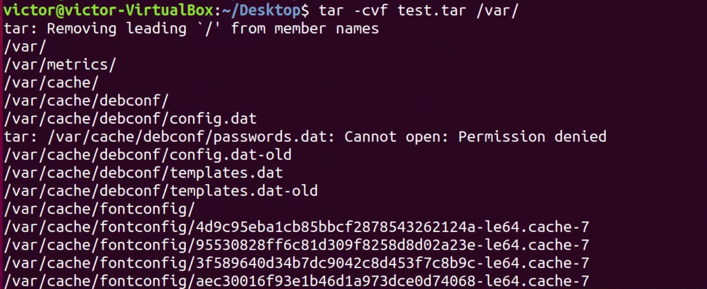
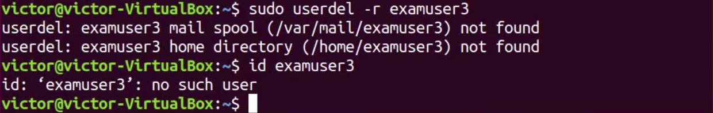
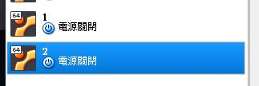

<strong>第一大題</strong>  

<strong>1.</strong> 
先在virtual box 設定host only 
  

進到linux後，用ifconfig -a檢查一下網路資訊，找到正確網路代號，然後下指令：ifconfig enp0s8 192.168.200.100 。 最後再用ifconfig檢查一次是否正確。 

  

<strong>2.</strong> 
安裝完後，透過指令：service nginx start chkconfig nginx on 啟動。  

 

透過指令：netstat -nlp | grep 80  驗證。  

  

<strong>3.</strong> 
啟動網頁輸入 http://192.168.200.100 。 連線成功。 

  

<strong>3.</strong> 
使用指令curl http://192.168.200.100。 連線成功 

 

<strong>4.</strong> 
先訪問錯誤網站：curl 192.168.0.1

使用指令cat /var/log/nginx/access.log 看連線結果 
 

再用指令 cat /var/log/nginx/error.log ｜ sort 

