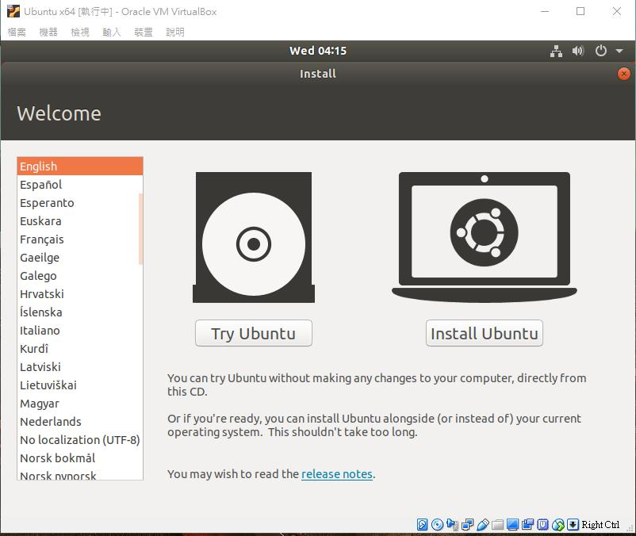

<strong>第一大題</strong> 

先用rpm -ql openssh-server指令看一下輸出  
 

透過以下命令分別確認 sshd 服務是由 .service 文件啟動，還是是由 .socket 文件啟動：  
systemctl status sshd.service        ,    systemctl status sshd.socket
 

接著透過指令用vim 修改文件內容把port改成2222:vi /etc/ssh/sshd_config
 

輸入命令semanage port -a -t ssh_port_t -p tcp 2222 允許新port  
 

輸入命令firewall-cmd --permanent --zone=public --add-port=2222/tcp 穿過防火牆  
 

輸入命令 systemctl restart sshd.service重啟服務 
 

輸入命令ss -tnlp | grep sshd 看結果 
 

