<strong>期末考</strong>

<em>1.<em>
+ 先開啟VMWARE並為虛擬機器添加一張網卡
+ 在右邊的選項選擇HOST-ONLY
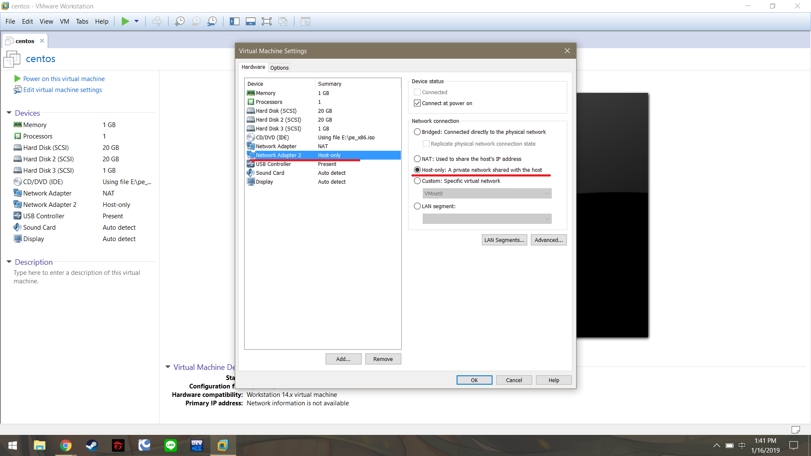
+ 接著開啟自帶的Virtual Machine Editor進行設定
+ 將Subnet IP設定為192.168.200.0
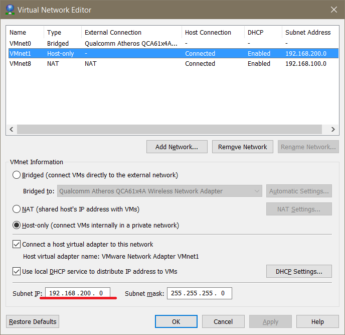
+ 在機器內執行ifconfig ens37 192.168.200.100手動設定IP位址
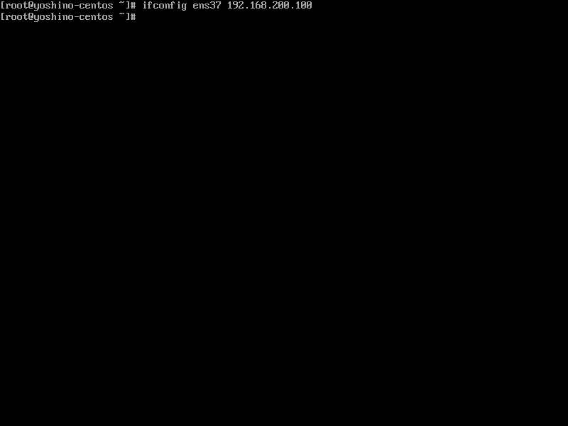
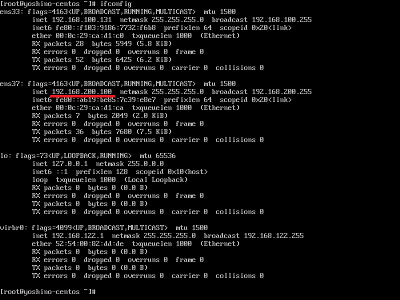

<em>2.<em>
+ 先執行yum install nginx來安裝nginx
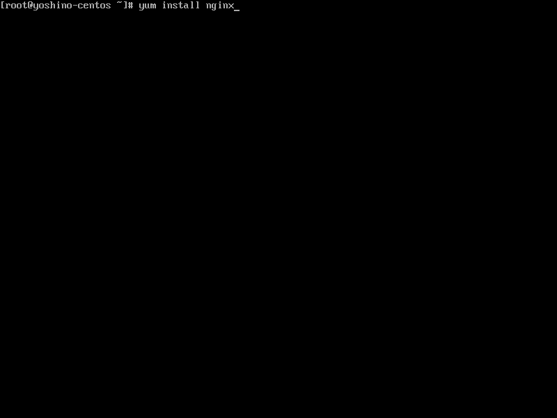
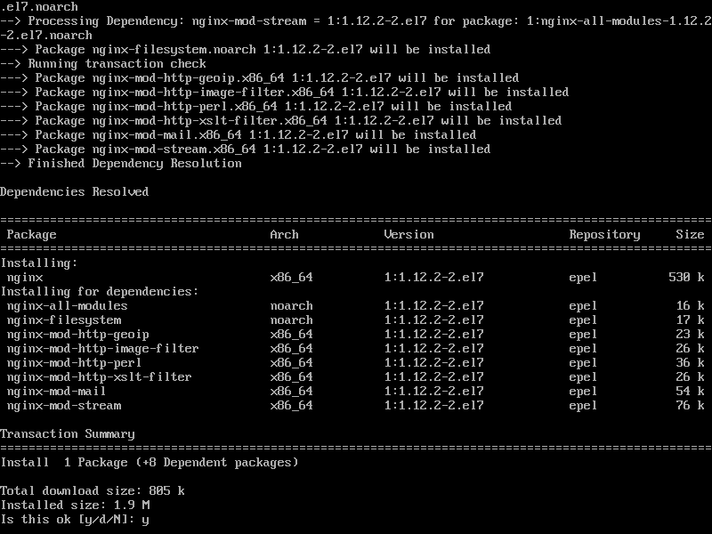
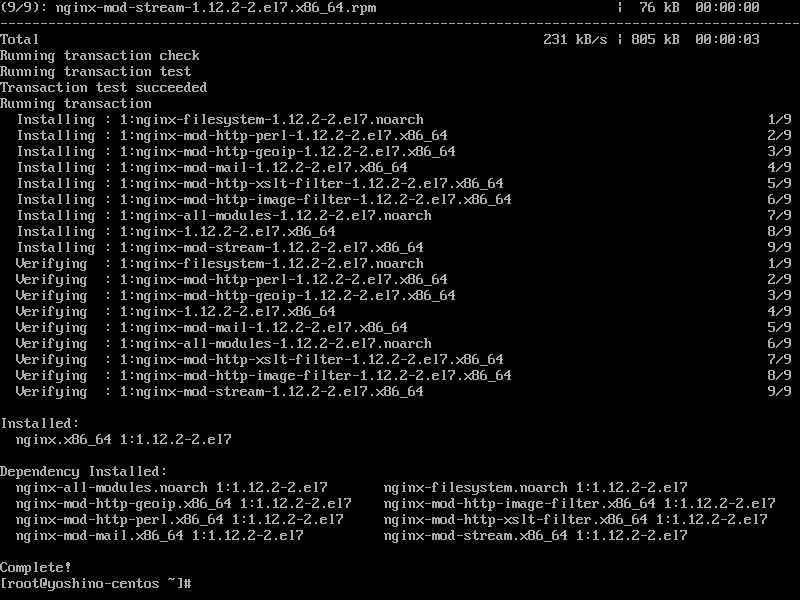
+ 接著執行systemctl start nginx來啟動nginx
+ 再來執行netstat -alntp來查看port的使用狀態
+ 如圖所示80 port正在被nginx使用並監聽中
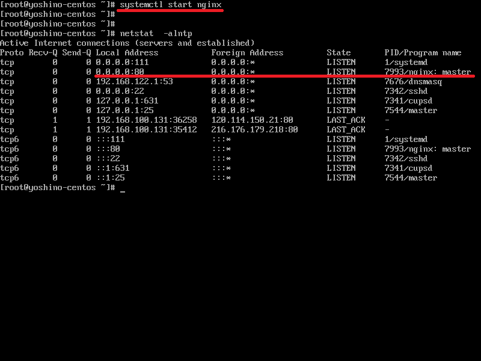

<em>3.<em>
+ 在windows上開啟瀏覽器並造訪192.168.200.100
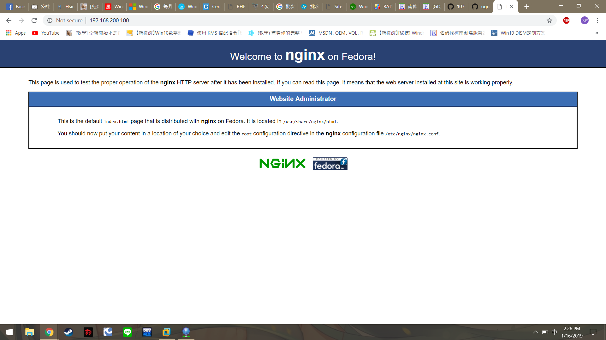

<em>4.<em>
+ 在機器內執行curl 192.168.200.100抓取網頁內容
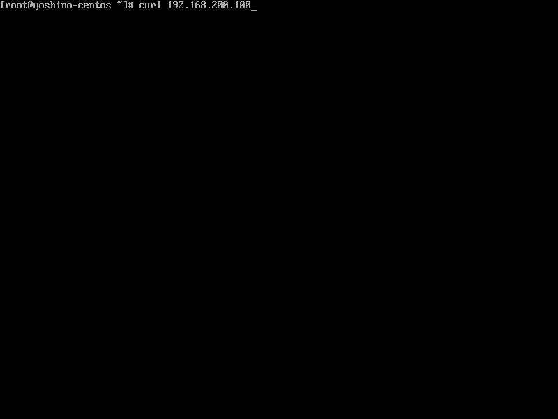
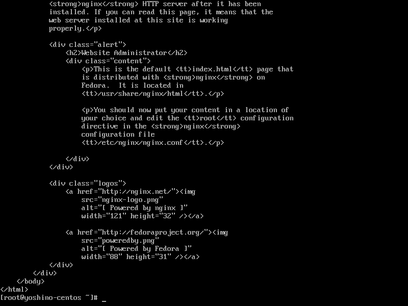

<em>5.<em>
+ 執行cat error.log | cut -d , -f 2 | cut -d : -f 2 | uniq -c
+ 如圖所示 可以看到來自192.168.200.1的錯誤有3次
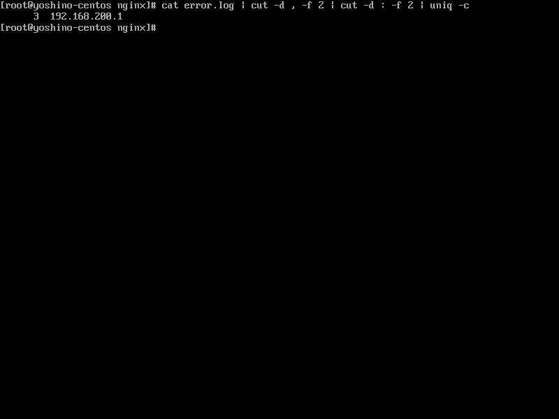
