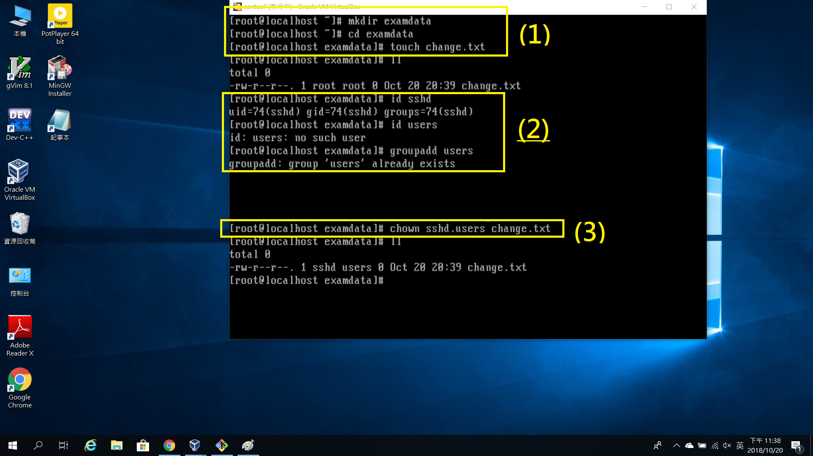
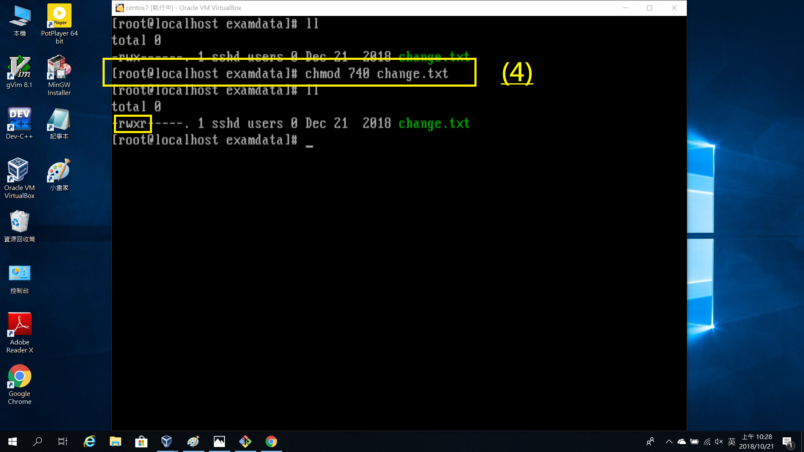
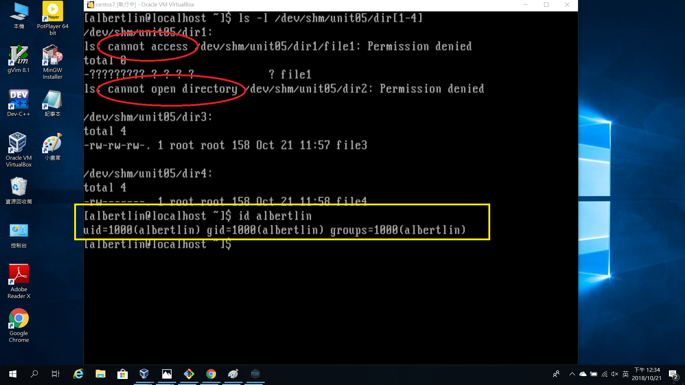

#HW3#

1.
  * 首先,建立examuser1,examuser2,examuser3三個帳號,密碼為ItIsExam
      *要建立帳號要用root,不然權限不足*

    > * 新增帳號的指令為 useradd [帳號名字] (在centos版本中,useradd和adduser是一樣的)
    > * 設定密碼的指令為 passwd [帳號名字]

    *使用ll /home/或是id [帳號名字]指令確認帳號已存在*

  --------------------------------------------------------------------------

* 刪除examuser3帳號      
    ** 刪除帳號的指令為userdel [帳號名字] 或是userdel -r [帳號名字]
    >以上兩種差在於前者會保留原來帳號的家目錄及檔案等,後者則會全部刪除

   
*記得刪完要確認一下是否成功喔!*

  --------------------------------------------------------------------------

* 假設現在誤刪了examuser1,變成下面這樣

   >要怎麼復原原來的帳號呢? 方法如下:
       ** useradd -u [原帳號UID] -U [帳號名字]
       >說明:-u是設定要創建帳號的UID, -U則是創建一個與帳號名稱相同的群組
       ** 再次設定密碼

==============================================================================

2.
  * 建立examuser4帳號, 密碼隨意

  ---------------------------------------------------------------------  

* 接下來,請看圖

  >(1) 將 /etc/securetty 複製到examuser4 (~examuser4是相對路徑,~表示家目錄)
  >(2) 因為複製過去時擁有者還是root, 所以這裡使用chown(change owner)來更改擁有者
       * 用法: chown [owner].[group] [file]
  >(3) 最後,因為目前只能read和write,現在要使examuser4可以執行(x)該檔案
       * 方法: chmod 700 [file]
            >>r=4,w=2,x=1
	    >>第一個數是擁有者權限,第二個是群組,最後則是其他人

  --------------------------------------------------------------------------

  >(1) 建立資料夾(mkdir) examdata,並在其中建立一個檔案(touch) change.txt
        * 方法: mkdir [資料夾]; cd(切換目錄至該資料夾) [資料夾]; touch [file]

  >(2) 確認sshd(owner)和users(group)存在
        * 方法: id sshd; groupadd users

  >(3) 更改owner為sshd,改群組為users

  >(4) 更改權限,使sshd有所有權限,users群組可讀,而其他人沒有任何權限

  >(5) 更改時間至2012/12/21 
        * 方法: touch -t [YY][MMDD][HH][mm] [file]

===============================================================================

3.

  首先,利用cd至shm中
  >(1) 在裡面建立叫做unit05的資料夾
  >(2) 改變群組權限,使群組也可編輯此資料夾
        * 用法:chmod u=rwx,g=rwx,o=rwx [file]
	>> 只需要打出要修改的部分即可(註: u = owner)
  >(3) 在unit05中再創建4個資料夾名為dir1,dir2,dir3,dir4

  >(4) 依照題目要求更改權限
       * 途中省略之步驟:chmod o=r dir1;chmod o=x dir2;chmod 777 dir4

  >(5) 進入etc將hosts檔案複製到file1~file4
       *方法: cp [file] [目標file]
  >(6)(7) 分別將file1~4複製到dir1~4中 (ll部分是確定有成功複製過去)
  >(8) 更改file3和file4的權限
  -------------------------------------------------------------------
*以下是使用一般使用者的身分遇到的問題*

   * 從黃色框框可以知道該身分對於dir[1-4]屬於other
  > dir1因為沒有執行權限而dir2沒有讀取權限因此兩個看不到該資訊

  > 要看file1資訊時,因為dir只能讀且file1也只能讀無法執行,所以看不了
  > file2在dir2可執行而file2本身可讀,因此可以看到資訊
  > file3和file4則是在dir3和dir4時就有權限了

  
  > 使用vim開啟時
    file1和file2無法儲存及強制儲存 (因為file1和file2沒有編輯權限)
    file3本身可編輯, 可以直接儲存
    file4本身無法編輯,但因dir4可編輯,所以可以強制儲存

>>這邊有個問題是:為什麼file4強制儲存一次後,之後直接儲存就行了呢?

