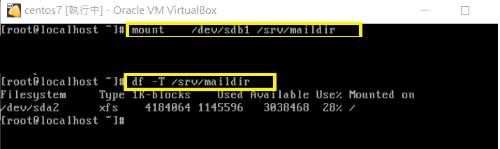
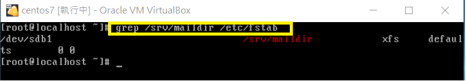

# midterm

## 1.

### (1)

> * ver=my\ kernel\ version\ is\ $(uname -r)

> * echo ${ver}

### (2)

> * echo $PATH

> * 執行檔或指令的搜尋是依序由PATH的變數內的目錄查詢

-------------------------------------------------------

## 2.

### (1)

> 此檔案為目錄檔，擁有者及群組有所有權限，其他人則可以讀跟執行。

> 共有另外兩個檔案與該檔的inode相同

> 該檔擁有者為root，而群組為mail

> 該檔大小為4096

> 最後touch的時間為20170216

### (2)

> * 數字法: chmod 755 script.sh

> * 符號法: chmod u+x,g+x,o+x script.sh

-------------------------------------------------------

## 3.

### (1)

> 實體連結只是在某目錄下新增一筆檔名連結到某inode的關聯紀錄而已，其inode與原檔案相同

> 而符號連結則是創建一個連結到原檔案的新檔案，其inode與原檔案不同

### (2)

> * touch hosts.real

> * ln /etc/hosts ~hosts.real

### (3)

> * touch hosts.symbo

> * ln -s /etc/hosts ~hosts.symbo

##4.

### * /srv/mailgroup 可讓mailgroup群組共用，其他人沒權限

### * mailuser 在 mailgroup 中

### 掛載並用df驗證

### 驗證開機自動掛載

### 驗證該帳號無法用shell登入

> 因為該UID\>1000

