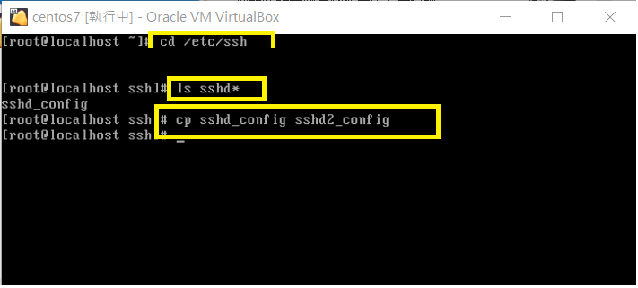
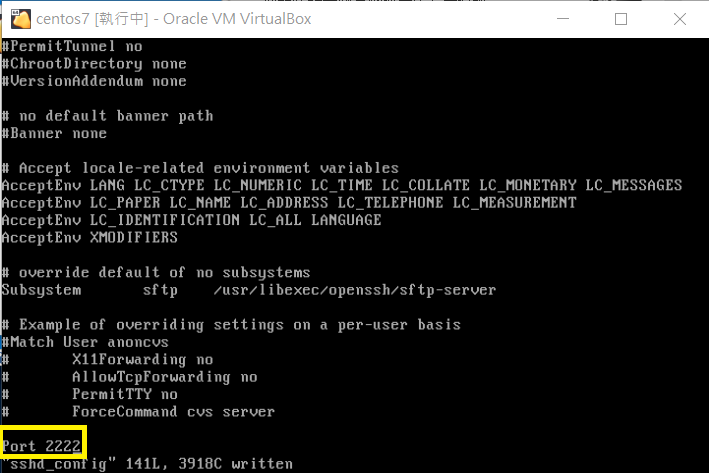
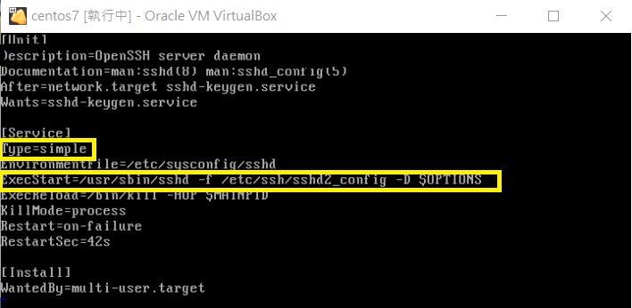
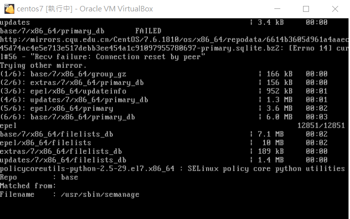
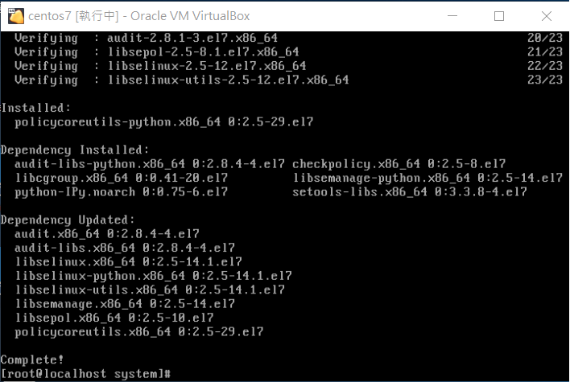

# HW 10
-----------------------------

### 先切換至ssh並將sshd\_config複製到sshd2\_config

### 在sshd2\_config中任一處加上`Port 2222`

### 用好後再將sshd.service的部分複製到sshd2.service

### 開始修改

> 因Type會影響ExecStart，所以改成simple方便進行判斷

> 在ExecStart修改成`/usr/sbin/sshd -f /etc/ssh/sshd2_config -D`

### `yum provides semanage`查詢需要的指令包

### `yum install policycoreutils-python` 安裝完就可以使用 *semanage* 囉

### 依指令設定並確認設定成功

* `semanage port -a -t ssh_port_t -p tcp 2222` (之後稍等一下)

* `semanage port -l | grep ssh`  (確認設定完成)

> 因為netstat---command not found，所以用

`yum whatprovides netstat`

`yum install net-tools`

### 打了指令沒有看到新增的(因為沒重新讀取過設定檔)

> 指令

* `systemctl daemon-reload` (重新讀取設定檔)

* `systemctl start sshd2.service` (開啟該服務)

* `netstat -alntp | grep ssh`

