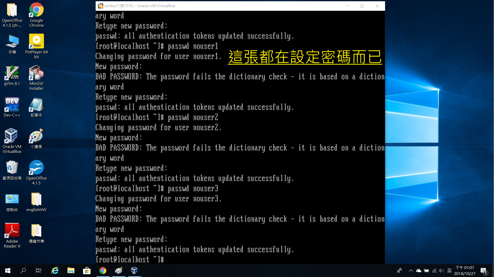
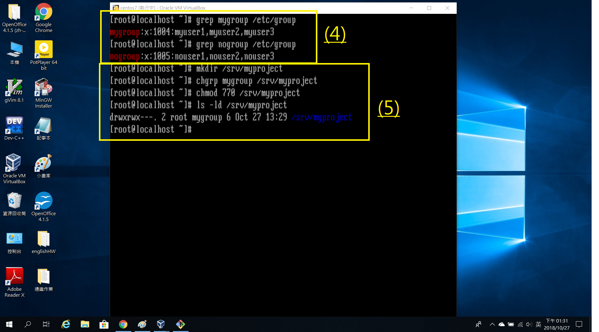
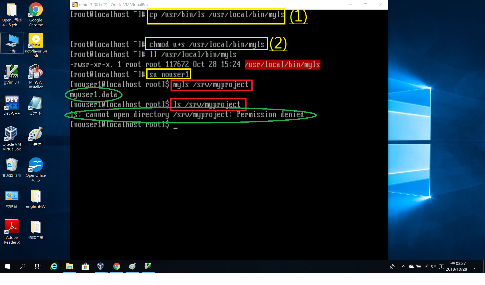
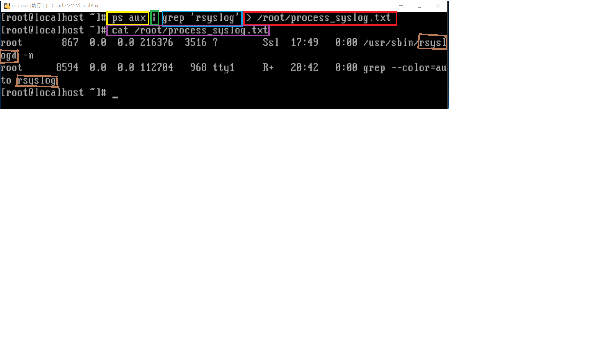

# HW4

## 1.管理群組共用資料的權限設計

> (1) 建立名稱為mygroup和nogroup的群組  

> (2) 建立myuser和nouser各1~3的帳號, 並將其加入剛創立的兩個群組
   * 用法: 在useradd和帳號名之間加入-G [grp]
> (3) 幫各帳號建立密碼, 其中密碼為MyPassWord

> (4) 確認有將帳號成功加入群組
   * 用法: grep [group] /etc/group  

(5)  
> 創建/srv/myproject這個目錄 (mkdir \[創建目錄名\])  

> 將該目錄的擁有群組改為mygroup (chgrp \[grp\] \[目錄名\])  

> 使群組成員擁有該目錄的完整使用權限(770中第二個7為使群組擁有所有權線的位置)  

> 檢查前面的指令是否成功

### 以下是以myuser1帳號進行的操作

   (6) 
> 切換目錄至剛剛創建的目錄  

> 使用touch創建檔案myuser1.data  

> 確定指令有成功  

*然後就可以登出囉*

### 從nouser1執行, 發現沒有權限查看myproject目錄內的檔名資訊

### 以下以root操作

   >(1) 將ls複製到本地的myls (cp \[被複製的\] \[目的地\])  

   >(2) 將複製過來的myls修改權限, 在owner(u)部份加上s(SUID)  

    * suid表示other在執行該動作時會暫時擁有owner權限

### 然後切換成nouser1

#### 可以發現利用myls可以查看到該目錄裡面的檔名資料, 而ls則不行

-----------------------------------------------------------------------------

## 2.

#### *黃色*框框利用ps aux呼叫出系統中的程序
#### *綠色*的這個符號意思是使左邊的指令由右邊的指令繼續做下去
#### *藍色*部分是對前面指令再進行篩選出rsyslog的相關程序
   * 用法: grep '要找的相關程序'
#### *紅色*的部分是我要將上述結果"重新導向"到/root/process\_syslog.txt中
   * 用法: \> [file]
   *如果為新檔案, 則會自行創建*
#### 最後, 用cat來查看該檔案內容, 確認有成功重導向
   * 用法: cat [file]

-------------------------------------------------------------------------------

## 3.

#### *黃色*框起來的部分是利用find尋找要找的資料

#### *綠色*部分是對要找的資料附加說明

    >這邊我想找出該目錄中含有SUID特殊檔檔名的, 因此使用 -perm
    >在系統中SUID是4分, SUID是2分, SBIT是1分, 所以在-perm後面加上/4000(同時要全部的話則是/7000, 以此類推)

#### 藍色的部分是在find後額外要進行的動作

    > -exec表示額外動作開始, \;表示額外動作結束(因為;在bash環境有特殊意義, 所以用\來跳脫)
    >我想知道我所find的詳細資料, 所以在其間加上ls -l {}(大括號中表示由find找到的內容, 也就是說find的結果會被放置到{}中)
   *這裡的ls -l不能用ll代替!*

#### 紅色的部分是我要將上面的結果"重新導向"到/root/findsuidsgid.txt中
   
### 為什麼這些指令結束沒有印出任何東西呢?
#### 因為已經被導向剛剛的檔案中啦!

#### 使用cat來看看檔案中的資料吧!
