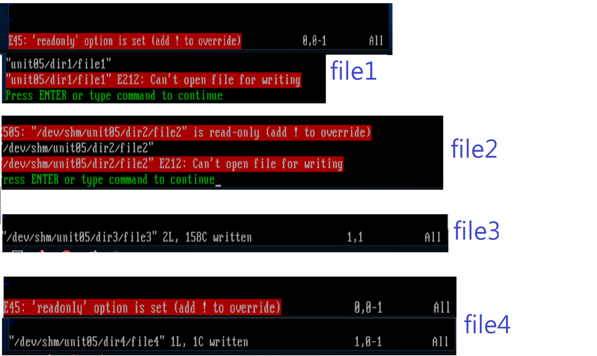

# HW6

------------------------------------------------------------

## 利用 *vim ~/.bashrc* 進入後新增變數

## 之後esc離開編輯模式，並:wq離開(w為儲存，q為離開)

## 利用 *source ~/.bashrc* 使修改過的變數不用再次登入就生效

> source指令可用\".\"代替

## 利用 *cat $HOSTS_PATH* 來確認有寫入

------------------------------------------------------------------------

## 接下來一樣用vim寫一個C語言程式(檔案後最後最好加\"\.c\")

## *黃色部分* 編譯該程式(如果沒錯就可直接下下一個指令)

> 如果沒有gcc指令則需透過 *yum groupinstall "Development Tools"* 來安裝

## *紅色部分* 用一個執行檔

> 最後直接呼叫該執行檔即可\!

#### 以下為輸出結果

## 沒有讀到HOSTS\_PATH \?

> *因為該變數不在子程序當中*

## \$0為1

> *程式未成功執行* (若輸出為0代表成功執行)

--------------------------------------------------

## 利用 *export* 指令將該變數用到子程序中

> ### 記得離開後要再 *source ~/.bashrc* 一次喔 \!

> ### *黃色部分* 就是前面提到的指令

> ### *紅色部分* 再編譯執行一次

> ### *綠色部分* 就是成功讀到HOSTS_PATH囉 \!

> ### echo \$\? 的結果也變為0了 \!

### FINISH \!\!

