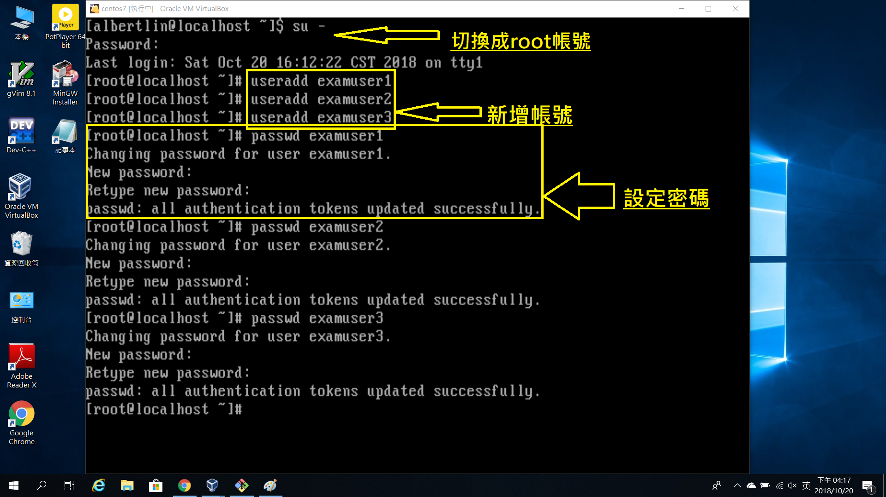

# HW8

---------------

## 建立新網卡

> 檔案---主機網路管理員---建立

## 從設定值的網路中將新網卡加入

## 利用ip指令設定網路

> ### ip address add [ip] *新增網路ip*

> ### bradcast + *設定廣播，"+"是讓系統自行運算*

> ### dev [裝置名] *兩個裝置一樣*

## 將網路設定存進該檔中

## 重新開機後互相ping完確認有連上

