#Centos7安裝說明#
==================

>首先,來到CentOS官網並下載

>>隨便選一個都可以,載到的都一樣,只是為了分散流量而已

>接下來,打開安裝好的Virtualbox,選擇"新增"

>>為虛擬機器取名, 因為接下來準備使用linux系統,因此在類型部分選擇linux,版本選擇與電腦及類型相符的

>>設定此虛擬機器的記憶體(RAM)容量

>>建立虛擬硬碟,由於是第一次使用,因此直接點選"建立"即可
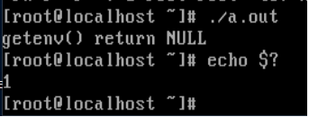

>>下一步
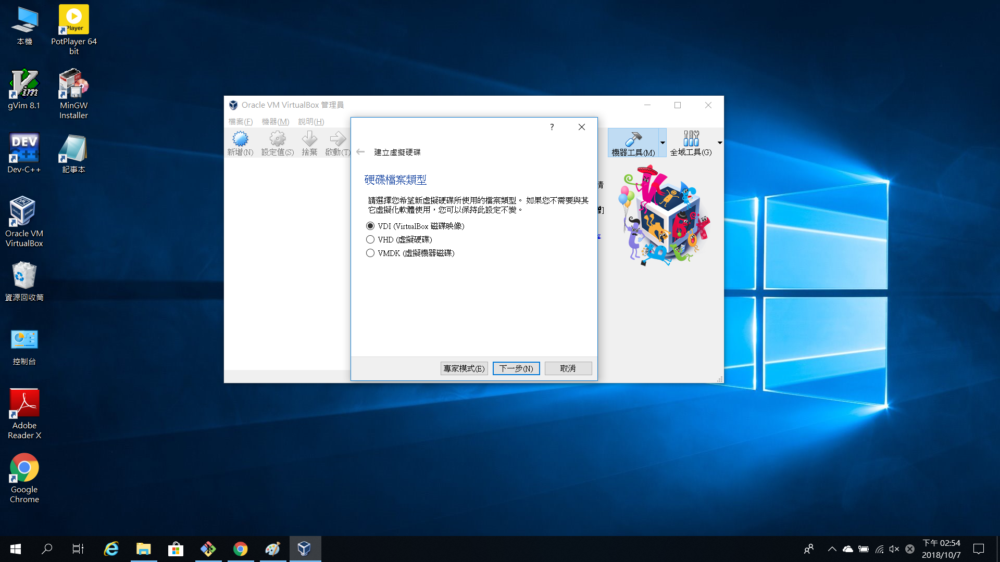

>>這裡稍微解釋一下, 動態配置的硬碟會隨著使用空間擴張(直到設定時的最大值),優點是比較不占空間;而固定大小硬碟的優點則是速度較快\-\-\-這裡建議使用動態配置即可

>>再來是選擇要放置虛擬硬碟的位置及虛擬硬碟的大小
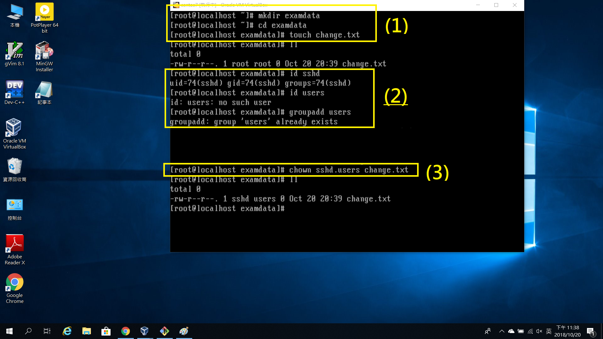

>>選擇"設定"\-\-\-"存放裝置",點選右上角的光碟選擇剛剛安裝的虛擬映像檔
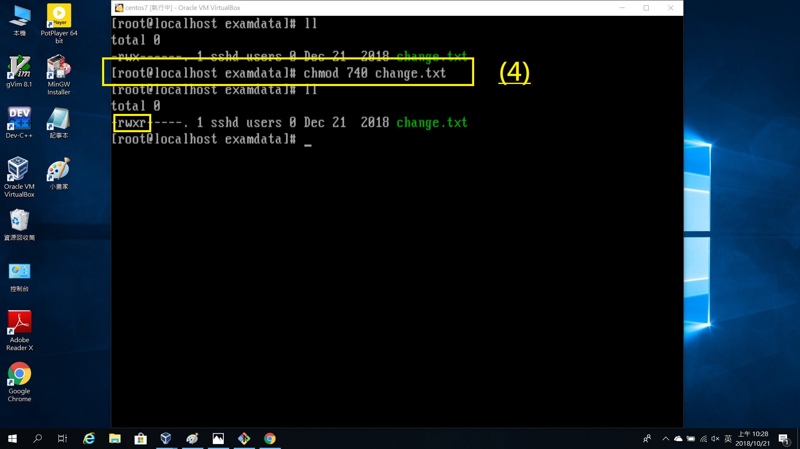

>>選擇設定\-\-\-網路\-\-\-介面卡2
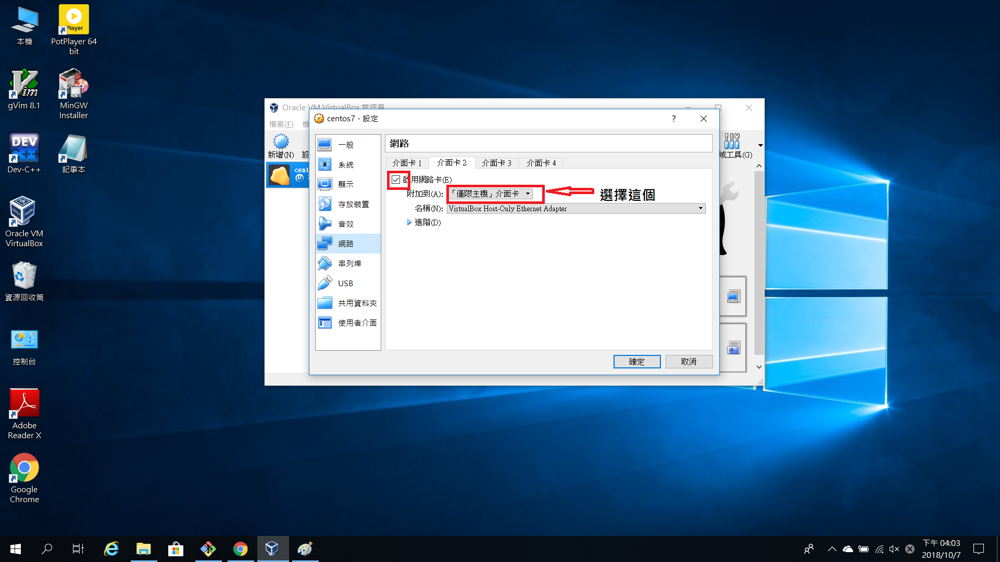

然後就可以啟動啦~

>啟動後可以直接點選第一個安裝,或是選擇第二個檢查光碟後安裝
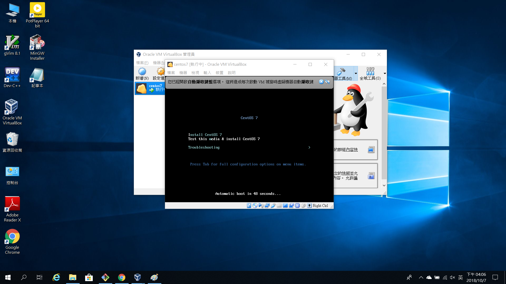

>>之後會進入此畫面, 選擇語言
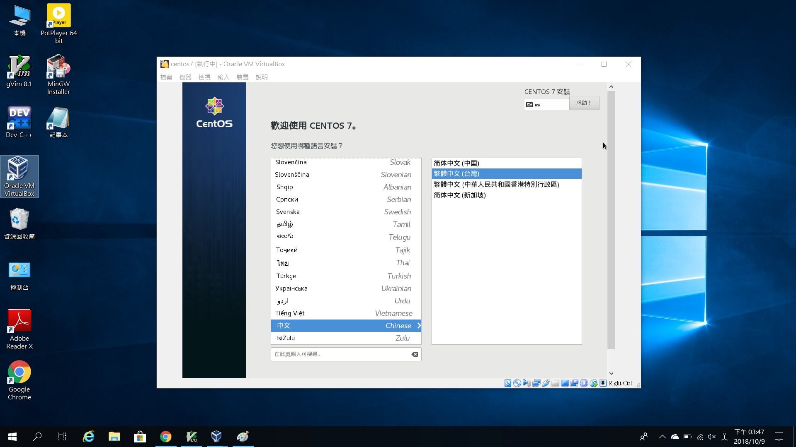

>>接下來會看到可以設定時間等等的設定,這裡要準備進入一個很重要的步驟---切割硬碟啦\!
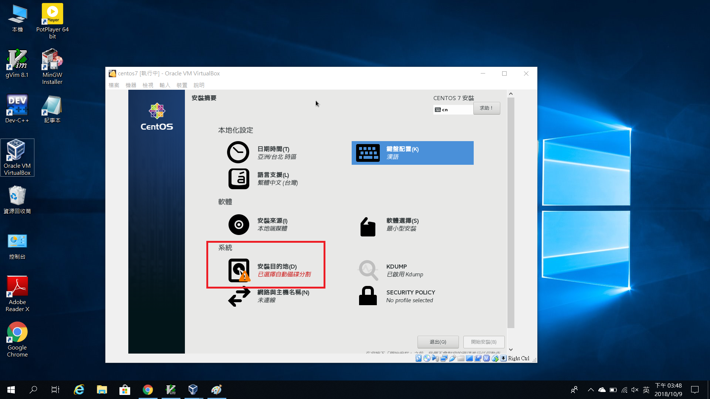

>>選完自訂分割後點選完成,進入自訂分割畫面
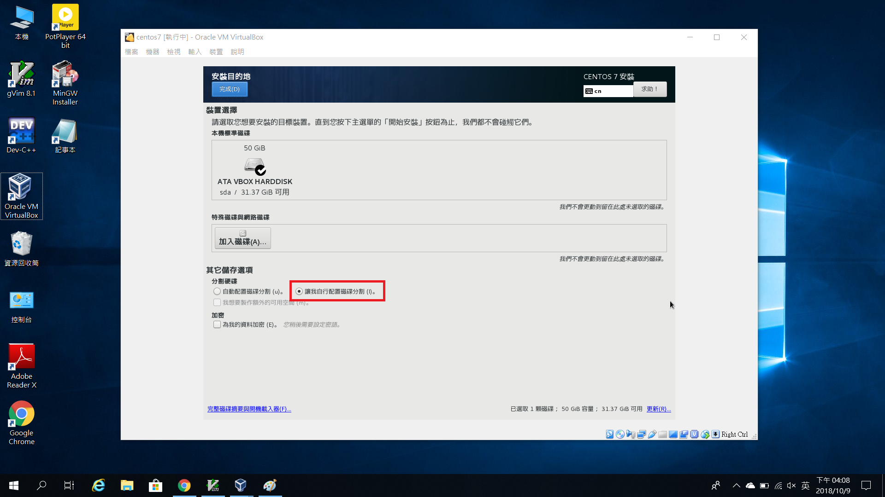

>>在手動分割中,我們選擇標準分割區, 並開始新增掛載點
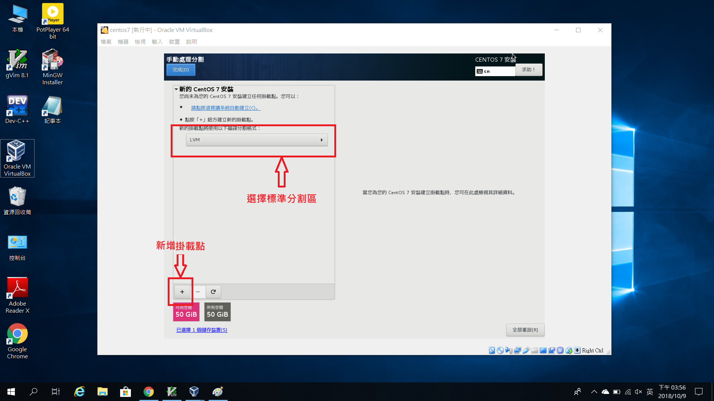

>>接下來是我新增的掛載點\-\-\-/和/home是必須的
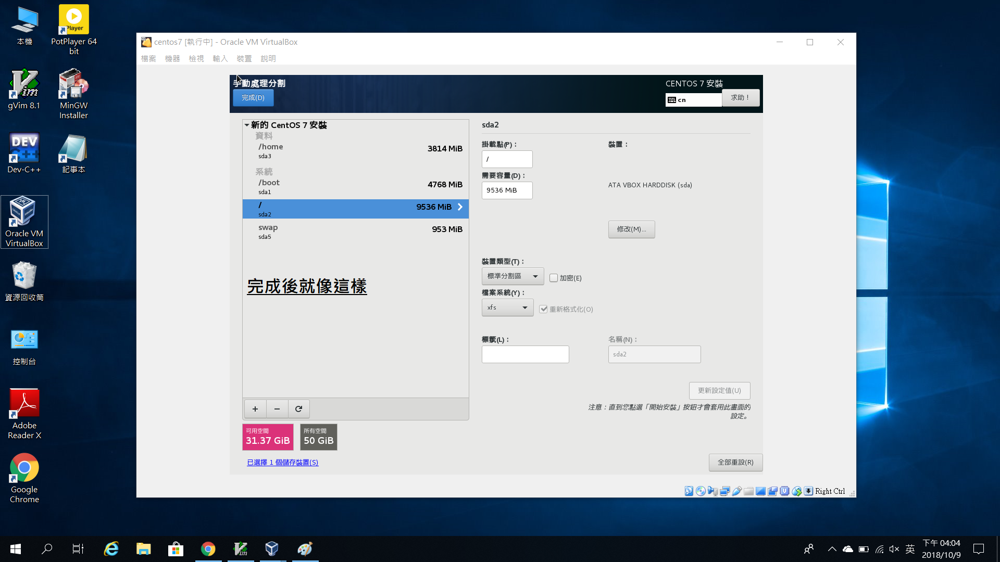

>>再來是網路部分,將網路打開
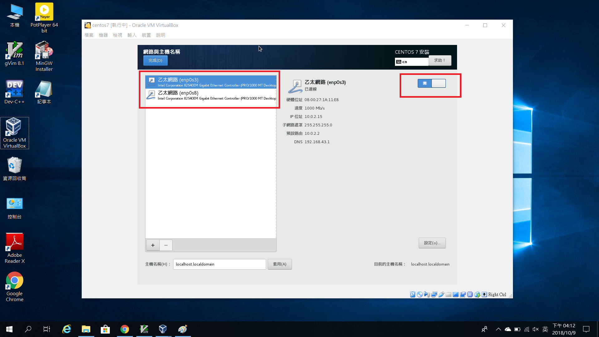

沒問題後就可以開始安裝啦\!

>安裝時會出現用戶設定,這邊要設定的是root的密碼及個人的帳號密碼(設定完一定要記得喔\!)
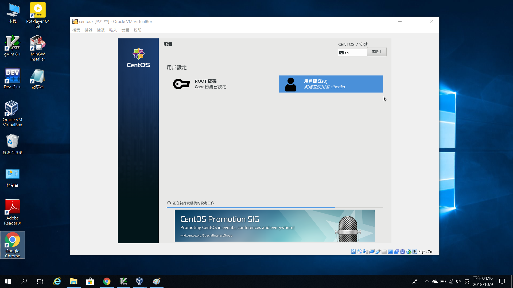

>安裝完會要求重新開機,看到這個畫面後,就表示安裝完成囉\!
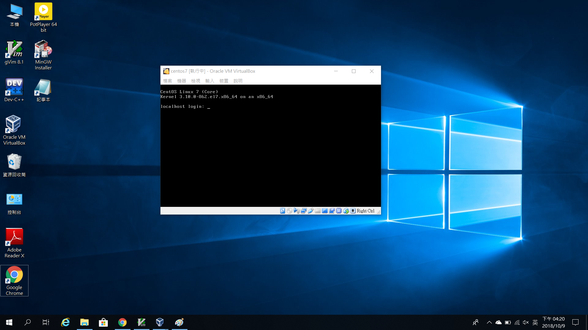

>注意\!\!輸入密碼時螢幕不會有任何變化,別以為是電腦壞掉囉\!

>登入後的畫面
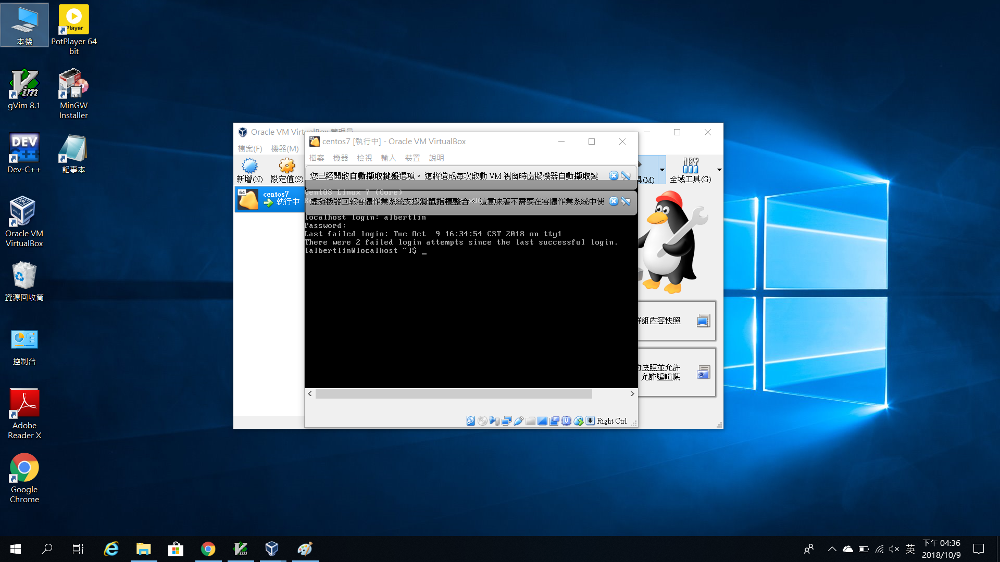

恭喜你完成安裝Centos7趕快開始使用吧\!

