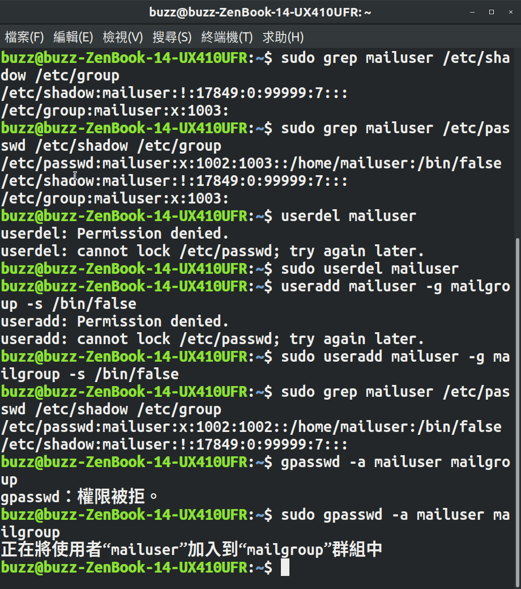

ACS107128 張云榮
＝＝＝＝＝＝＝＝＝＝＝＝

1.
設定一個環境變數然後把他print出來：

首先先用ver="my kernel version is 4.15.0-36-generic"設定ver
再來把他echo出來即可

用echo $PATH把環境變數的值print出來

PATH的值主要是執行檔搜尋的路徑,他顯示的目錄與目錄中間用冒
號：作間隔,檔案搜尋的順序由這些目錄來查詢。

2.
有一個檔案屬性權限為 
drwxrwsr -x 3 root mail 4096 2月 16 2017 mail/

前面的英文代表的是檔案權限類型， 中間的3是指連結檔的數量
再來的root是指檔案的擁有者 mail是指檔案所屬的群組（不是檔
名歐）4096是檔案的容量， 再來顯示的是檔案最後被修改的時間。
最後才是檔名。
權限的部份
分成第一個d是檔案類型
接下來的三個rwx是檔案擁有者的權限，意思是可讀可寫入和可執行
在接下來的三個是rws 是指群組內的人擁有的權限，s的意思是暫
時擁有root的權限，可以更改自己的密碼之類的。
最後是訪客的權限r-x只可讀和運行但不可更改。

數字法
用chmod r:4 w:2 x:1
使用chmod 777 script.sh 
這樣會把所有權限都打開，但如果只是想要大家可以執行的話
可以用 chmod 755 就是原本的權限不動，只增加執行的權限。

符號法
用ugo 分別代表擁有者權限和其他路人 加上你想要加的權限
寫法是chmod ugo+x script.sh

3.
實體連結是新增一個檔名連結到inode 號碼的關聯紀錄，他不能跨
檔案系統不能link目錄
符號連結就是新增一個檔案，當讀取資料的時候會讀取他設定的來源檔，就是window 的捷徑概念
刪除了hardlink 他還是能藉由其他管道去連結到inode 指向的block所以相較來說hardlink比較安全，但限制很多，所以還是symbolic 
link 用的比較廣。

移動到/etc/裡 用ln 建立實體連結

移動到/etc/裡 用ln -s 建立符號連結

由圖上可以看到家目錄裡有hosts.real 和hosts.symbo的檔案

4.
有點尷尬，因為我是在自己的電腦上做，幸好我有預留16g的空間再
給我劃出來，不然等他慢慢把雙系統的磁碟區劃出來，考試都過完了

(1)
	第一個 使用df 顯示1gb檔案正被掛載中

(2)
用grep驗證有設定開機自動掛載

最下面那行

(3)
確認目錄權限 

(4) 

確認他的shell為/bin/false 
確認他的群組為mailgroup

