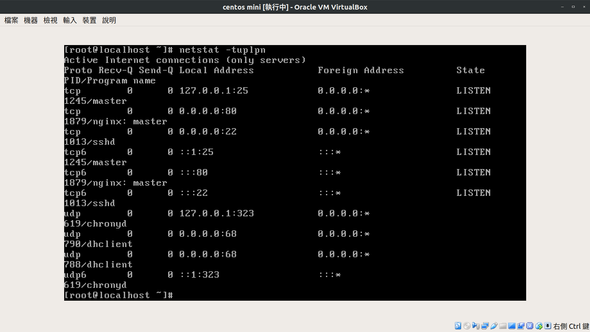

期末考 ACS107128 張云榮
===========================

第一步驟：
在配置host-only 網卡的時候，發現不能配置。因為linux和mac，預設沒有給vm一張虛擬網卡。但我們可以自己設，點選主機網路設定，新增一張vbox01的網卡，接著回到centos的vm上即可指定。

接著把nginx下載下來跑，第一次還不小心忘記輸入systemctl，還得kill掉以後再來跑
不過netstat查看它是否真的在跑～

尷尬＠＠
透過實體window上的瀏覽器瀏覽vm的網頁 不過我的是實體的ubuntu呀 是否意味著我達不到題目的要求了！！
所以我用nmap掃了一下192.168.200.100
有掃到 也掃到了port 80腳位的開啟

