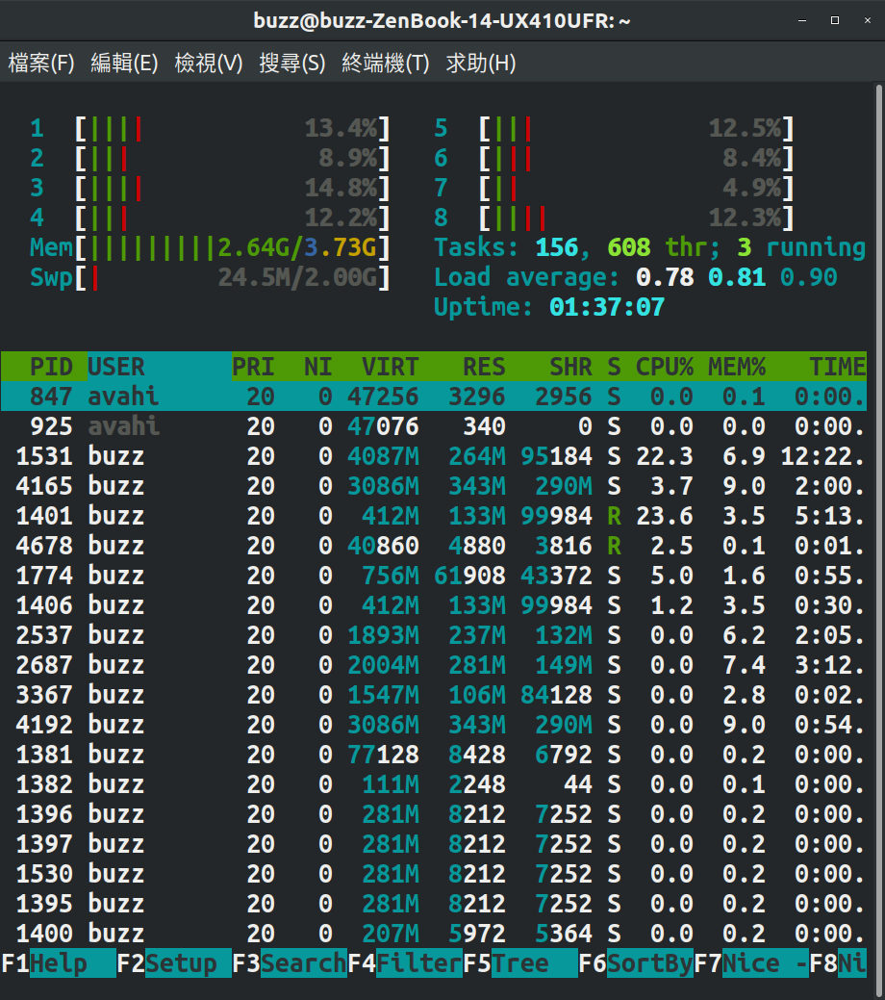
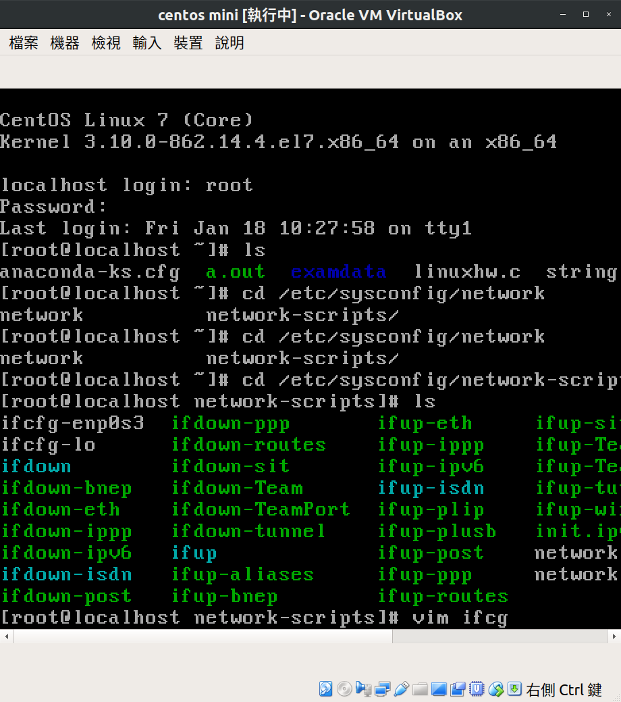
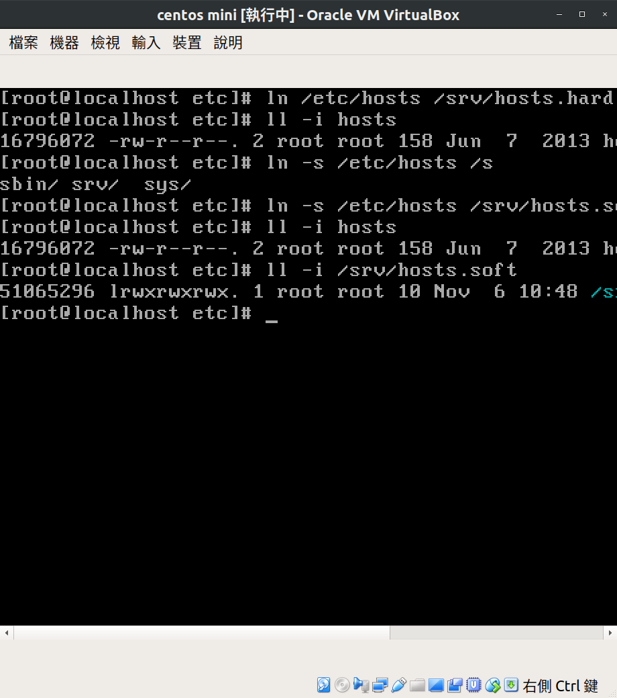
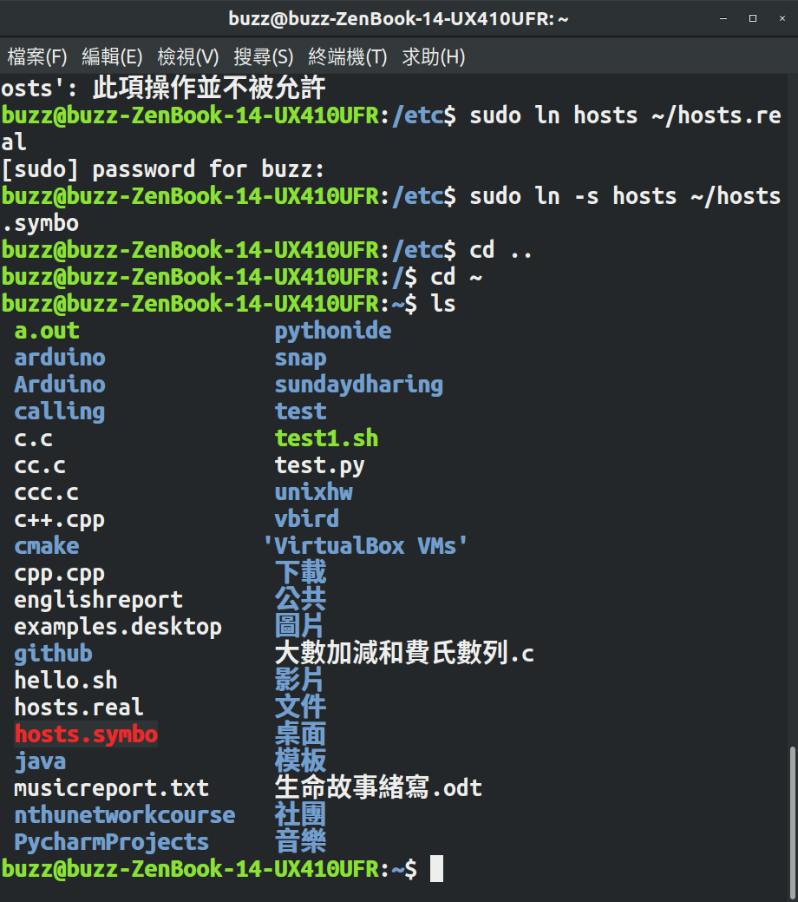
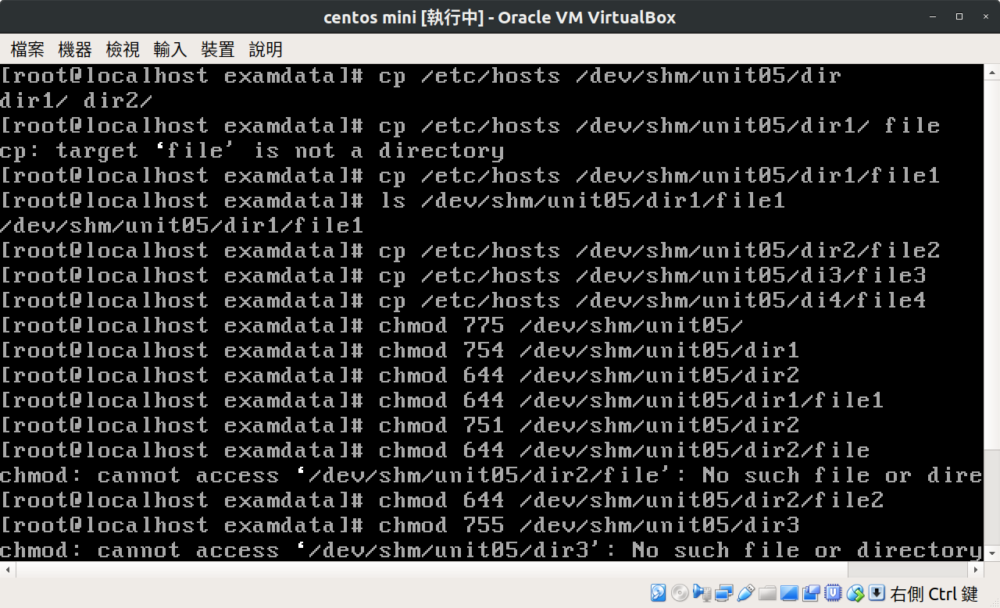
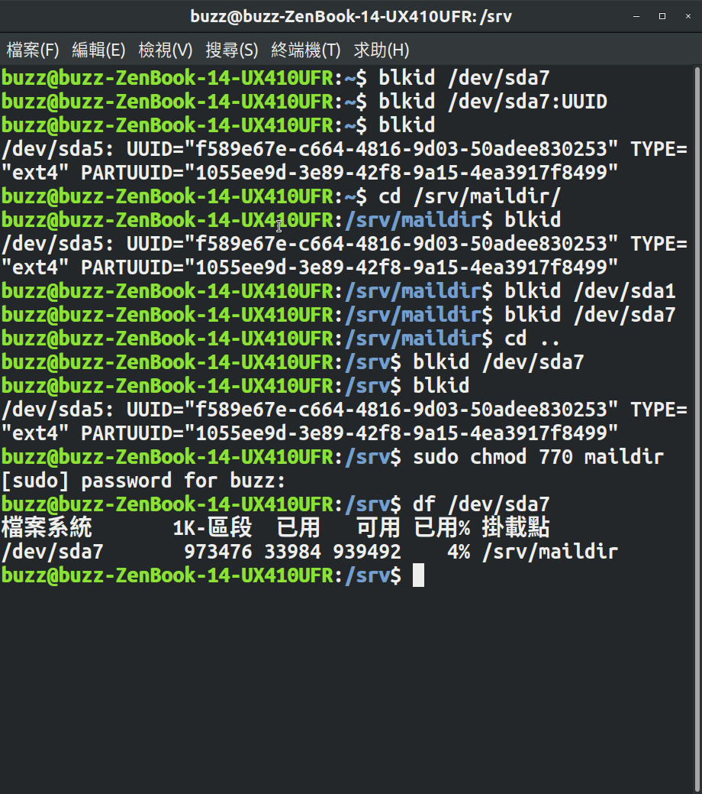
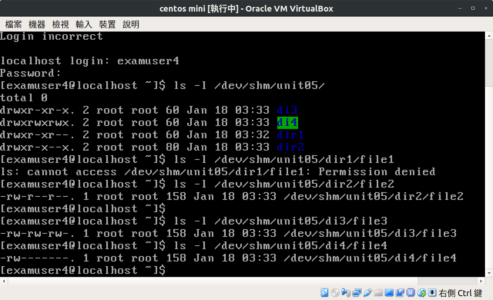

ACS107128 張云榮 linux安裝教學 安裝發行版：kali linux
----------------------------
1.首先打開已安裝好的virtualbox
2.點選新增

3.設定名稱和作業系統
4.設定記憶體大小（這個記憶體是指暫存記憶體叫做RAM，pgpg(please google))

5.建立虛擬硬碟，選擇硬碟類型，直接下一步即可

6.選擇動態配置還是固定大小，若是沒有特殊需求，按照預設選擇即可。
7.再來就為你的虛擬機選定資料夾的位置和大小

8.選擇你的linux機器打開設定
9.在存放裝置裡，點選光碟機旁的小小光碟圖示，選擇你從官網下載下來的linux distibution iso檔 按下確定

10.之後打開就會當安裝畫面 點選install

11.點選中文 選擇台灣 漢語

12.等待他跑完......
13.設定自己的主機名稱，網域名稱

14.設定root密碼
15.無特殊需求及點選使用整顆硬碟
16.把所有檔案設定在同個分割區，優點是方便和輕鬆，缺點是損壞時較難救回
17.按著引導enter enter enter
18.吃個飯等它安裝完....
19.網路鏡像站點選是
20.proxy直接留白
21.等待它跑完
22.選擇安裝開機程式
23.將開機程式安裝在自己的硬碟上
24.安裝完成～
25.接下來進入開機畫面 
26.使用者名稱就是root
27.密碼為自己設定的密碼
28.再來就可以使用摟～:)

