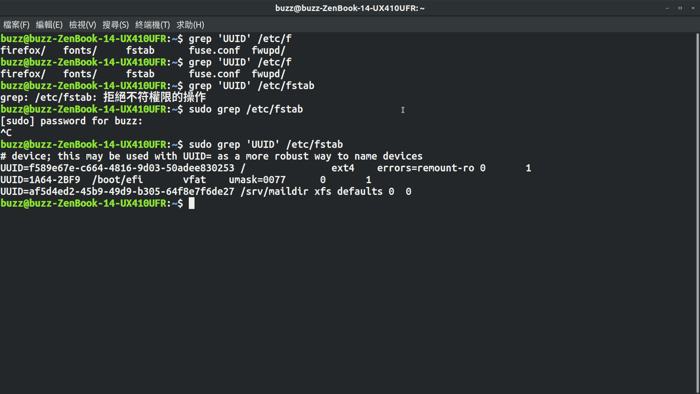

第三次作業
================

##1.第一項要求
2
然後將他們的密碼都改為ItlsExam,重複作三次,突然有寫shell script的衝動@@。

再來將examuser3刪掉
運用userdel -r 將家目錄和信箱刪除

用userdel 刪除examuser1 保留下家目錄和信箱
查看他的uid後
再來用useradd -u 1000 將他復原

##2.第二項要求

創建examuser4
更改密碼後 cp檔案複製到他的家目錄 chmod更改權限

用touch 新增文件和 -d參數修改時間
最後用chmod chgrp chown 來更改使用權限

ll顯示結果

##3.第三項要求

創建一堆檔案和目錄
給予不同的權限 去了解他到底這樣設可不可以被外人使用

這隻帳號只創了root 所以借用examuser4

使用ls -l 
di4  被綠綠了 可能是我只能進入那個

ls -l file1-4 權限給的不一樣導致之結果

file1 不能讀不能改
file2 不能讀不能改
file3 可讀可改
file4 不可讀不可改

