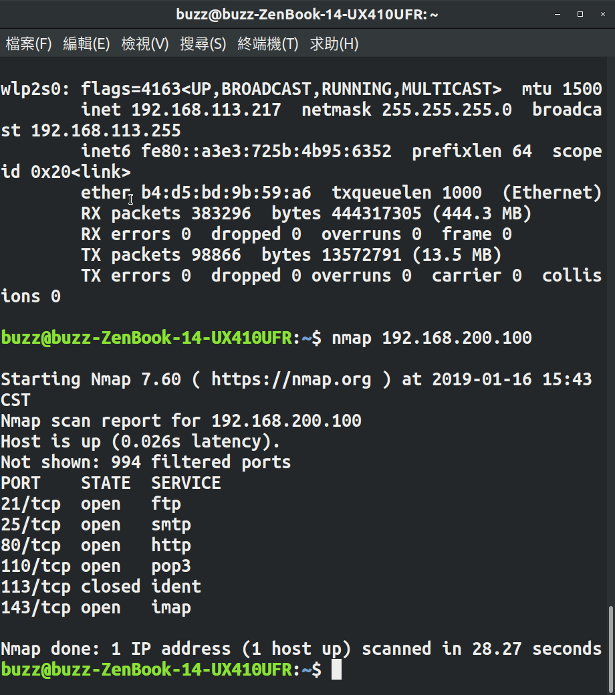

ACS107128 張云榮
＝＝＝＝＝＝＝＝＝＝＝

1.查詢/etc/hosts 的inode 號碼
方法：輸入ll -i 後看到的第一項 及為inode號碼 
是16796072
再來的第3項顯示他的連結檔有多少個。
連結檔相當於window中的捷徑

2.

建立實體連結，原始檔案為 /etc/hosts 而新的檔案檔名為 /srv/hosts.hard 使用ln
/srv/hosts.hard的 inode 號碼為幾號？
為與原本的檔案相同,
因為他指向的記憶體位置就是原本的檔案inode所指向的記憶體位址
但增加了原inode連解檔的數目

3.

建立符號連結，原始檔案為 /etc/hosts 而新的檔案檔名為 /srv/hosts.soft
    /srv/hosts.soft的 inode 號碼為幾號？
由於符號連結 所以host.soft所建立的是另外一個檔案,與原檔案不同,因此兩者的inode數不同
而原本的hosts的inode數目也不會增加

