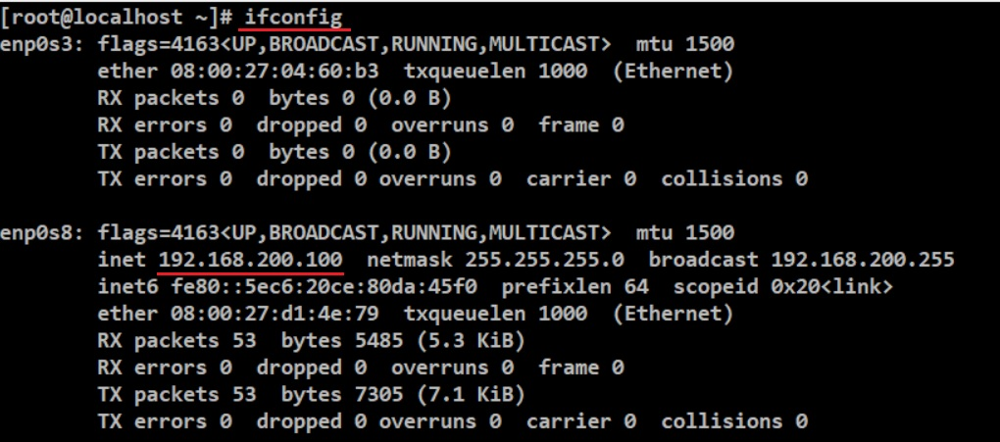

### HW4

## 一

<ol>使用"groupadd"建立mygroup, nogroup，建立完後用"grep 群組名稱 /etc/group"檢查是否已經確實建立
</ol>

<ol>創立三支帳號，myuser1, myuser2, myuser3，密碼都是"mypassword"，然後將他們加入到"mygroup"這個群組，可以輸入"useradd -G mygroup 帳號名稱"
</ol>

<ol>創立三支帳號，nouser1, nouser2, nouser3，密碼都是"mypassword"，然後將他們加入到"nogroup"這個群組，指令與上個步驟一樣，就不附圖說明了
</ol>

<ol>建立一個名為 /srv/myproject 的目錄，指令為"mkdir /srv/myproject"，可用"ll /srv/"確認目錄已經建立
</ol>

<ol>使這個目錄(/srv/myproject)可以讓群組"mygroup"可以完整使用，且將擁有者也改成這個群組，先輸入"chgrp mygroup /srv/myproject"，將擁有者改為mygroup，然後為了讓其他人沒有權限，輸入"chmod 070 /srv/myproject"，操作完後可以輸入"ll /srv/"確認此目錄的屬性(記得要切換成root)
</ol>

<ol>切換帳號為"myuser1"，前往/srv/myproject後建立一個名為"myuser1.data"，指令為"touch myuser1.data"，然後輸入"ll"確認檔案已經建立，確認完後登出，使用上一個帳號
</ol>

<ol>複製/usr/bin/ls到/usr/local/bin/myls，指令為"cp /usr/bin/ls /usr/local/bin/myls"，用"ll /usr/local/bin"確認已經複製之後登出
</ol>

<ol>切換帳號為"nouser1"，用"ll /usr/local/bin/myls"查看這個帳號對該檔案的權限，然後輸入"myls /srv/myproject"，發現權限不足。切換為root，修改該檔案的權限改為SUID，指令為"chmod u+s /usr/local/bin/myls"，在使用一次"ll /usr/local/bin/myls"發現rwx的x被改為s，然後切換為nouser1，在執行一次"myls /srv/myproject"，就可以執行了
</ol>

## 二

<ol>輸入ps aux | grep rsyslog 找到有關於"rsyslog"的程序，然後輸入"ps aux | grep rsyslog > /root/process_syslog.txt"，將這個程序轉存在/root/process_syslog.txt，然後輸入"cat /root/process_syslog.txt"確認資訊有確實轉存進去
</ol>

## 三

<ol>輸入"find /usr/bin /usr/sbin -perm /4000"，找出含有 SUID 的特殊檔案檔名
</ol>

<ol>使用"find /usr/bin /usr/sbin -perm /4000 -exec ls -l {} \;"列出該檔案的相關權限
</ol>

<ol>使用"find /usr/bin /usr/sbin -perm /4000 -exec ls -l {} \; > /root/findsuidsgid.txt"轉存完畢之後，輸入vi findsuidsgid.txt，確認資料已經存入
</ol>

