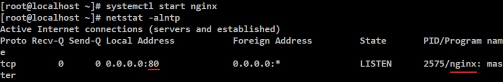

### HW7

# 1

* 先確認是否已經安裝 wget ，若沒安裝則輸入"yum -y install wget"。

* 輸入"wget https://raw.githubusercontent.com/ogre0403/107-1-ntcu-linux/master/resource/web.log" ，就可以下載此檔案

* 然後輸入指令"cat web.log | grep error"，就能顯示error發生的原因。

# 2

* 輸入"tar -cvf var.tar /var 2> tar-err.log"，然後會產生一個var.tar的壓縮檔、tar-err.log的檔案(錯誤訊息)在當前目錄。

> tar指令可以參考：http://linux.vbird.org/linux_basic/0240tarcompress/0240tarcompress-fc4.php#tar

* 然後輸入"cat tar-err.log"，確認裡面是錯誤訊息。

