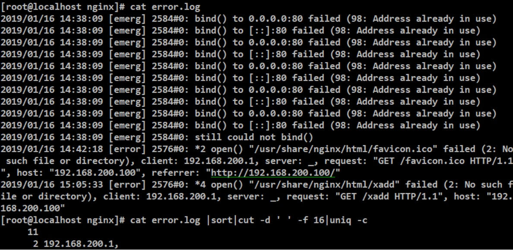

### HW8

# 1-1

* 到下圖的地方，建立一個新的Host-only網卡，再修改一下ip就可以了，記得勾選啟用。

# 1-2、1-3

* 建立虛擬機器-1，之前有講過了就不多做說明了，可以參考：https://github.com/careful12/107-1-ntcu-linux/blob/HW2/ACS107143/hw2.md

* 建立完之後點選設定值，設定「僅限主機」介面卡

* 然後就把它開機，輸入`yum install net-tools`因為會用到相關指令

* 安裝完之後輸入`ifconfig enp0s8 192.168.100.100/24`更改IP，然後輸入`ip a`確認已經改好

> 虛擬機器-2也是同樣的作法

# 1-4

* (我用`虛擬機器-2`示範) 然後輸入`vi /etc/sysconfig/network-scripts/ifcfg-enp0s8`，在輸入下圖的內容

> BOOTPROTO要改成static

> ONBOOT要改成yes

* 然後重開機確定ip設定無誤

# 1-5

* 各輸入`ping 192.168.100.100`、`ping 192.168.100.200`

