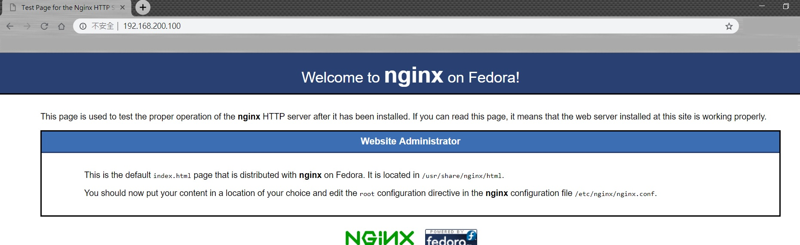

## Midterm

# 1

* (1) 輸入指令"uname -r"，顯示出"3.10.0-862.e17.x86_64"，然後輸入指令ver='my kernel version is 3.xx'，然後輸入"echo $ver"，就會顯示出my kernel version is 3.xx。

* (2) 下圖為PATH環境變數的值。PATH的功用為：執行檔搜尋的路徑，目錄與目錄中間以冒號(:)分隔。

# 2

* (1) 此檔案擁有者為"root"，擁有的group為"mail"，d代表它是一個目錄檔，r代表可讀，w代表可寫/編輯/修改，x代表可執行，d之後的前三碼代表擁有者的權限，在此檔案中擁有者的權限是全開的，再後面三碼代表group的權限，此檔案也是全開，只是x變成了s，表示只要在群組的任何人具有x的執行權，當用戶執行的時候，就會自動透過s(SUID)轉換身分成為owner，也是就是變成root的身分。最後三碼代表其他人，其他人的權限只有讀和執行。

* (2) 輸入指令"chmod a+x script.sh"，此為符號法。數字法為"chmod 755 script.sh"(r=4，w=2，x=1)，記得要注意自己是否有權限去修改權限。

# 3

* (1) 實體連結建立時，磁碟的空間和inode的數目都不會改變。符號連結是建立一個獨立的檔案，所以會產生inode。

* (2) 輸入指令"ln /etc/hosts ~/hosts.real"。

* (3) 由於我本來就在家目錄下，所以直接輸入"ln -s /etc/hosts hosts.symbo"就可以了。

# 4

* (1) 

* (2) 

* (3) 

* (4) 

* (5) 