### CentOS7安裝

# <ol>
<li>到CentOS7下載iso檔，基本上現在不會用到太多功能，所以只要安裝"Minimal ISO"就好了</li>
</ol>

# <ol>到VirtualBox官網下載VirtualBox，然後根據自己的作業系統去選擇下載的檔案
</ol>

# <ol>都安裝好之後，開啟VirtualBox，點擊新增
</ol>

# <ol>取一個自己想取的名稱後，類型選擇"Linux"，版本選擇"Other Linux"，32或64位元都可以，這裡我選64，點擊下一步
</ol>

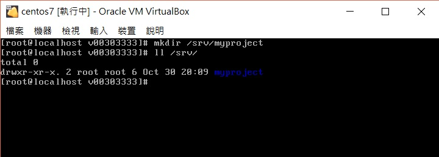

# <ol>選擇自己想要的記憶體大小，這裡我選2048MB，點擊下一步
</ol>

# <ol>目前基本上應該是沒有虛擬硬碟的，所以就選擇"立即建立虛擬硬碟"，點擊建立
</ol>

# <ol>這裡我會建立使用VDI，畢竟是Virtualbox原生支援，可能產生的問題會較少，不過還是可以自行選擇其他的，點擊下一步
</ol>

# <ol>選擇動態配置，點擊下一步
</ol>

# <ol>選取虛擬硬碟的大小，這裡我選擇20GB，可以依個人需求調整，點擊建立
</ol>

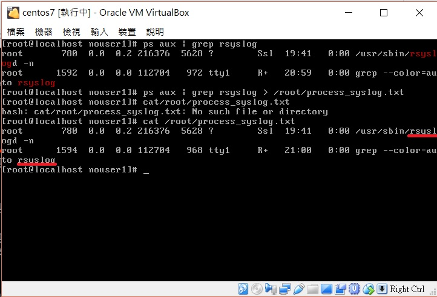

# <ol>這時候就建立完了，然後就開始設定，對著你剛建立的作業系統點右鍵候選設定值
</ol>

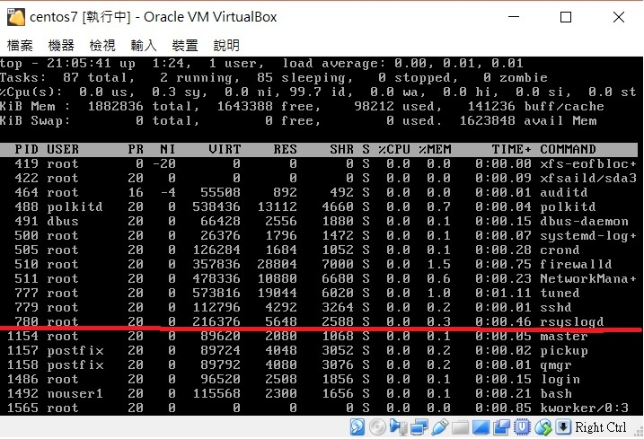

# <ol>點擊存放裝置，會看到右邊有一個寫"空"的光碟圖示，點它之後，再往右選擇光碟機，然後選擇剛剛安裝的Centos
</ol>

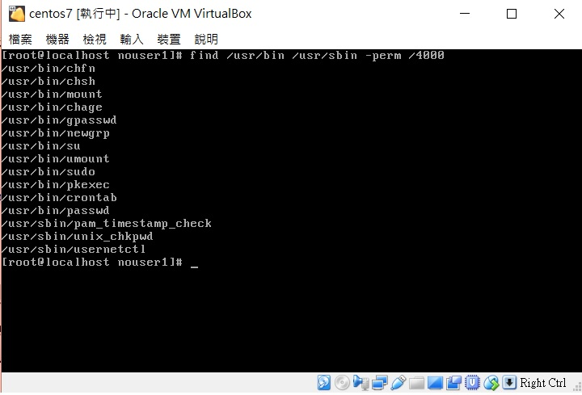

# <ol>點擊網路，點擊介面卡1，點選進階，確定"線路已連接"有打勾，表示有連接到網路
</ol>

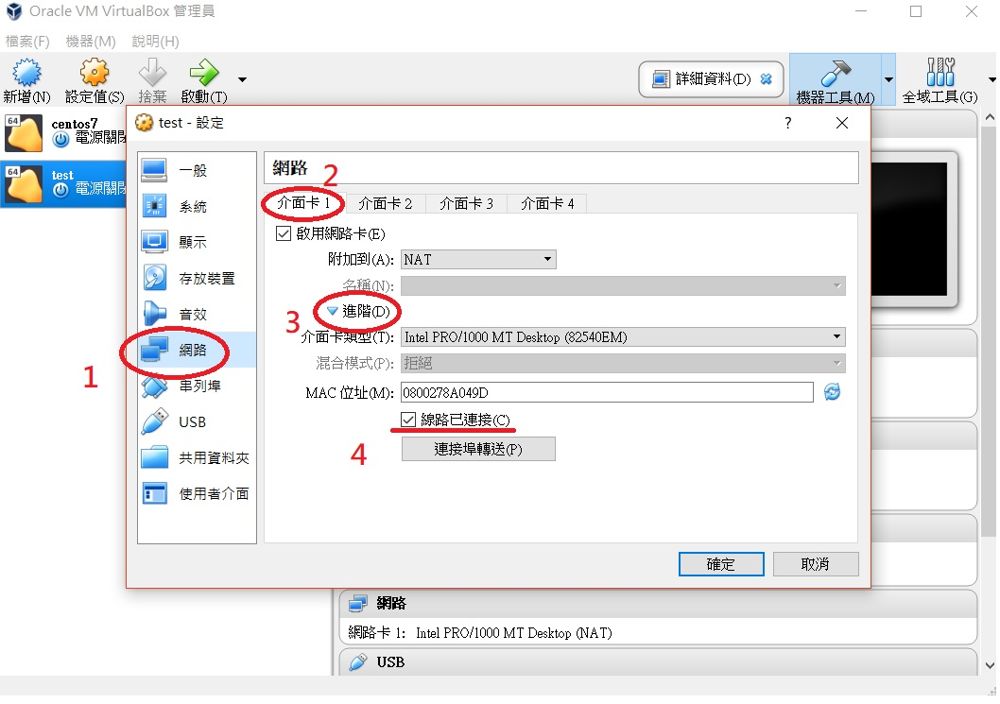

# <ol>都設定好後，點擊右下角的確定，然後啟動這個作業系統，選擇"Install CentOS 7"
</ol>

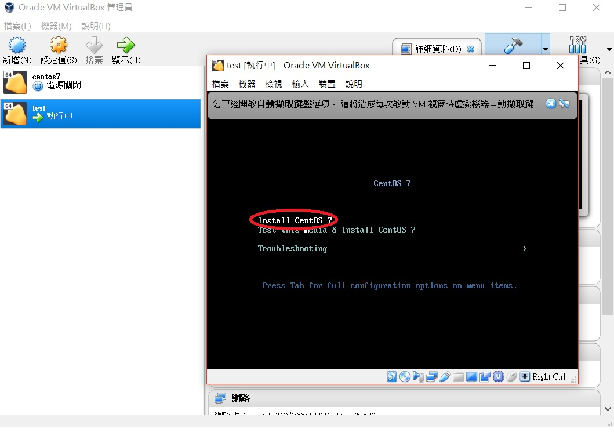

# <ol>然後就開始設定CentOS 7，第一步是選擇語言，這裡我選英文，點選continue
</ol>

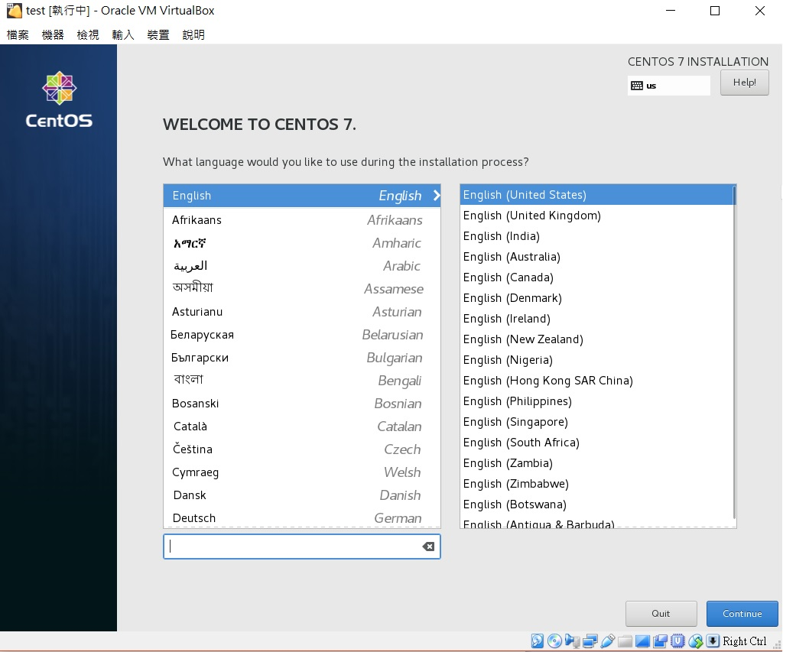

# <ol>LOCALIZATION就是一些基本設定，可以依個人需求去調整。點選installation destination
</ol>

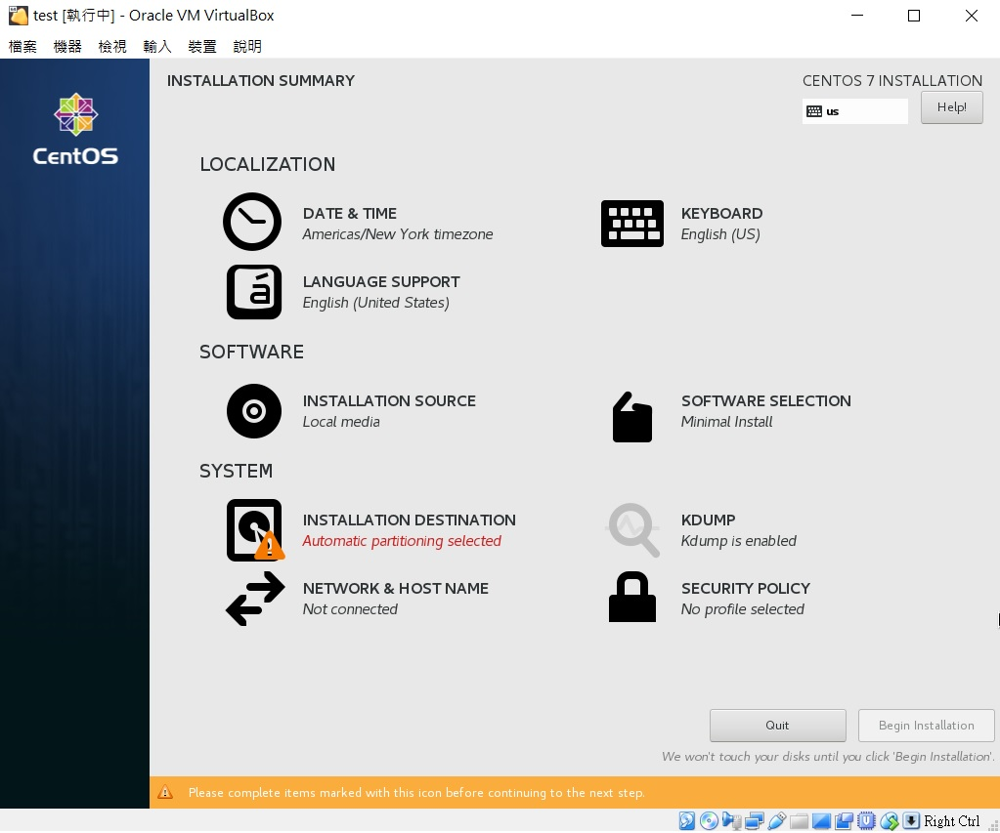

# <ol>下面有automatically configure partitioning和I will configue partitioning，前者它會自動幫你分割，後者可以自己去分割，這裡我選後者，然後按左上的Done
</ol>

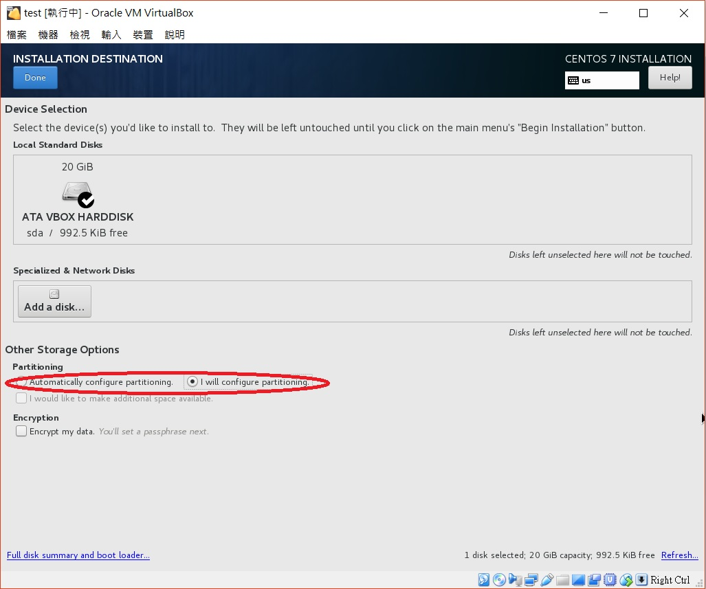

# <ol>中間有個"LVM"點它後選擇Standard Partition，就可以開始分割了，點左下的"+"
</ol>

# <ol>然後會出現第一張圖的畫面，"/"是一定要設定的，之後其他的看自己要怎麼分割，分割完大概如第二張圖，然後點擊Done，在點擊accept change
</ol>

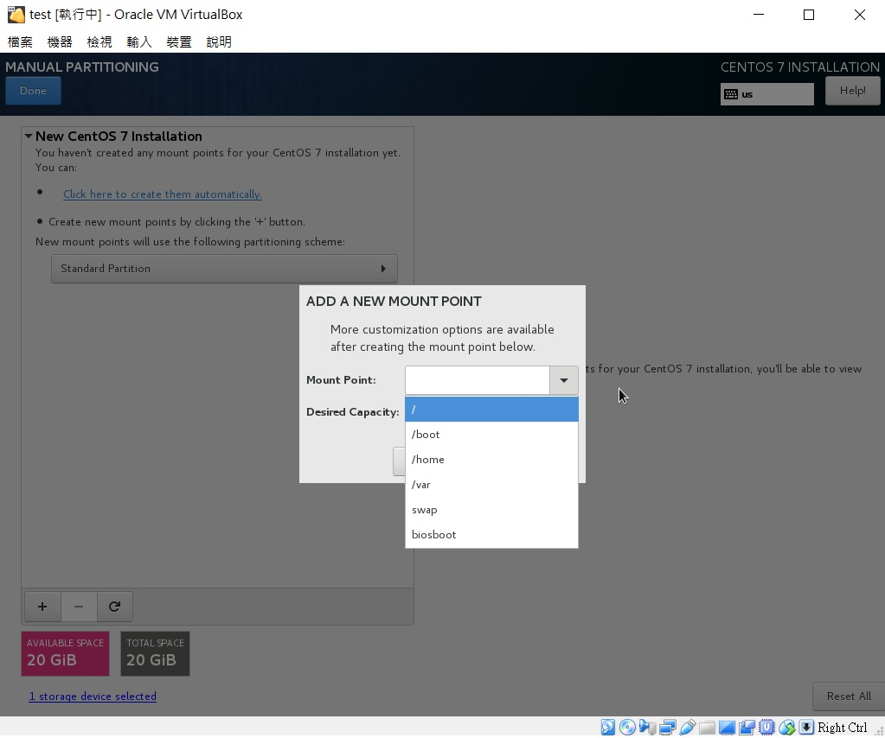
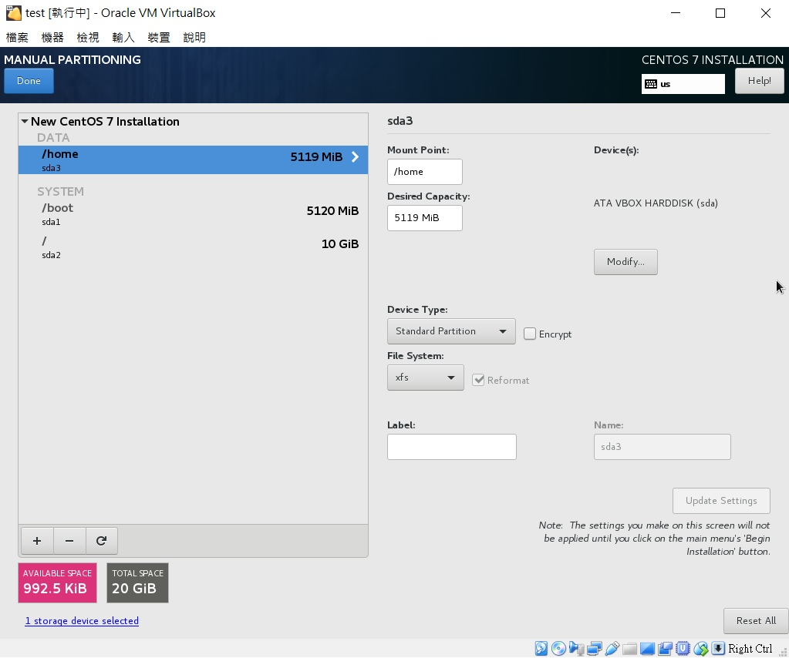

# <ol>然後就點選右下的begin installation
</ol>

# <ol>在安裝的同時，可以去設定帳號密碼，包括root跟一般帳密
</ol>

# <ol>安裝完成後啟動，輸入帳密就可以使用了
</ol>

