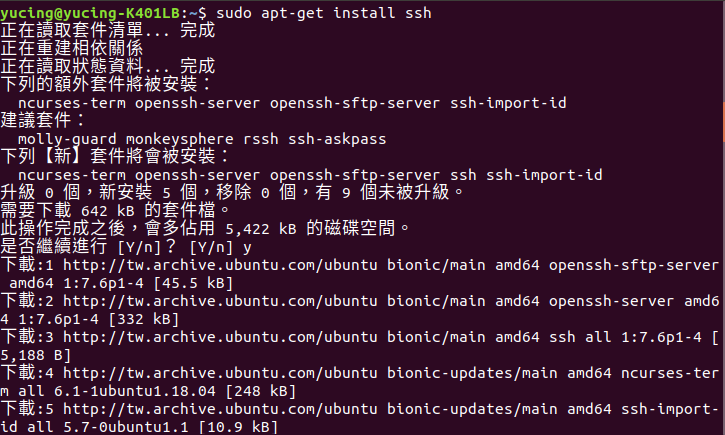
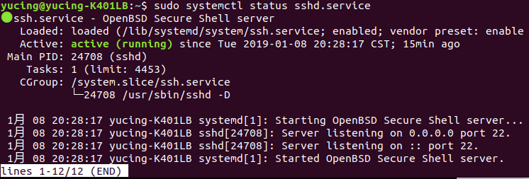
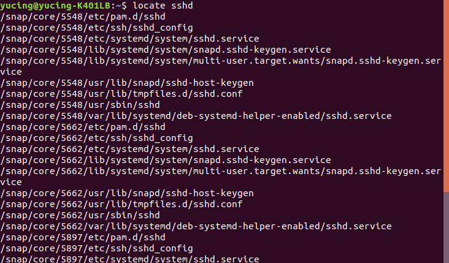
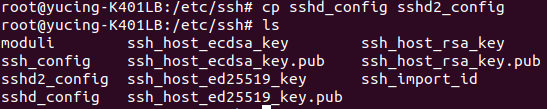
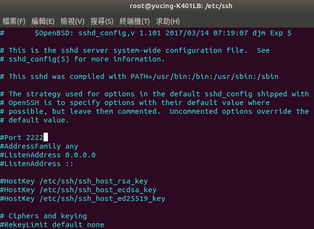
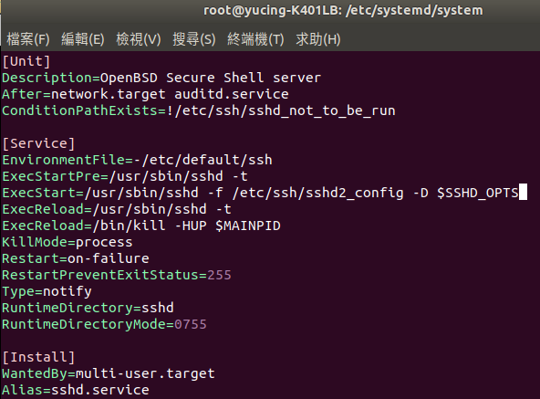
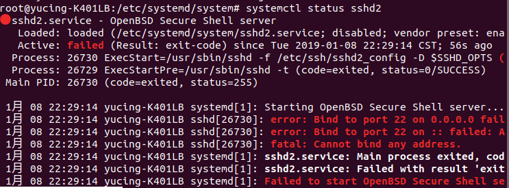
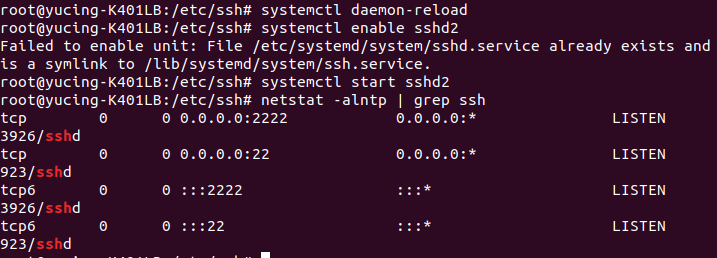

### HW10

1.先安裝ssh 
 
2.用程式碼systemctl觀察sshd狀況 
 
3.用locate找sshd裡面的config跟service 
 
4.複製sshd_config 
 
5.把它的port改成2222 
 
6.複製service並把ExecStart增加參數 
 
7.使用systemctl start sshd2發現無法開啟 
 
8.加入port2222，並且更新，最後再用netstat -alntp | grep ssh查看 
 