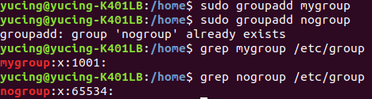
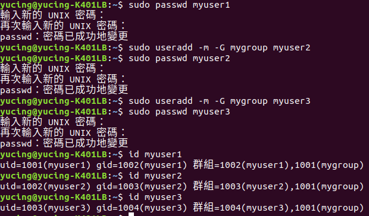
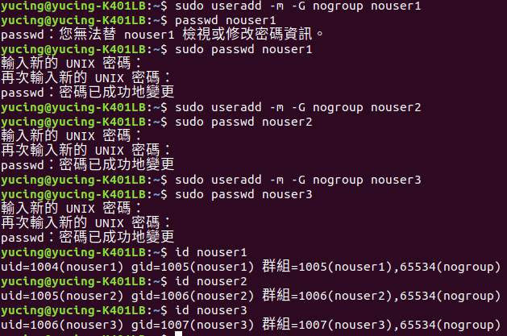
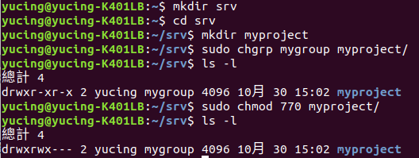
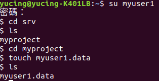
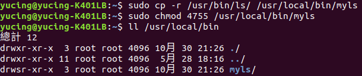
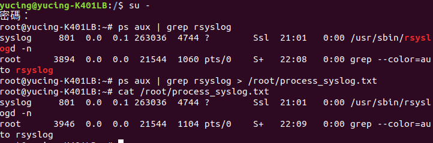
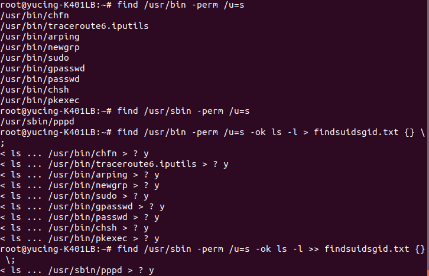

### HW4

1.(1)用程式碼 
<pre><code># groupadd 群組名稱</code></pre>
來建立mygroup,nogroup兩個群組 
 
(2)用程式碼 
<pre><code># useradd -m -G 帳號加入的群組名稱 名稱</code></pre>
來建立myuser1,myuser2,myuser3的帳號,且加入mygroup的群組 
在用passwd來建立密碼 
 
(3)用程式碼 
<pre><code># useradd -m -G 帳號加入的群組名稱 名稱</code></pre>
來建立nouser1,nouser2,nouser3的帳號,且加入nogroup的群組 
在用passwd來建立密碼 
 
(4)用程式碼 
<pre><code># chgrp 群組名稱 資料夾</code></pre>
修改檔案擁有的群組為mygroup，且用chmod 770來修改權限 
 
(5)用程式碼 
<pre><code># su 帳號名稱</code></pre>
把帳號切換成myuser1，進入目錄建立myuser1.data的檔案 
 
(6)用程式碼 
<pre><code># cp -r 原本位置 複製位置</code></pre>
把檔案複製過去，再把權限改成4755就可以執行 
 

2.(1)用程式碼 
<pre><code># ps aux "直條" grep 程序名稱</code></pre>
找到的rsyslog程序的PID,PRI,NI,COMMAND資訊 
確認程序後，原本的指令加上>重導向輸出，再用cat確認檔案 
 

3.(1)用程式碼 
<pre><code># find 路徑 -perm /u=s</code></pre>
找出/usr/bin及/usr/sbin目錄中，含有SUID的特殊檔案檔名 
因為要含有SUID的檔案，所以程式碼後面要加上-prem /u=s 
我們再用原本的指令加上-ok ls -l >想要覆蓋的檔案 {} \  
最後再用cat查詢確認有沒有成功 
 
 