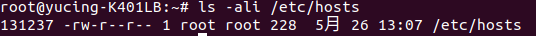
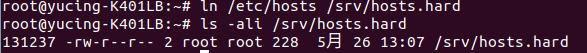
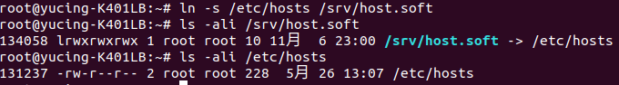

### HW5

1. 
1.(1)用程式碼 
<pre><code># ls -ali 檔案位置</code></pre>
查看/etc/hosts檔案的inode 
inode號碼為 131237 
(2)目前共有一個檔名在使用 
 
2.(1)用程式碼 
<pre><code># ln 原本檔案位置 複製檔案位置</code></pre>
做實體連結，/srv/hosts.hard的inode為 131237 
(2)目前共有兩個檔名在使用 
(3)因為hard link是把原本檔案、複製檔案都連結到同一個inode 
所以兩個檔案的資料會相同，你刪掉任何一個檔名，inode及block還是存在 
 
3.(1)用程式碼 
<pre><code># ln -s 原本檔案位置 複製檔案位置</code></pre>
做符號連結，/srv/hosts.soft的inode為134058 
(2)目前共有一個檔名在使用 
(3)因為soft link是利用檔案做指向動作，所以inode會不同 
如果指向地原本檔案刪除，那麼複製的檔案就打不開 
 