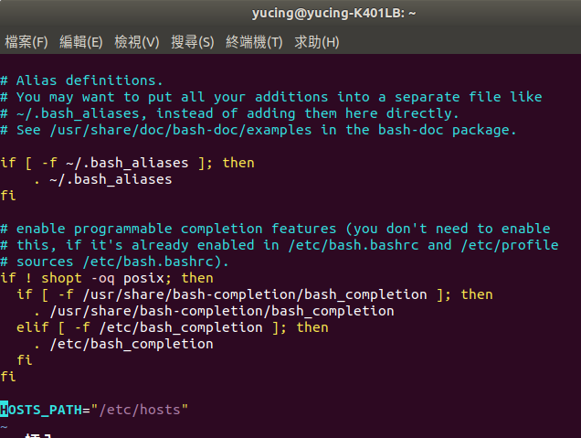
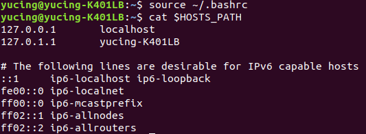
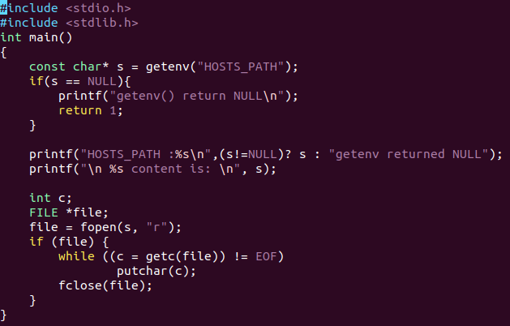
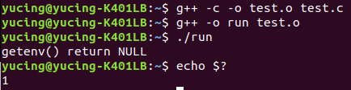
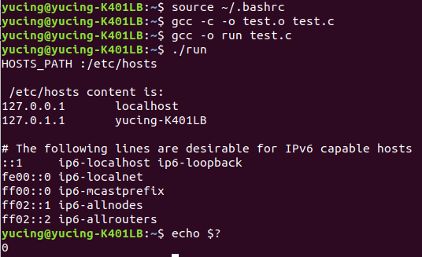

### HW6

1. 
(1)輸入vi .bashrc，進去後在最下面一行加上HOSTS_PATH=/etc/hosts 
 
使用source ~/.bashrc，讓變數不登出就能生效 
最後用cat去呈現 
 
(2)輸入vi test.c，進去後打上範例程式碼 
 
用g++ -c -o 去compiler程式碼，compiler完後用./執行 
最後得到NULL及1，因為HOSTS_PATH是區域變數 
 
(3)要讓變數在其他子程序執行，需要在變數前面加入export使變成環境變數 
 
 