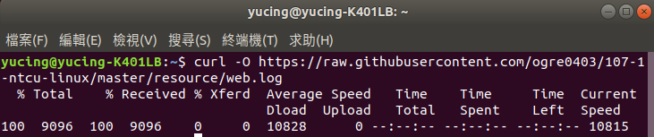
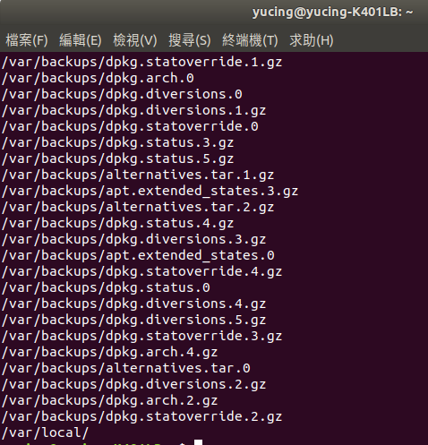
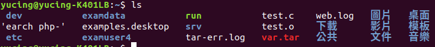
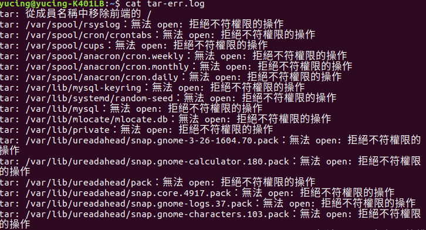

### HW7

1.(1)用程式碼 
<pre><code># curl -O 網址</code></pre>
下載日誌檔 
 
(2)用程式碼 
<pre><code># cat web.log</code></pre>
顯示error的原因 
 
2.(1)用程式碼 
<pre><code># tar -cvf var.tar /var 2> tar-err.log</code></pre>
製成壓縮檔 
 
檢查是否成功 
 
用程式碼 
<pre><code># cat tar-err.log</code></pre>
抓出檔案中的錯誤，並且輸出 
 