# HW3
### 使用ubuntu
一 
* 先建立三個用戶，密碼皆為ItLsExam 
<pre><code>adduser examuser1
密碼 : ItLsExam</code></pre>
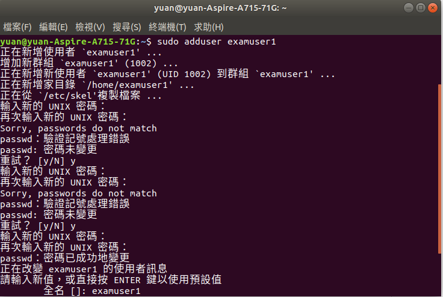 
2,3以此類推 
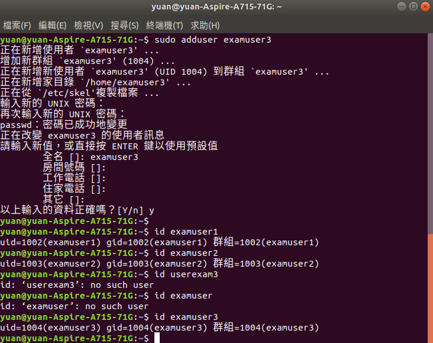 
* 刪除系統中的 examuser3 這個帳號，使用[-r]將這個帳號的家目錄同步刪除 
<pre><code>userdel -r examuser3</code></pre>
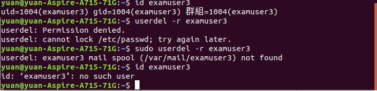 
* 誤刪examuser3，在ubuntu下，若未完全刪除，再次使用[adduser]會重建該帳號 
<pre><code>userdel examuser1</code></pre>
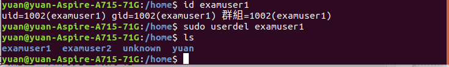 
<pre><code>adduser examuser1
密碼 : ItLsExam</code></pre>
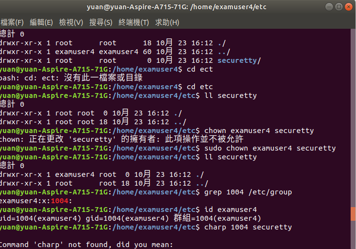 

二 
* 創建examuser4如同前面所敘 
更改使用者&權限以及group 
<pre><code>chown examuser4 securetty
chmod 777 securetty
charp 1004 securetty</code></pre>
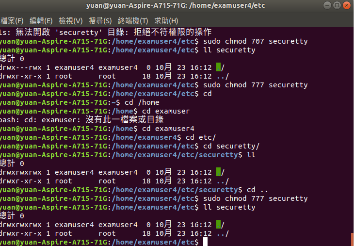 
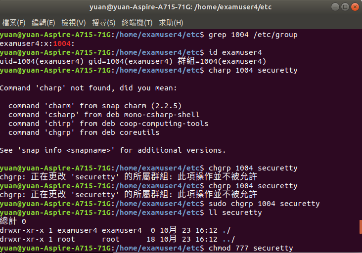 
* 建立 /examdata/change.txt，擁有者為sshd，擁有群組為users，sshd 可讀可寫，users 群組成員可讀，其他人沒權限。
<pre><code>mkdir examdata
cd examdata
touch change.txt</code></pre>
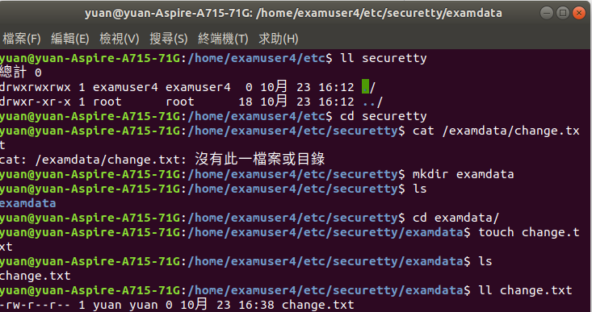 
更改使用者、group以及日期 
<pre><code>chown sshd change.txt
charp users change.txt
touch -t 201212211200 change.txt</code></pre>
 

三 
* 建立檔案 & 複製 & 更改使用權限/etc/hosts
<pre><code>cp /etc/hosts ./dir1/file1</code></pre>
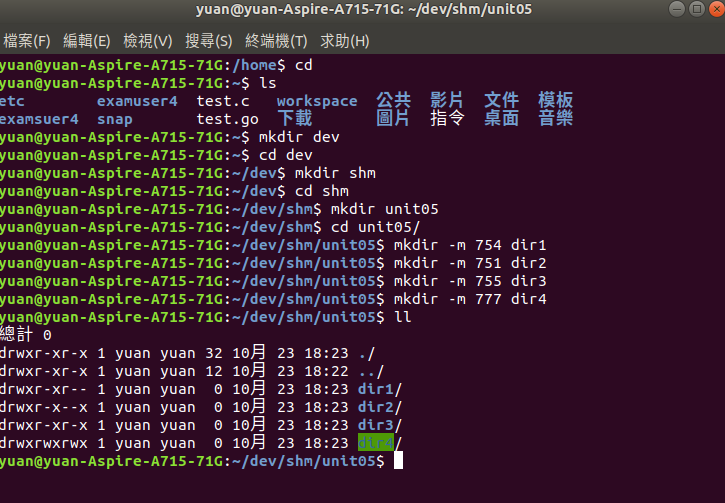 
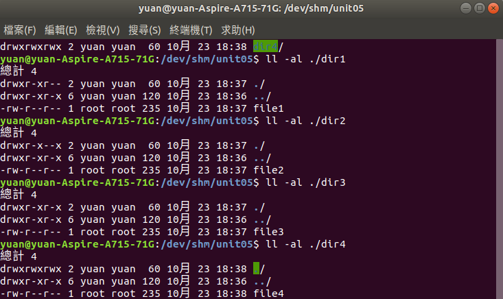 
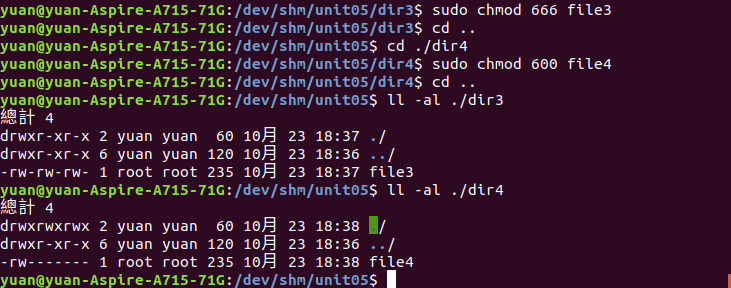 
<pre><code>cp /etc/hosts ./dir1/file1</code></pre>
* 使用 ls -l /dev/shm/unit05/dir[1-4] 
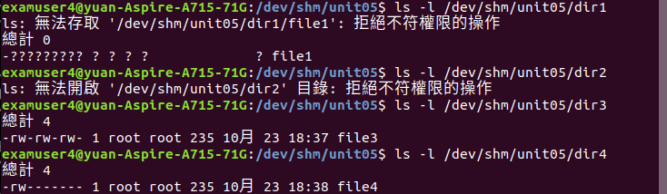 
fire1 可讀不可執行，所以只到有甚麼東西 
file2 可執行但不可讀，無法知道內容 
file3、file4 皆可讀可執行，可知道內容 
* 使用 ls -l /dev/shm/unit05/dir1/file[1~4] 
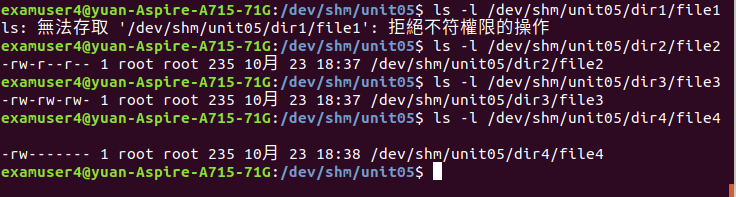 
file1因dir1無法執行，所以看不到 
file2、file3、file4因各個dir都能執行，皆能再往裡面探勘 
* vim /dev/shm/unit05/dir[1~4]/file[1~4] 
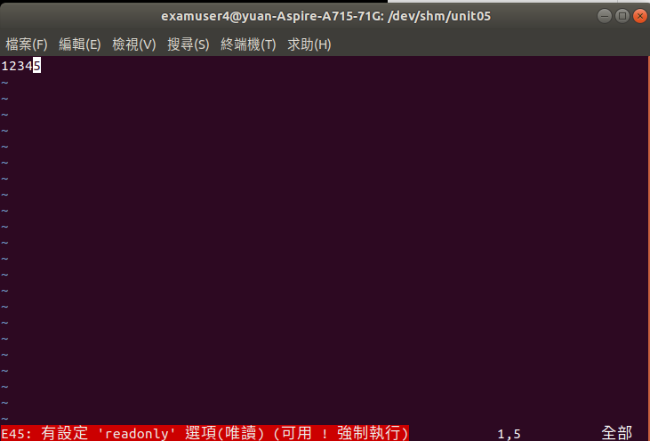 
 
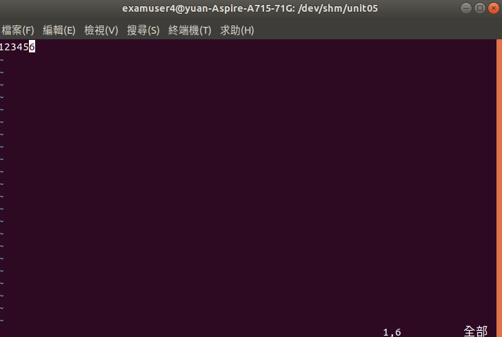 
