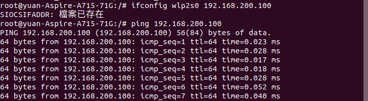

# HW5
### 使用ubuntu

1 
* 查閱檔案 
<pre><code>ls -ali /etc/hosts</code></pre>
 
incode 為 664，共一個使用者 
* 實體連結
<pre><code>ln etc/hosts srv/host.hard</code></pre>
 
incode 為 664，共3名使用者 
是完全連結，屬於同一個檔案，資料相同 
* 符號連結
<pre><code>ln -s etc/hosts srv/host.soft</code></pre>
 
incode 為 302187，共3名使用者 
像是捷徑一樣，抓取檔案，但屬於個體，若原檔刪除，符號連結的檔案就無法開啟 
