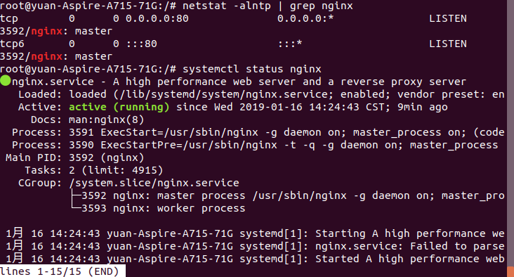
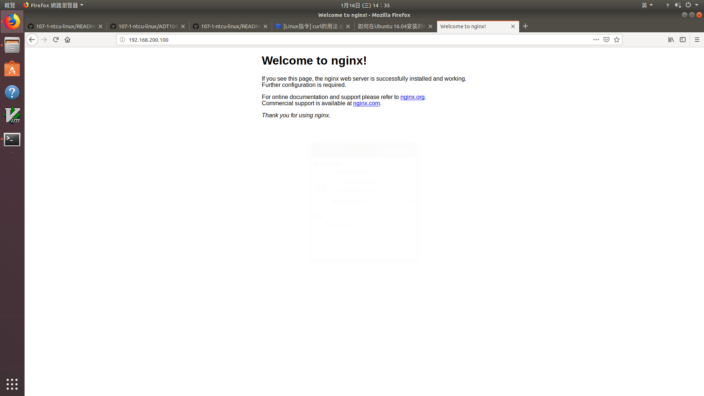

# HW10
### 使用ubuntu
一、請仿照課堂上練習，透過systemd管理二個sshd服務，並讓第二個sshd服務的 port 放行於 2222。完成後可以使用指令 netstat -alntp | grep ssh 確認是否啟動二個sshd服務，範例如下： 
複製sshd_config，製造成sshd2_config 
 
開啟sshd2_config並將port改成2222 
 
複製sshd.service，製造成sshd2.service，並編輯 
 
將ExecStart=/usr/sbin/sshd -f /etc/ssh/sshd2_config -D $SSHD_OPTS 
 
用systemctl指令重啟 
 
安裝policycoreutils-python-utils，安裝此第三方包才能執行下一航程式 
 
<pre><code>semanage port -a -t ssh_port_t -p tcp 2222</code></pre>
 
<pre><code>netstat -alntp | grep ssh</code></pre>
 
