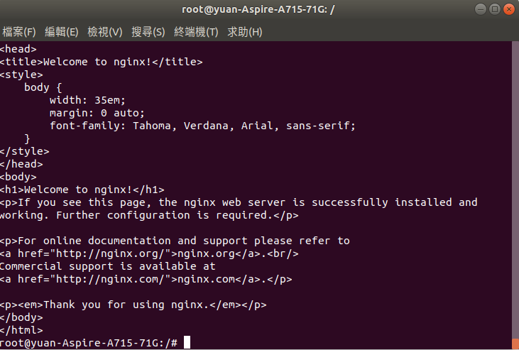

# finaltest
### 使用ubuntu
## 上機考題目

請依下述情境完成系統操作後再用相關指令進行驗證，請抓驗證指令的圖：

    * 設定virtualbox虛擬機器，加入一張host-only網路卡，在Linux裡設定虛擬機器的網路為192.168.200.100/24。請用 `ifconfig`驗證。(25%)
    </br>

    * nginx是一套網頁伺服器軟體，請用`yum`安裝，透過`systemctl`啟動後，使用`netstat`驗證nginx有在使用Port 80。(25%)
    </br>
    </br>

    * 透過實體 windows 上的瀏覽器，連線至192.168.200.100。抓圖驗證可以連線至Linux上的nginx網頁伺服器。(10%)
    </br>

    * 在Linux裡，用`curl`連線至192.168.200.100。抓圖驗證可以連線至Linux上的nginx網頁伺服器。(10%)
    </br>

    * nginx的日誌檔位於`/var/log/nginx`目錄下，當連線不存在的網頁時，nginx會記錄相關資訊，格式如下。其中client欄位為客戶端ip。 (30%)

    ```
    2019/01/15 19:28:28 [error] 12337#0: *4 open() "/usr/share/nginx/html/aa" failed (2: No such file or directory), client: 127.0.0.1, server: _, request: "GET /aa HTTP/1.1", host: "127.0.0.1"
    ```

    請使用管線指令，找出每個ip連線錯誤的次數。你可能需要使用 `cat`、`cut -d` 、 `sort` 、 `uniq -c`

    最後輸出格式，表示自127.0.0.1來的ip發生二次錯誤，自192.168.200.100來的ip發生二次錯誤. 
    
    ```
        2  127.0.0.1
        1  192.168.200.100
    ```
    