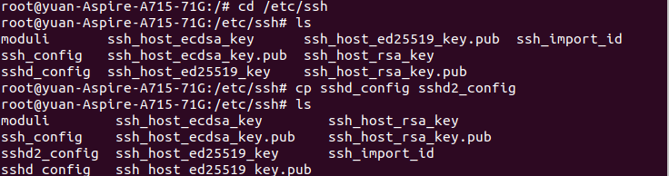
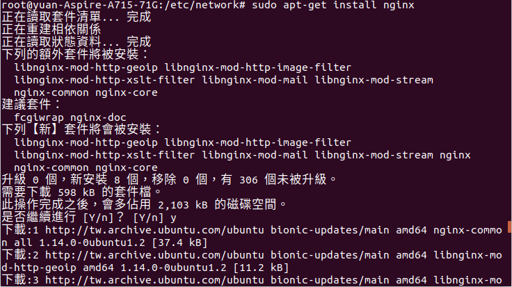
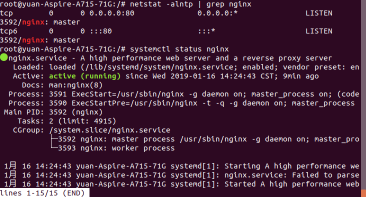
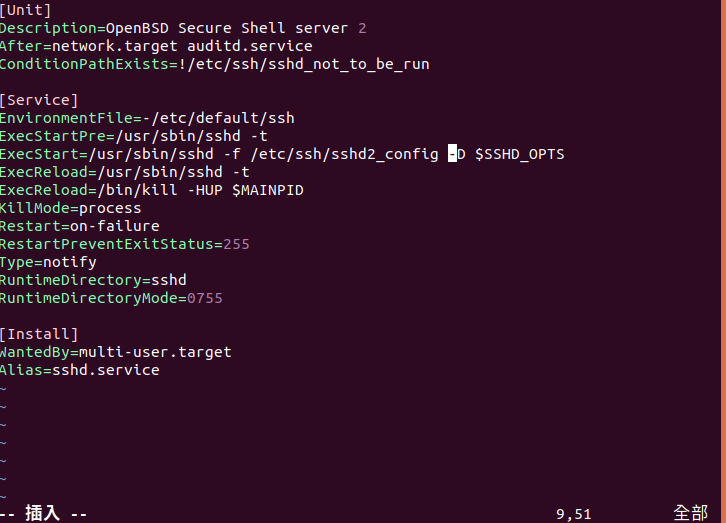
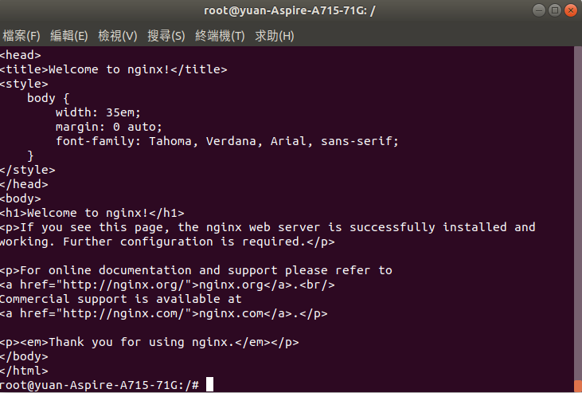
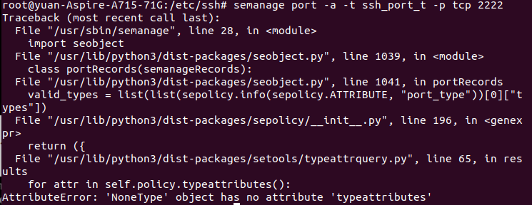

# HW7
### 使用ubuntu

1.apache log是apache web server的日誌檔 
* 先安裝curl
<pre><code>apt install curl</code></pre>
 
在使用curl，下在日誌檔 
<pre><code>curl -O https://raw.githubusercontent.com/ogre0403/107-1-ntcu-linux/master/resource/web.log</code></pre>
 
* 使用cat檢視 
<pre><code>cat web.log | grep error</code></pre>
 
2.使用 tar cvf 檔案名稱 目錄 
<pre><code>tar cvf hw7test.tar /var 2>tar-err.log</code></pre>
 
 
 
