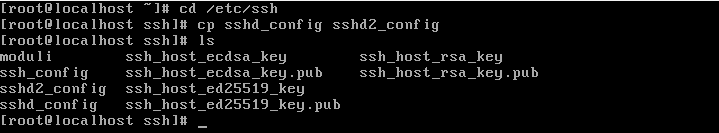
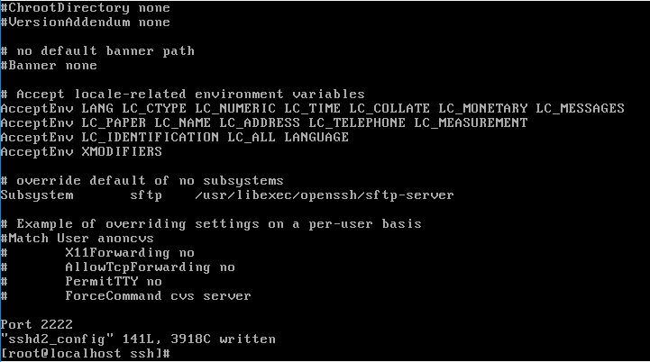
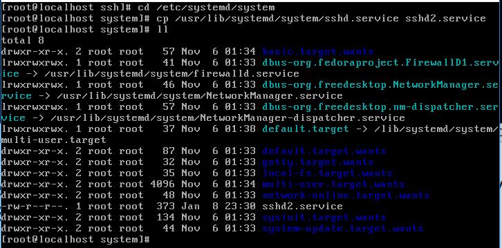
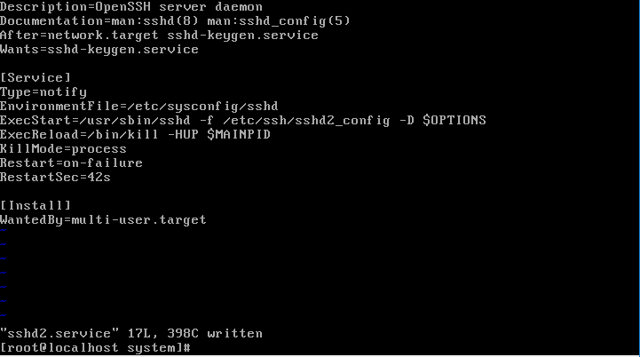
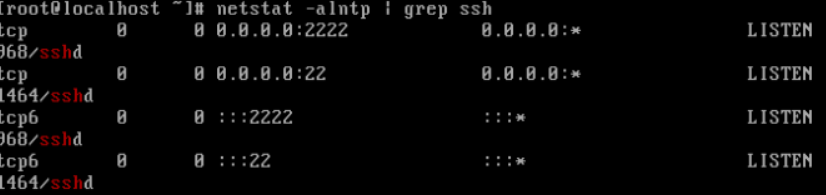

# ADT104137 - HW10

### 1.請仿照課堂上練習，透過systemd管理二個sshd服務，並讓第二個sshd服務的 port 放行於 2222。完成後可以使用指令 netstat -alntp | grep ssh 確認是否啟動二個sshd服務，範例如下：
<pre><code>$ netstat -alntp | grep ssh
tcp        0      0 0.0.0.0:22     0.0.0.0:*     LISTEN      1300/sshd
tcp        0      0 0.0.0.0:2222   0.0.0.0:*     LISTEN      15275/sshd
tcp6       0      0 :::22          :::*          LISTEN      1300/sshd
tcp6       0      0 :::2222        :::*          LISTEN      15275/sshd</code></pre>

<pre><code>Note 1: CentOS有使用SELinux ，故預設只允許 SSH 使用埠號 22，若要使用埠號 2222，使請用下列指開啟並檢查

```sh
$ semanage port -a -t ssh_port_t -p tcp 2222
$ semanage port -l | grep ssh
ssh_port_t tcp 2202, 22
```  

Note 2: CentOS預設的防火牆firewalld會禁止訪問埠號2222，若要透過2222埠連ssh，請先關閉firewalld。
HW9: Deadline: 2019/1/1 23:59</code></pre>

將目錄轉換到/etc/ssh裡，並且將sshd_config內容複製到sshd2_congig
<pre><code># cd /etc/ssh
# cp sshd_config sshd2_config</code></pre>


編輯sshd2_config 在內容隨意處加入Port 2222
<pre><code># vi sshd2_config</code></pre>


轉換到/etc/systemd/system目錄下將sshd.service 複製到 sshd2.service
<pre><code># cd /etc/systemd/system
# cp /usr/lib/systemd/system/sshd.service sshd2.service</code></pre>


修改sshd2.service的ExecStart部分為ExecStart=/usr/sbin/sshd -f /etc/ssh/sshd2_config -D $OPTIONS



安裝檔案
<pre><code># yum provides semanage
# yum install policycoreutils-python
# yum install net-tools</code></pre>

使用 netstat -alntp | grep ssh顯示


