# ADT104137 - HW3
## 1.
### * 建立帳號名稱分別為 examuser1 ,examuser2 ,examuser3 的用戶，同時為這三個帳戶設定密碼 ItIsExam
<pre><code># useradd examuser1
# passwd examuser1</code></pre>
系統會詢問您想設定的密碼，輸入 IsItExam
<pre><code>New password:IsItExam(看不到)</code></pre>
再次確認密碼
<pre><code>Retype new password:IsItExam(看不到)</code></pre>
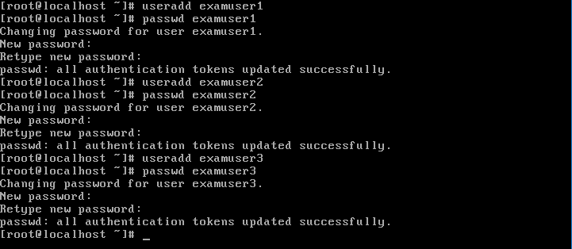
### * 刪除系統中examuser3的帳號，連同家目錄及郵件檔案同步刪除
<pre><code># userdel -r examuser3</code></pre>
在userdel指令中加入-r，會連同該帳號的家目錄及郵件檔案一同刪除 
輸入id指令查詢
<pre><code># id examuser3</code></pre>
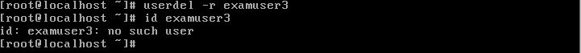 
轉換到home下查詢
<pre><code># cd /home
# ls -l</code></pre>
發現已經沒有之前新增的examuser3之目錄 
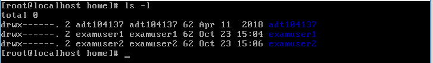
### * 刪除examuser1，但保留其家目錄及郵件檔案
<pre><code># userdel examuser1</code></pre>
刪除examuser1，但沒有在指令中加-r，保留了他的家目錄 
在home中查詢
<pre><code># ls -l</code></pre>
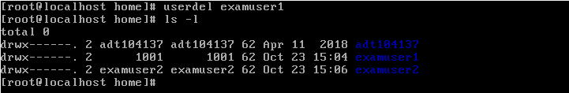 
發現其家目錄由UID以及GID替代examuser1為使用者
### * 嘗試以原本的UID及GID重建帳號
建立一群組，給定原使用者的GID作為群組ID
<pre><code># gruopadd -g 1001 examuser1</code></pre>
創建帳號，指定原UID為使用者的ID，並將該使用者加入原群組
<pre><code># useradd -u 1001 -g examuser1 examuser1</code></pre>
查詢使用者的UID及GID
<pre><code># id examuser1</code></pre>
查詢home下的家目錄
<pre><code># ls -l</code></pre>
重新定密碼給examuser1
<pre><code># passwd examuser1</code></pre>
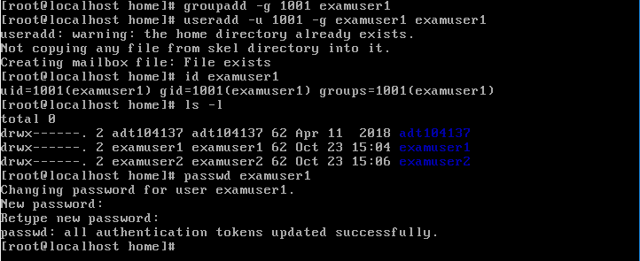

## 2.
### * 建立examuser4使用者
<pre><code># useradd examuser4
# passwd examuser4</code></pre>
### * 將/etc/securetty 複製給 examuser4，且該帳號要能夠完整使用該檔案
查看securetty原本的權限
<pre><code># ls -ld /etc/securetty</code></pre>
將securetty複製到examuser4之家目錄下
<pre><code># cp -r /etc/securetty /home/examuser4</code></pre>
轉換到家目錄下
<pre><code># cd /home/examuser4</code></pre>
更改securetty的擁有者以及其權限
<pre><code># chown examuser4 securetty
# chmod 777 securetty</code></pre>
最後確認權限
<pre><code># ls -l</code></pre>
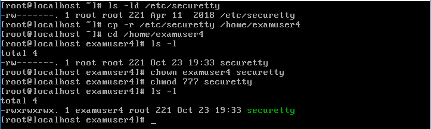

#### 建立一個名為 /examdata/change.txt 的空檔案
<pre><code># mkdir examdata
# touch examdata/change.txt</code></pre>
#### 修改檔案相關資料
檔案的擁有者為 sshd
<pre><code># chown sshd change.txt</code></pre>
擁有群組為 users
<pre><code># chgrp users change.txt</code></pre>
sshd 可讀可寫，users 群組成員可讀， 其他人沒權限
<pre><code># chmod 640 change.txt</code></pre>
修改日期調整成 2012 年 12 月 21 日
<pre><code># touch -t 1212210000 change.txt</code></pre>
最後確認修改結果
<pre><code># ls -l</code></pre>
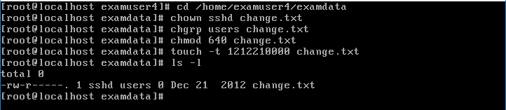

## 3.
### * 建立資料夾，以及修改權限，檢查權限
<pre><code># mkdir unit05
# chmod 775 unit05
# ls -l</code></pre>
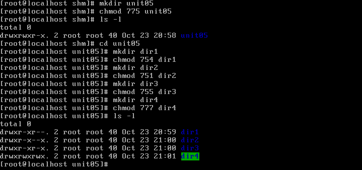
### *　複製檔案到資料夾，進入資料夾中修改檔案權限
<pre><code># cp /etc/hosts ./dir1/file1
# cd dir1
# chmod 644 file1
# ls -l</code></pre>
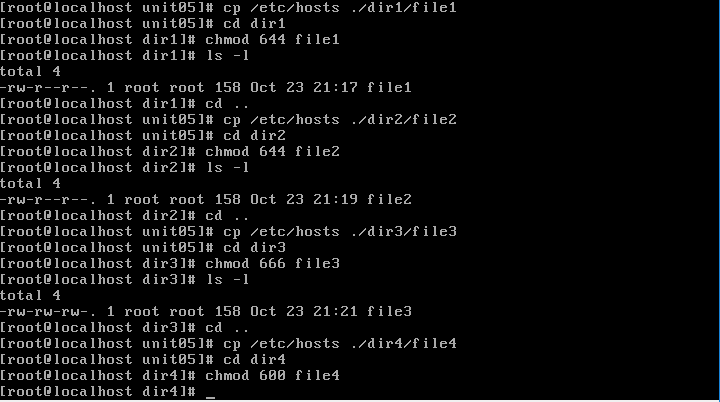
### * 切換為一般使用者
<pre><code># su examuser2</code></pre>
#### 輸入 ls -l /dev/shm/unit05/dir1
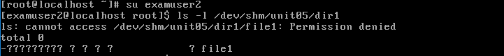 
根據一般使用者的權限，unit05是可閱讀且執行的，所以能順利進到資料夾裡面 
但dir1能閱讀不能執行，只能知道在dir1裡有file1，卻無法得知詳細資料
#### 輸入 ls -l /dev/shm/unit05/dir2
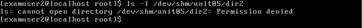 
dir2能執行卻不能閱讀，導致無法判讀dir2內
#### 輸入 ls -l /dev/shm/unit05/dir3
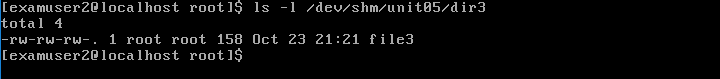 
dir3可閱讀且可執行，順利得知資料夾內檔案的詳細資料
#### 輸入 ls -l /dev/shm/unit05/dir4
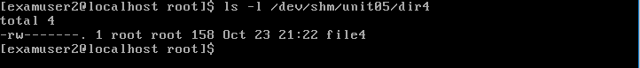 
同樣能執行跟閱讀，能得知詳細資料
#### 輸入 ls -l /dev/shm/unit05/dir1/file1
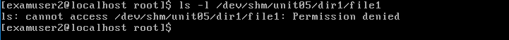 
dir1無法執行，沒辦法得知資料夾內file1資料
#### 輸入 ls -l /dev/shm/unit05/dir2/file2
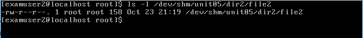 
dir2能被執行，所以能得知詳細資料
#### 輸入 ls -l /dev/shm/unit05/dir3/file3
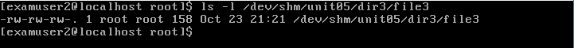 
dir3能被執行且閱讀
#### 輸入 ls -l /dev/shm/unit05/dir4/file4
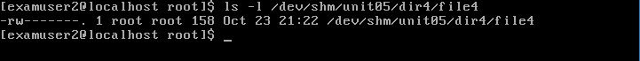 
dir4能被執行
#### 輸入 vi /dev/shm/unit05/dir1/file1
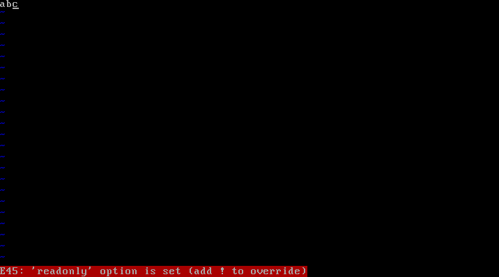 
無法被存取，dir1無法執行，file1內文字也沒有顯示
#### 輸入 vi /dev/shm/unit05/dir2/file2
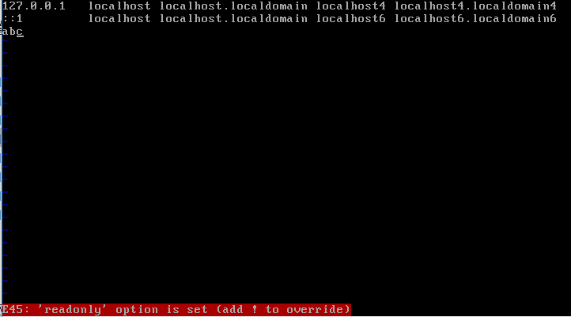 
只能被讀取
#### 輸入 vi /dev/shm/unit05/dir3/file3
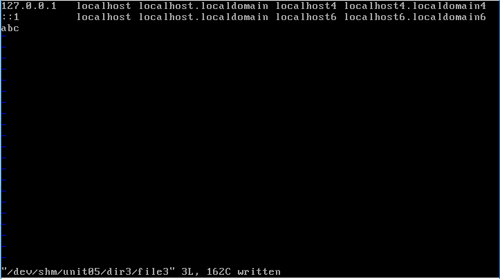 
可以存取修改資料
#### 輸入 vi /dev/shm/unit05/dir4/file4
 
無法讀取以及存取，內部資料無法得知
