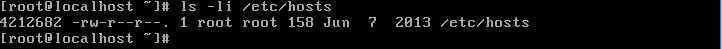
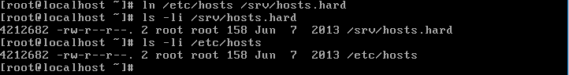
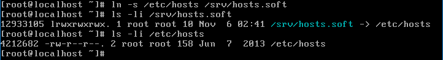

# ADT104137 - HW5

## 關於連結檔案的建置行為:

### 在 /etc/hosts 檔案，請找出

* 該檔案的 inode 號碼為幾號？

* 這個 inode 共有幾個檔名在使用？

<pre><code># ls -li /etc/hosts</code></pre>
 
該檔案的inode為4212682，連結數為1表示有1個檔名連結到這個inode號碼

### 建立實體連結，原始檔案為 /etc/hosts 而新的檔案檔名為 /srv/hosts.hard，請找出

* /srv/hosts.hard的 inode 號碼為幾號？

* 這個 inode 共有幾個檔名在使用？

* 說明原因

建立實體連結(hard link)
<pre><code># ln /etc/hosts /srv/hosts.hard</code></pre>
查詢
<pre><code># ls -li /srv/hosts.hard</code></pre>
 
此建立實體連結後的檔案的inode同為4212682，但連結數為2。 
這是因為建立的hard link與原檔案連結同個inode，所以檔案資訊都一樣但連結數改變。

### 建立符號連結，原始檔案為 /etc/hosts 而新的檔案檔名為 /srv/hosts.soft，請找出

* /srv/hosts.soft的 inode 號碼為幾號？

* 這個 inode 共有幾個檔名在使用

* 說明原因

建立符號連結(Symbolic link)
<pre><code># ln -s /etc/hosts /srv/hosts.soft</code></pre>
查詢
<pre><code># ls -li /srv/hosts.soft</code></pre>
 
建立Symbolic link的檔案inode為12933105，連結數為1。 
這是因為Symbolic link是建立一個獨立的檔案，會讓資料的讀取指向他連結的原檔檔名，所以inode和連結數與原檔不相同

