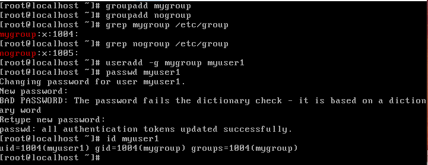
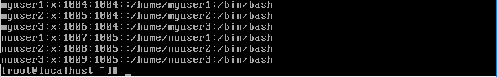
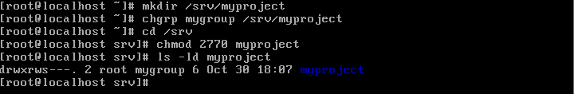
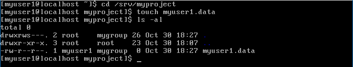
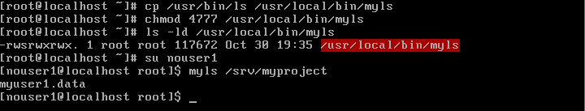
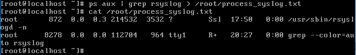
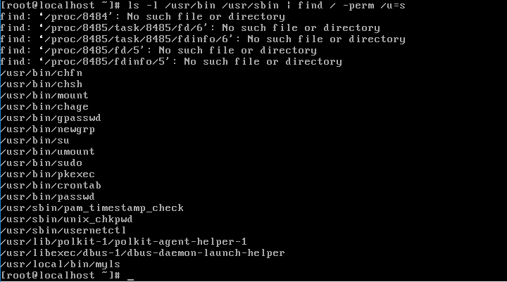
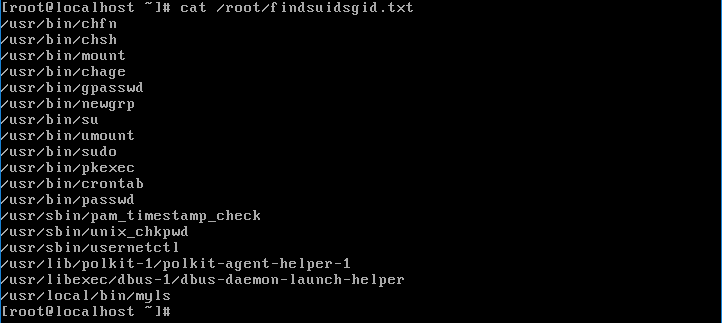

# ADT104137-HW4
## 1. 管理群組共用資料的權限設計
### * 建立群組名稱
<pre><code># groupadd mygroup
# groupadd nogroup</code></pre>
可用grep來搜尋檢查群組及GID
<pre><code># grep mygroup /etc/group</code></pre>
### * 建立帳號名稱、密碼，以及加入群組
創立使用者帳號時，同時加入群組
<pre><code># useradd -g mygroup myuser1</code></pre>
設定密碼
<pre><code># passwd myuser1</code></pre>
檢查使用者UID及GID
<pre><code># id myuser1</code></pre>
 
可檢視所有帳戶之UID及GID
<pre><code># cat /etc/passwd</code></pre>

### * 建立一個名為 /srv/myproject 的目錄，此目錄可以讓 mygroup 群組內的使用者完整使用，且【新建的檔案擁有群組】為 mygroup，其他人不能有任何權限
建立/srv/myproject
<pre><code># mkdir /srv/myproject</code></pre>
改變目錄的擁有群組
<pre><code># chgrp mygroup /srv/myproject</code></pre>
轉換到srv內對myproject的權限進行設定
<pre><code># cd /srv
# chmod 2770 myproject</code></pre>
2770的2是SGID設定，建立新檔案的群組與此目錄的群組相同 
 
檢查目錄權限
<pre><code># ls -ld myproject</code></pre>

### * 以 myuser1 的身分前往 /srv/myproject 目錄，嘗試建立一個名為 myuser1.data 的檔案，之後登出 myuser1
切換使用者
<pre><code># su myuser1</code></pre>
前往/srv/myproject
<pre><code># cd /srv/myproject</code></pre>
建立myuser1.data
<pre><code># touch myuser1.data</code></pre>

### * 復制/usr/bin/ls至/usr/local/bin/myls後，完成下列操作 雖然 nogroup 群組內的用戶對於 /srv/myproject 應該沒有任何權限，但當 nogroup 內的用戶執行 /usr/local/bin/myls 時，可以產生與 ls 相同的資訊，且暫時擁有 mygroup 群組的權限，因此可以查詢到 /srv/myproject 目錄內的檔名資訊。 也就是說，當你使用 nouser1 的身分執行【myls /srv/myproject】時，應該是能夠查閱到該目錄內的檔名資訊。
復制/usr/bin/ls至/usr/local/bin/myls
<pre><code># cp /usr/bin/ls /usr/local/bin/myls</code></pre>
給myls的SUID權限
<pre><code># chmod 4777 /usr/local/bin/myls</code></pre>
使用者切換成nouser1，以該身分執行myls /srv/myproject
<pre><code># su nouser1
# myls /srv/myproject</code></pre>
可查閱到該目錄內的檔名資訊myuser1.data 

## 2. 用程序觀察的指令，搭配 grep 的關鍵字查詢功能，將找到的 rsyslog 相關的程序的 PID, PRI, NI, COMMAND 等資訊轉存到 /root/process_syslog.txt 檔案中
<pre><code># ps aux | grep rsyslog > /root/process_syslog.txt</code></pre>
利用 ps aux (觀察程序)配合 grep (搜尋)找到含rsyslog程序，再配合 > 轉存資訊到 /root/process_syslog.txt 裡 
 
可用cat指令查看內容
## 3. 使用 find 找出 /usr/bin 及 /usr/sbin 兩個目錄中，含有 SUID 的特殊檔案檔名，並使用 ls -l 去列出找到的檔案的相關權限後，將螢幕資料轉存到 /root/findsuidsgid.txt 檔案中
<pre><code># ls -l /usr/bin /usr/sbin | find / -perm /u=s > /root/findsuidsgid.txt</code></pre>
find / -perm /u=s 能列出系統中所有 SUID 的檔案 
 
以 > 轉存資料 
最後利用cat指令確認txt 

