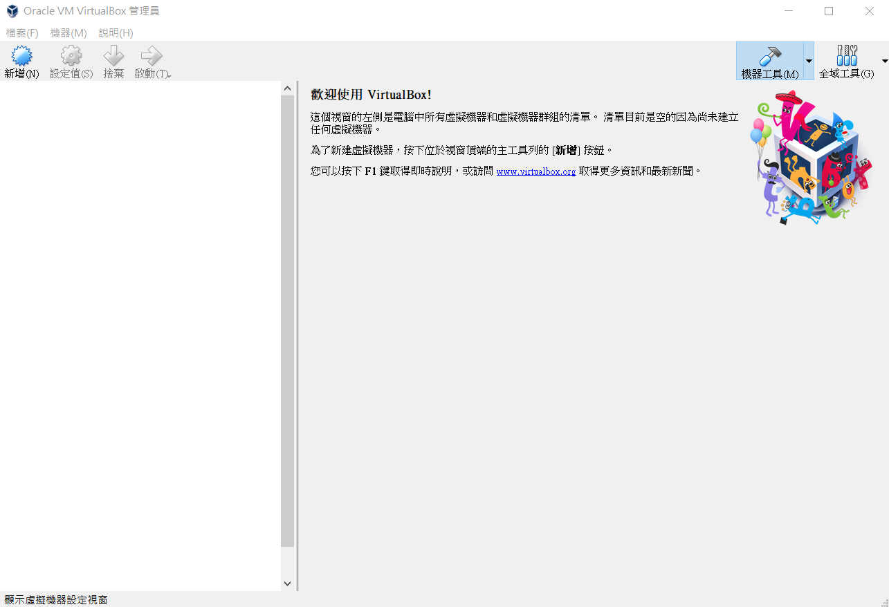

# 虛擬主機安裝
 
為了成功在電腦上運行Linux，而又不動到內建的windows作業系統，我們需要虛擬主機程式的幫助，首先下載virtualbox來進行以下作業。 
 
 
成功下載virtualbox後，為欲安裝的虛擬主機取名稱、建立記憶體空間及虛擬硬碟相關設定。 
 
 
右鍵點選虛擬主機名稱選擇設定值，設定虛擬主機的存放位置，將預先下載好虛擬主機的ISO檔案放入IDE欄位下。 
 
 
設定網路選項，點選介面卡2選擇「僅限主機」介面卡 
 
 
啟動虛擬主機程式進行安裝 
 
 
進行磁碟分割，選則欲分割的硬碟採取手動分割，選擇標準分割區類型(sda)，建立/、/home、swap等分割區 
 
 
進入網路與主機名稱，將網路選項開啟 
 
 
建立使用者的名稱及密碼，還有root的密碼。等待程式安裝完成即可 
 
 
成功進入虛擬主機後，登入使用者帳號及密碼，輸入df查看所分割的磁區
