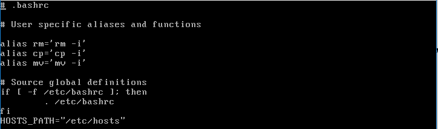
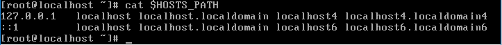
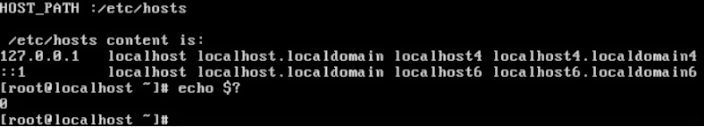

# ADT104137 - HW6

* 請在家目錄下的.bashrc裡新增一個shell變數 HOSTS_PATH=/etc/hosts，(注意不需用export)，說明如何不登出讓HOSTS_PATH變數生效，執行cat $HOST_PATH確認有讀取到檔案內容。

透過vi編輯
<pre><code># vi ~/.bashrc</code></pre>
在文件內輸入
<pre><code>HOSTS_PATH="/etc/hosts"</code></pre>
 
編輯完成後，按esc、輸入 :wq 存取並退出編輯模式 

輸入讀環境設定檔指令
<pre><code># source ~/.bashrc</code></pre>
最後以cat 確認有讀取到檔案內容
<pre><code># cat $HOSTS_PATH</code></pre>

* 在C語言程式可以用getenv()讀取LINUX的環境變數，範例程式如題。請在Linux裡編譯此範例程式並執行，請問否有讀到HOSTS_PATH以及$?的值為何，請說明。也許需透過yum groupinstall "Development Tools"安裝gcc。

安裝gcc
<pre><code># yum groupinstall "Development Tools"</code></pre>
透過vi新增c語言檔案，按i編輯檔案
<pre><code># vi program.c</code></pre>
將題目的程式碼輸入進檔案，編輯完成按esc、輸入 :wq 存檔並離開 

輸入gcc 編譯程式碼
<pre><code># gcc program.c</code></pre>
輸入
<pre><code># ./a.out</code></pre>
發現讀取不到HOSTS_PATH，因它不在子程序內 

以echo查詢$?
<pre><code># echo $?</code></pre>
得到值為1 

* 在.bashrc裡要如何修正，讓C語言程式可以讀到環境變數並將檔案內容顯示。

再次透過vi編輯
<pre><code># vi ~/.bashrc</code></pre>
在之前加入的指令下輸入
<pre><code>export HOSTS_PATH</code></pre>
再次輸入指令讓變更生效
<pre><code># source ~/.bashrc</code></pre>
輸入
<pre><code># ./a.out
# echo $?</code></pre>

