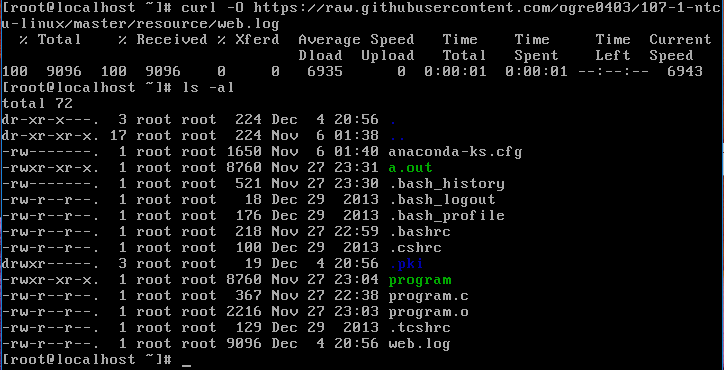
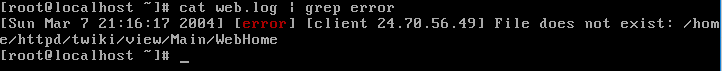

# ADT104137 - HW7

### 1.apache log是apache web server的日誌檔

* 請查詢 curl 或 wget 的用法後，用其中一個指令下載此日誌檔。

使用 curl -O 指令，後面加上網址
<pre><code># curl -O https://raw.githubusercontent.com/ogre0403/107-1-ntcu-linux/master/resource/web.log</code></pre>

* 使用bash的pipe指令，例如grep、cat...等等，將此日誌中error發生的原因輸出至螢幕，但其他資訊不需要呈現。

利用 cat 指令、配合 grep 指令，在web.log裡抓出含error的部分
<pre><code># cat web.log | grep error</code></pre>

### 2.tar是linux下用來打包壓縮目錄的工具，請自行查詢tar的用法後，用一般使用者身份打包並壓縮/var目錄。在tar執行過程中，忽略正常輸出結果，但需將錯誤訊息輸出至tar-err.log檔案。

切換為一般使用者，利用 "tar -jcv -f (檔案名稱).tar.bz2 (欲壓縮檔案)" 指令打包壓縮目錄，以 2> 指令將錯誤訊息傳輸到 tar-err.log
<pre><code># tar -jcv -f varnew.tar.bz2 /var 2> tar-err.log</code></pre>

使用 cat 指令查看檔案
<pre><code># cat tar-err.log</code></pre>

