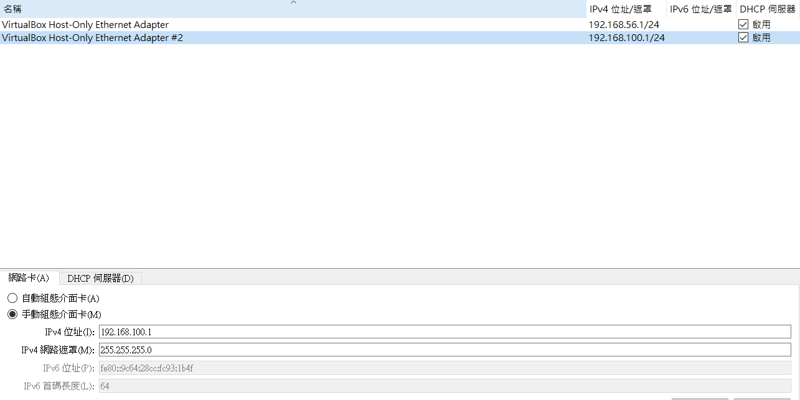
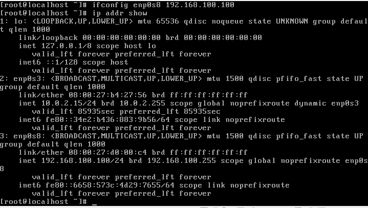
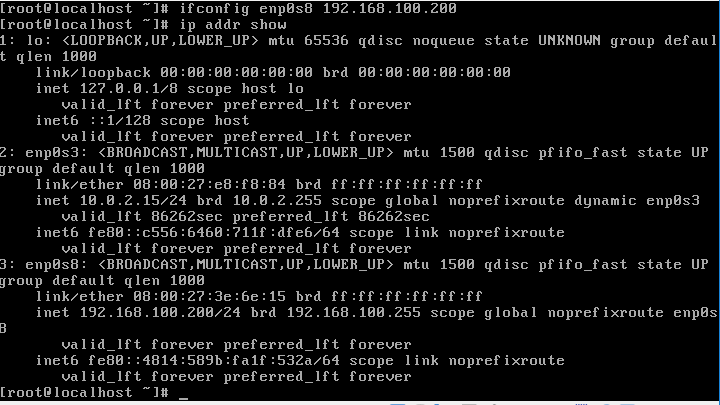
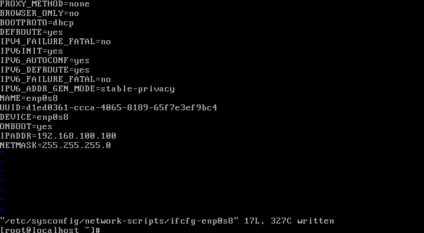
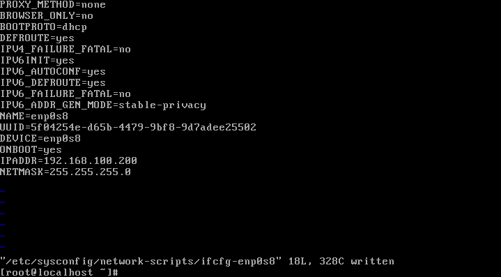

# ADT104137 - HW8

### 請依說明完成下列操作讓虛擬機器彼此間能夠透過網路相互溝通：
* 在VirtalBox內建立一個新的Host-only 網路卡，網段為192.168.100.1/24

選取全域工具 > 主機網路管理員 > 建立 > 將ip位置改為192.168.100.1 

* 建立虛擬機器-1，並啟用host-only網路卡，透過ifconfig 或 ip指令，設定虛擬機器-1的網路為192.168.100.100/24

<pre><code># ifconfig enp0s8 192.168.100.100</code></pre>
修改成功後確認
<pre><code># ip addr show</code></pre>

* 建立虛擬機器-2，並啟用host-only網路卡，透過ifconfig 或 ip指令，設定虛擬機器-2的網路為192.168.100.200/24

<pre><code># ifconfig enp0s8 192.168.100.200</code></pre>
修改成功後確認
<pre><code># ip addr show</code></pre>

* 將二台虛擬機器的網路設定存至/etc/sysconfig/network-scripts/下相對應的ifcfg-* 檔案，重新啟動虛擬機器，確認網路ip設定無誤。

找到相應的ifcig-檔案
<pre><code># ll /etc/sysconfig/network-scripts/ | grep ifcfg</code></pre>
在修改其文字檔
<pre><code># vi /etc/sysconfig/network-scripts/ifcfg-enp0s8</code></pre>
修改ONBOOT為yes，並加入 IPADDR=192.168.100.100 及 NETMASK=255.255.255.0 
 
修改ONBOOT為yes，加入 IPADDR=192.168.100.200 及 NETMASK=255.255.255.0 

* 從虛擬機器-1 ping 虛擬機器-2確認網路是連通，並從虛擬機器-2 ping 虛擬機器-1，確認網路也是連通。

<pre><code># ping 192.168.100.200</code></pre>

