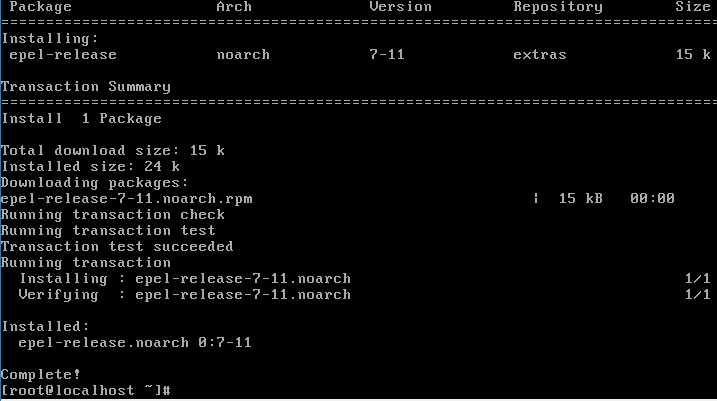
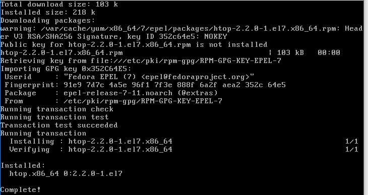
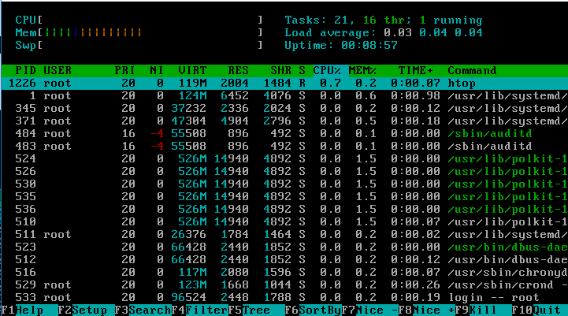

# ADT104137 - HW9

### 1. yum 是透過設定檔的規範去找到安裝/升級伺服器，預設的 CentOS 7 的設定檔的檔名為 /etc/yum.repos.d/CentOS-Base.repo。Red Hat 提供了 EPEL 的計畫，提供額外打包好的軟體，提供給用戶使用。但這些軟體並非官網提供， 因此其軟體庫並沒有在預設的設定檔內。
* 請閱讀 https://www.cyberciti.biz/faq/installing-rhel-epel-repo-on-centos-redhat-7-x/ 後，依照其作法，啟用epel repo�isitory，並安裝htop

首先先要安裝Epel擴充套件庫
<pre><code># yum install epel-release</code></pre>
 

安裝好Epel後，接著便可開始安裝htop
<pre><code># yum install htop</code></pre>
 

安裝完成後，輸入htop可檢查系統狀態
<pre><code># htop</code></pre>

