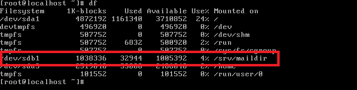
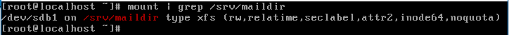
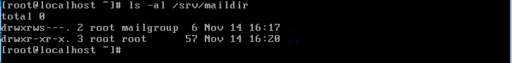
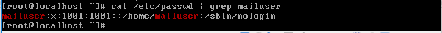

# ADT104137 - midterm
## 1.
* **設定 ver 變數，內容為『 my kernel version is 3.xx 』，其中 3.xx 為 uname -r 輸出的資訊，並顯示出ver變數的值。(10%)**

<pre><code># ver="my kernel version is $(uname -r)"
# echo $ver</code></pre>

* **請顯示目前PATH環境變數的值為何，並說明PATH的功用為何? (10%)**

<pre><code># echo $PATH</code></pre>

當在執行一個指令時，系統會根據PATH的設定去每個定義的目錄下搜尋指令的可執行檔，若在定義目錄中和有多個相符的可執行檔，則先被搜尋到的同名指令先被執行，也就是說有了PATH環境變數的協助，使用者才能在任何目錄下執行有定義過的指令。

## 2.
* **有一個檔案的屬性權限為 drwxrwsr-x 3 root mail 4096 2月 16 2017 mail/，請說明此檔案的特性。(10%)**

此檔案(mail)為目錄檔，並且擁有者(root)及所屬群組(mail)有全部(讀取、修改、執行)的權限，而非以上兩者的其餘用戶只有讀取及執行的權限。此外設有SGID，讓執行者在執行過程中能獲得該程式群組權限。檔案連結數為3，檔案容量有4GB，於2017/2/16最後修改此檔案。

* **假設有一個script.sh檔案的權限為-rw-r--r--，若希望讓所有人可以執行該檔案，請問該如何下達指令？請使用數字法與符號法各操作一次。(10%)**

數字法
<pre><code># chmod +1 script.sh</code></pre>
符號法
<pre><code># chmod +x script.sh</code></pre>

## 3.
* **說明實體連結與符號連結的差異。(10%)**

實體連結(hard link)設定連結檔時，磁碟空間及inode的數目都不會變，且若將連結相同inode的檔名之中任一刪除，其inode和block都還是存在的，可透過另一檔名讀取到正確的檔案資料。 

符號連結(symbolic link)則是再建立一個獨立的檔案，所以inode及磁碟空間會與連結檔不相同，且來源檔若是被刪除，使用此連結方式的檔案會開不了。

* **在家目錄下建立一個檔名為 hosts.real 的實體連結指到 /etc/hosts？ (請用相對路徑表示家目錄) (5%)**

<pre><code># ln /etc/hosts ~/hosts.real</code></pre>

* **在家目錄下建立一個檔名為 hosts.symbo 的符號連結指到 /etc/hosts？ (請用相對路徑表示家目錄 (5%)**

<pre><code># ln -s /etc/hosts ~/hosts.symbo</code></pre>

## 4.請依下述情境完成系統操作後再用相關指令進行驗證，請抓驗證指令的圖：

### 建立一個容量為1GB的xfs檔案系統，每次開機都能夠自動的掛載到 /srv/maildir，且該目錄是給 mailgroup 這個群組共用的，其他人不可具有任何權限。再建立一個名為mailuser的帳號，並加入 mailgroup 群組，且此帳號不可使用shell登入系統。

* **請用`df`指令配合`human-readable`選項，顯示有1GB的檔案系統正掛載到`/srv/maildir` (8%)**

* **請用`grep`驗證有設定開機自動掛載。(8%)**

* **請用`ls`查詢`/srv/maildir`屬性，確認可以讓`mailgroup`群組共用，而其他人不具任何權限。(8%)**

* **請用`id`檢查`mailuser`使用者有在`mailgroup`. (8%)**

* **請用`grep`驗證此帳號無法透過shell登入。(8%)**

