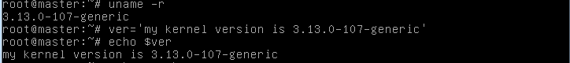
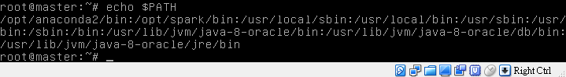
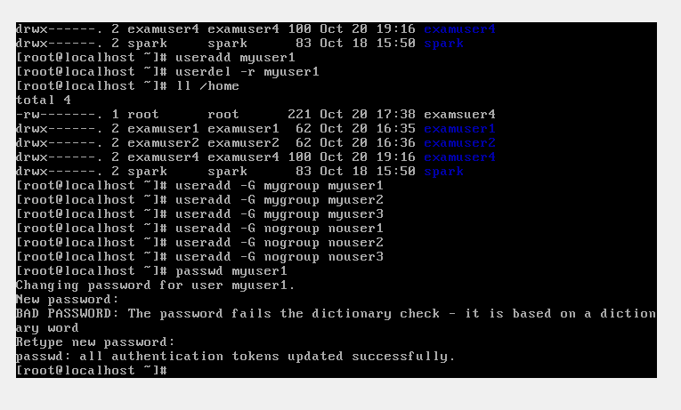
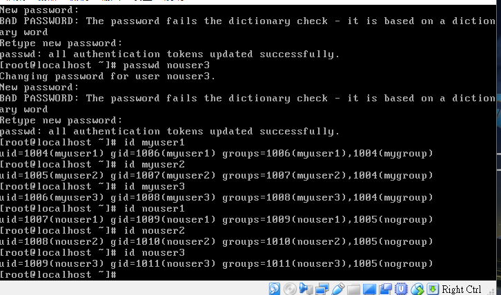

關於連結檔案的建置行為:

ll-i /etc/hosts可發現inode link數為1所以只有1個檔使用

建立實體連結

ln /etc/hosts /srv/hosts.hard的inode與/etc/hosts相同link數變為2所以有個檔使用

此為hard link(檔案屬性和原本檔案相同)所以inode block不變

建立符號連結

ln-s /etc/hosts /srv/hosts.soft的inode與前兩完全不同link數也只有1

然而以vi開啟可發現連接到/etc/hosts(儘管此inode為獨立的,不過最後都會到/etc/hosts)

因soft link、Symbolic Link所建立的檔案為一個獨立的新的檔案，會佔用掉inode 與 block

而這個獨立的檔案會指向目的檔案，當資料讀取時，會指向他 link 的那個檔案的檔名

