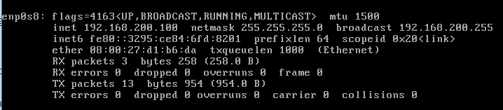

#1

apache log網址為https://raw.githubusercontent.com/ogre0403/107-1-ntcu-linux/master/resource/web.log

curl指令為 curl 網址  題目為需要找出error原因 所以加上 | grep error > out

curl https://raw.githubusercontent.com/ogre0403/107-1-ntcu-linux/master/resource/web.log | grep error > out

cat out

#2

tar 壓　縮：tar -jcv -f filename.tar.bz2 要被壓縮的檔案或目錄名稱

tar -jcv -f filename.tar.bz2 /var 2> tar-err.log

cat tar-err.log 查看錯誤訊息

