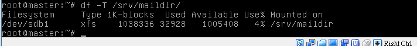
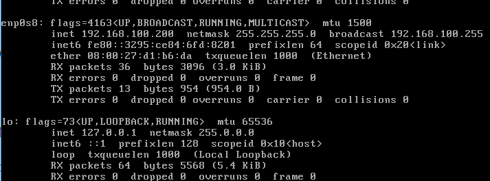
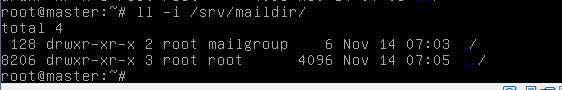
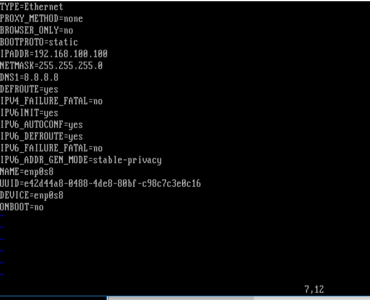

#1

vim ~/.bashrc   

i ->  HOSTS_PATH=/etc/hosts(不需加export)   ->  esc : wq

source ~/.bashrc

cat $HOSTS_PATH

#2

yum groupinstall "Development Tools"

vim test.c

gcc test.c
 
./a.out         讀不出來

echo $為1       返回值是0，就是執行成功,返回值是0以外的值，就是失敗

#3

vim ~/.bashrc

i -> export HOSTS_PATH (記得加export)->  esc :wq

source ~/.bashrc

gcc test.c

./a.out

echo $?為0代表成功了

