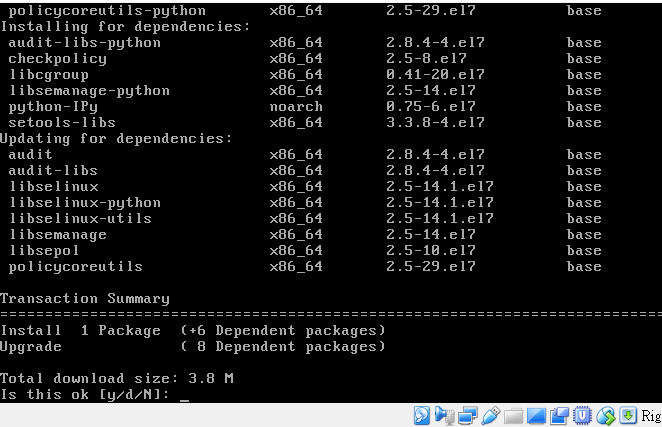

1.
uname -r

ver='   '

echo $ver

環境變數值

環境變數是背景環境的資訊,以存取變數中的資料

2.

(1)此檔案為rwxrwsr-x 使用者表示為可讀可寫可執行  而團體為可看可寫然而x改成的s,為sgid(當使用這個檔時,使用者變成擁有者) 
 
他人為可看可執行而沒有可寫代表只能閱讀此檔案沒有修改的權力  而此檔的擁有者為root 群體為mail 4096則為該檔案的容量
mail/為檔名

(2)數字法: chmod 777 script.sh   符號法:chmod u=rwx,g=rwx,o=rwx script.sh

3.

(1)實體連結(hard link):指令很簡單ln test exam  

使用完指令後兩個檔案的inode為相同 link,block數也相同
       
符號連結(soft link、symbolic link):指令為ln -s test exam 

使用完後發現兩檔案 link block inode都不改變 然而exam的檔名被改為 exam -> test

而兩連結大多人使用符號連結 因為實體連結限制較多ex:不能link在目錄上(可link但結果很奇怪)以及不能跨filesystem

(2)touch hosts.real 以及ln /etc/hosts ./hosts.real

(3)touch hosts.symbo 以及ln -s /etc/hosts ./hosts.symbo

4.先將sdb1、mailgroup、mailuser設定好

(1)df -T /srv/maildir

(2)

(3)

(4)

(5)
