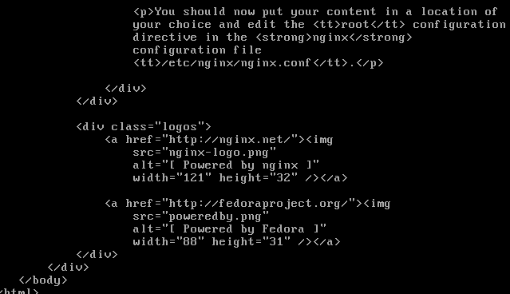

#1

在VirtalBox內建立一個新的Host-only 網路卡，網段為192.168.100.1/24

  

#2

建立虛擬機器-1，並啟用host-only網路卡，透過ifconfig 或 ip指令，設定虛擬機器-1的網路為192.168.100.100/24

  

#3

建立虛擬機器-2，並啟用host-only網路卡，透過ifconfig 或 ip指令，設定虛擬機器-1的網路為192.168.100.200/24

 

#4

將二台虛擬機器的網路設定存至/etc/sysconfig/network-scripts/下相對應的ifcfg-*檔案，重新啟動虛擬機器，確認網路ip設定無誤。

  

#5

從虛擬機器-1 ping 虛擬機器-2確認網路是連通，並從虛擬機器-2 ping 虛擬機器-1，確認網路也是連通。

  
