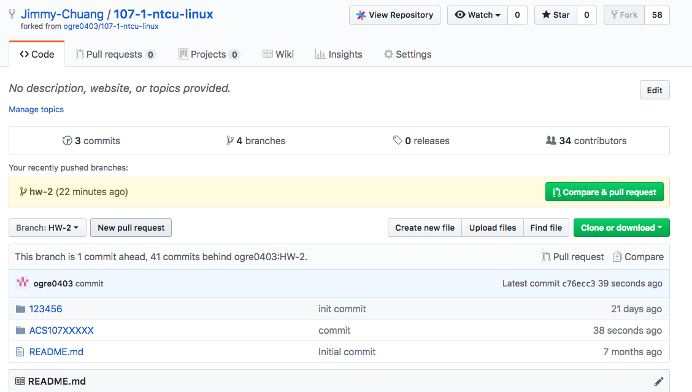
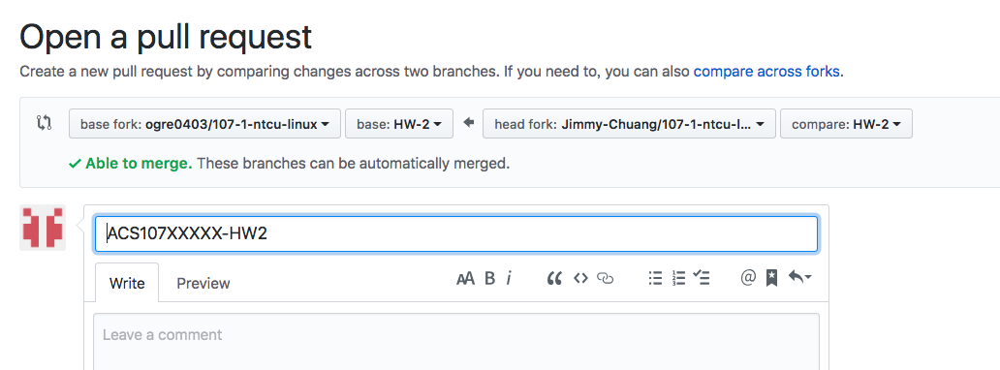
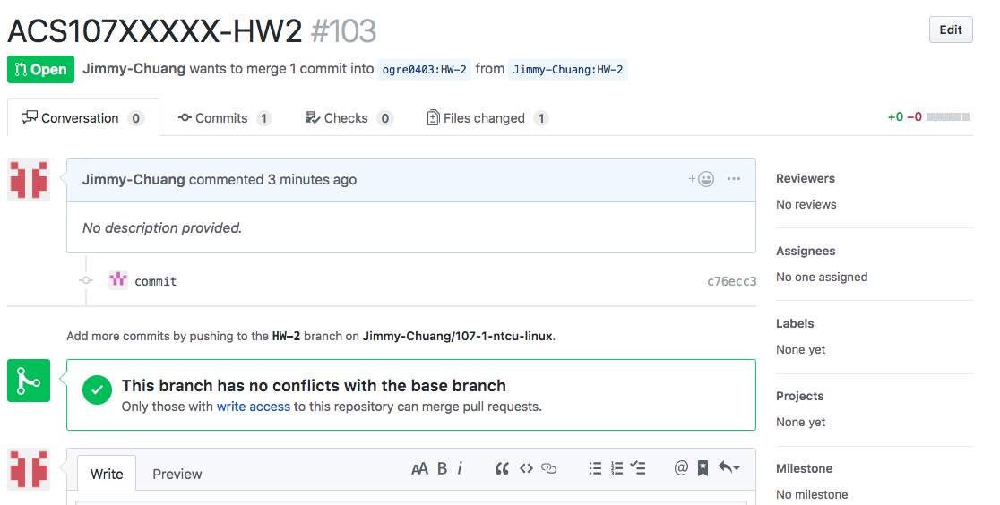
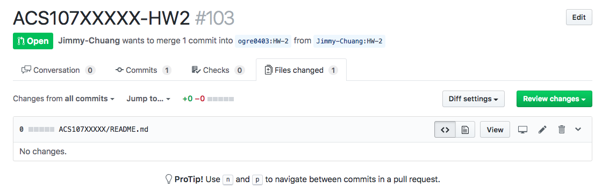

# 107(1) UNIX應用實務

*公告:* 

1. 請同學至[成績](https://github.com/ogre0403/107-1-ntcu-linux/tree/score)確認自己的期中成績，


## HW10: Deadline: 2019/1/8 23:59

*注意:* 請依[Git繳交作業流程](#Git繳交作業流程), 唯一不同處是作業2用HW-2的地方在作業10改用HW-10分支

1. 請仿照課堂上練習，透過systemd管理二個sshd服務，並讓第二個sshd服務的 port 放行於 2222。完成後可以使用指令 `netstat -alntp | grep ssh` 確認是否啟動二個sshd服務，範例如下：

```sh
$ netstat -alntp | grep ssh
tcp        0      0 0.0.0.0:22     0.0.0.0:*     LISTEN      1300/sshd
tcp        0      0 0.0.0.0:2222   0.0.0.0:*     LISTEN      15275/sshd
tcp6       0      0 :::22          :::*          LISTEN      1300/sshd
tcp6       0      0 :::2222        :::*          LISTEN      15275/sshd
```

    Note 1: CentOS有使用SELinux ，故預設只允許 SSH 使用埠號 22，若要使用埠號 2222，使請用下列指開啟並檢查

    ```sh
    $ semanage port -a -t ssh_port_t -p tcp 2222
    $ semanage port -l | grep ssh
    ssh_port_t tcp 2202, 22
    ```  

    Note 2: CentOS預設的防火牆firewalld會禁止訪問埠號2222，若要透過2222埠連ssh，請先關閉firewalld。

## HW9: Deadline: 2019/1/1 23:59

*注意:* 請依[Git繳交作業流程](#Git繳交作業流程), 唯一不同處是作業2用HW-2的地方在作業9改用HW-9分支

1. yum 是透過設定檔的規範去找到安裝/升級伺服器，預設的 CentOS 7 的設定檔的檔名為 /etc/yum.repos.d/CentOS-Base.repo。Red Hat 提供了 EPEL 的計畫，提供額外打包好的軟體，提供給用戶使用。但這些軟體並非官網提供， 因此其軟體庫並沒有在預設的設定檔內。

    * 請閱讀 https://www.cyberciti.biz/faq/installing-rhel-epel-repo-on-centos-redhat-7-x/ 後，依照其作法，啟用epel repoisitory，並安裝`htop`

## HW8: Deadline: 2018/12/18 23:59

*注意:* 請依[Git繳交作業流程](#Git繳交作業流程), 唯一不同處是作業2用HW-2的地方在作業7改用HW-8分支

1. 請依說明完成下列操作讓虛擬機器彼此間能夠透過網路相互溝通：

    * 在VirtalBox內建立一個新的Host-only 網路卡，網段為`192.168.100.1/24`

    * 建立虛擬機器-1，並啟用host-only網路卡，透過`ifconfig` 或 `ip`指令，設定虛擬機器-1的網路為`192.168.100.100/24`

    * 建立虛擬機器-2，並啟用host-only網路卡，透過`ifconfig` 或 `ip`指令，設定虛擬機器-2的網路為`192.168.100.200/24`

    * 將二台虛擬機器的網路設定存至`/etc/sysconfig/network-scripts/`下相對應的`ifcfg-*`檔案，重新啟動虛擬機器，確認網路ip設定無誤。

    * 從虛擬機器-1 ping 虛擬機器-2確認網路是連通，並從虛擬機器-2 ping 虛擬機器-1，確認網路也是連通。


## HW7: Deadline: 2018/12/4 23:59

*注意:* 請依[Git繳交作業流程](#Git繳交作業流程), 唯一不同處是作業2用HW-2的地方在作業7改用HW-7分支

1. [apache log](https://raw.githubusercontent.com/ogre0403/107-1-ntcu-linux/master/resource/web.log)是apache web server的日誌檔

    * 請查詢 `curl` 或 `wget` 的用法後，用其中一個指令下載此日誌檔。

    * 使用bash的pipe指令，例如`grep`、`cat`...等等，將此日誌中error發生的原因輸出至螢幕，但其他資訊不需要呈現。

2. `tar`是linux下用來打包壓縮目錄的工具，請自行查詢`tar`的用法後，用`一般使用者`身份打包並壓縮`/var`目錄。在`tar`執行過程中，忽略正常輸出結果，但需將錯誤訊息輸出至`tar-err.log`檔案。


## HW6: Deadline: 2018/11/27 23:59

*注意:* 請依[Git繳交作業流程](#Git繳交作業流程), 唯一不同處是作業2用HW-2的地方在作業6改用HW-6分支

*注意:* HW-6之後遲交以及線上繳交不合規定有錯，一率不接受補交。

1. 依下列描述完成並說明各項問題：

    * 請在家目錄下的`.bashrc`裡新增一個shell變數 `HOSTS_PATH=/etc/hosts`，(注意不需用export)，說明如何不登出讓`HOSTS_PATH`變數生效，執行`cat $HOST_PATH`確認有讀取到檔案內容。

    * 在C語言程式可以用`getenv()`讀取LINUX的環境變數，範例程式如下。請在Linux裡編譯此範例程式並執行，請問否有讀到`HOSTS_PATH`以及`$?`的值為何，請說明。也許需透過`yum groupinstall "Development Tools"`安裝gcc。

        ```c
        #include <stdio.h>
        #include <stdlib.h>
        int main()
        {
            const char* s = getenv("HOSTS_PATH");
            if(s == NULL){
                printf("getenv() return NULL\n");
                return 1;
            }
            
            printf("HOSTS_PATH :%s\n",(s!=NULL)? s : "getenv returned NULL");
            printf("\n %s content is: \n", s);

            int c;
            FILE *file;
            file = fopen(s, "r");
            if (file) {
                while ((c = getc(file)) != EOF)
                        putchar(c);
                fclose(file);
            }
        }
        ```

    * 在`.bashrc`裡要如何修正，讓C語言程式可以讀到環境變數並將檔案內容顯示。

## HW5: Deadline: 2018/11/6 23:59

*注意:* 請依[Git繳交作業流程](#Git繳交作業流程), 唯一不同處是作業2用HW-2的地方在作業5改用HW-5分支

*注意:* 以Markdown 格式 **詳細整理記錄說明** 每一個步驟，若太精簡成績以50分 記。


1. 關於連結檔案的建置行為: 
    
    * 在 /etc/hosts 檔案，請找出
        
        * 該檔案的 inode 號碼為幾號？
        
        * 這個 inode 共有幾個檔名在使用？
    
    * 建立實體連結，原始檔案為 /etc/hosts 而新的檔案檔名為 /srv/hosts.hard，請找出
        
        * /srv/hosts.hard的 inode 號碼為幾號？
        
        * 這個 inode 共有幾個檔名在使用？

        * 說明原因。

    * 建立符號連結，原始檔案為 /etc/hosts 而新的檔案檔名為 /srv/hosts.soft，請找出
    
        * /srv/hosts.soft的 inode 號碼為幾號？
        
        * 這個 inode 共有幾個檔名在使用

        * 說明原因


## HW4: Deadline: 2018/10/30 23:59 

*注意:* 請依[Git繳交作業流程](#Git繳交作業流程), 唯一不同處是作業2用HW-2的地方在作業4改用HW-4分支

*注意:* 題目已修改完成，都是10/24的進度內容。

*注意:* 以Markdown 格式 **詳細整理記錄說明** 每一個步驟，若太精簡成績以50分 記。

1. 管理群組共用資料的權限設計：

    * 建立群組名稱為： mygroup, nogroup

    * 建立帳號名稱為： myuser1, myuser2, myuser3 ，通通加入 mygroup，且密碼為 MyPassWord

    * 建立帳號名稱為： nouser1, nouser2, nouser3 ，通通加入 nogroup，且密碼為 MyPassWord

    * 建立一個名為 /srv/myproject 的目錄，這個目錄可以讓 mygroup 群組內的使用者完整使用，且【新建的檔案擁有群組】為 mygroup 。不過其他人不能有任何權限

    * 暫時切換成為 myuser1 的身分，並前往 /srv/myproject 目錄，嘗試建立一個名為 myuser1.data 的檔案，之後登出 myuser1。

    * 復制/usr/bin/ls至/usr/local/bin/myls後，完成下列操作

        * 雖然 nogroup 群組內的用戶對於 /srv/myproject 應該沒有任何權限，但當 nogroup 內的用戶執行 /usr/local/bin/myls 時，可以產生與 ls 相同的資訊，且暫時擁有 mygroup 群組的權限，因此可以查詢到 /srv/myproject 目錄內的檔名資訊。 也就是說，當你使用 nouser1 的身分執行【myls /srv/myproject】時，應該是能夠查閱到該目錄內的檔名資訊。


2. 使用程序觀察的指令，搭配 grep 的關鍵字查詢功能，將找到的 rsyslog 相關的程序的 PID, PRI, NI, COMMAND 等資訊轉存到 /root/process_syslog.txt 檔案中。(搭配`>`重導向輸出)

3. 使用 find 找出 /usr/bin 及 /usr/sbin 兩個目錄中，含有 SUID 的特殊檔案檔名，並使用 ls -l 去列出找到的檔案的相關權限後，將螢幕資料轉存到 /root/findsuidsgid.txt 檔案中。(自行查詢find指令用法，以及使透過重導向符號`>`輸出檔案)


## HW3: Deadline: 2018/10/23 23:59 

*注意:* 題目已修改完成，都是10/17的進度內容。

*注意:* 請依[Git繳交作業流程](#Git繳交作業流程), 唯一不同處是作業2用HW-2的地方在作業3改用HW-3分支

1. 請『依序』進行如下的帳號管理任務, 並以Markdown 格式 **詳細整理記錄說明** 每一個步驟，若太精簡成績以50分 記。

    * 建立三個用戶，帳號名稱分別為： examuser1, examuser2, examuser3 ，同時三個用戶的密碼都是『 ItIsExam 』。(請參考書上passwd --stdin的說明)

    * 請刪除系統中的 examuser3 這個帳號，同時將這個帳號的家目錄與郵件檔案同步刪除。

    * examuser1 不小心被管理員刪除了，但是這個帳號的家目錄與相關郵件都還存在。請參考這個帳號可能的家目錄所保留的 UID 與 GID， 並嘗試以該帳號原有的 UID/GID 資訊來重建該帳號。而這個帳號的密碼請給予 ItIsExam 的樣式。(相關建置帳號的指令，請參考 man useradd 等線上文件的說明)
    

2. 請進行如下的權限管理任務, 以Markdown 格式 **詳細整理記錄說明** 每一個步驟，若太精簡成績以50分 記。

    * 建立examuser4使用者帳號，密碼任意。

    * 使用 root 將 /etc/securetty 複製給 examuser4，且這個帳號要能夠完整使用該檔案才行，(即有所有的權限)。
    
    * 建立一個名為 /examdata/change.txt 的空檔案，這個檔案的擁有者為 sshd，擁有群組為 users，sshd 可讀可寫，users 群組成員可讀， 其他人沒權限。且這個檔案的修改日期請調整成 2012 年 12 月 21 日 (日期正確即可，時間隨便)


3. 請進行如下說明操作, 以Markdown 格式 **詳細整理記錄說明** 每一個步驟，若太精簡成績以50分 記。 

    * 請使用 root 的身份建立底下的檔案與權限：

    ```sh
    drwxrwxr-x  root root /dev/shm/unit05/
    drwxr-xr--  root root /dev/shm/unit05/dir1/
    -rw-r--r--  root root /dev/shm/unit05/dir1/file1 (複製來自 /etc/hosts)
    drwxr-x--x  root root /dev/shm/unit05/dir2/
    -rw-r--r--  root root /dev/shm/unit05/dir2/file2 (複製來自 /etc/hosts)
    drwxr-xr-x  root root /dev/shm/unit05/dir3/
    -rw-rw-rw-  root root /dev/shm/unit05/dir3/file3 (複製來自 /etc/hosts)
    drwxrwxrwx  root root /dev/shm/unit05/dir4/
    -rw-------  root root /dev/shm/unit05/dir4/file4 (複製來自 /etc/hosts)
    ```

    * 使用一般使用者 的身份進行各項工作：
    
    * 請使用 ls -l /dev/shm/unit05/dir[1-4] 依據輸出的結果說明為何會產生這些問題？
    
    * 請使用 ls -l /dev/shm/unit05/dir1/file1 ，依序將上述的檔名由 dir1/file1 ~ dir4/file4 執行，依據產生的結果說明為何會如此？
    
    * 請使用 vim /dev/shm/unit05/dir1/file1 ~ vim /dev/shm/unit05/dir4/file4，嘗試儲存 (或強制儲存)，說明為何可以/不可以儲存？


## HW2: 安裝Linux, Deadline: 2018/10/11 00:00 

請依下列要求練習安裝Linux，並詳細記錄說明安裝過程。
採用`Markdown`文件格式撰寫，檔名請命名為README.md，將檔案放於自己學號的目錄下，發PR至HW-2 branch。

1. 建立一個新的虛擬機器

2. distribution & image 任選

3. 至少建立二個分割區，分別掛載 / 與 /home

4. 登入後用 `df` 驗證是否有掛載二個分割區


## HW1: Deadline: 2018/10/3 00:00 
建立和自己學號相同的目錄，在目錄下用Markdown 寫自我介紹，並練習透過github發pull request (PR)


## **Git繳交作業流程**
目錄/檔案建立操作為使用command，若使用gui，請自行變通。

Step 1: clone 你 fork 後的git project，注意網址會與我的不同，請換成你的網址

```
$ git clone https://github.com/<YOUR-FORKED-REPO>/107-1-ntcu-linux.git
```

Step 2: checkout a76aa3121679a6d67e3456c0798a080c78b920d3 commit, 並查看目錄下內容，會有`123456`目錄與`README.md`檔案。

**注意**: 請不要刪除或修改`123456`目錄與`README.md`檔案。


```
$ cd 107-1-ntcu-linux
$ git checkout a76aa3121679a6d67e3456c0798a080c78b920d3 -b HW-2
$ ll -al
total 8
drwxr-xr-x  3 jimmy  wheel   102B Oct 10 11:21 123456
-rw-r--r--  1 jimmy  wheel    12B Oct 10 11:21 README.md
```


Step 3: 建立你自己的學號的目錄(如: `ACS107XXXXX`)，並在裡面建立`README.md`，目錄名稱每人都會不同，但目錄內的檔名一定要為`README.md`。
```
$ mkdir ACS107XXXXX
$ touch ACS107XXXXX/README.md

$ ls -al
total 8
drwxr-xr-x   6 jimmy  wheel  204 Oct 10 11:25 .
drwxrwxrwt   7 root   wheel  238 Oct 10 11:18 ..
drwxr-xr-x  12 jimmy  wheel  408 Oct 10 11:25 .git
drwxr-xr-x   3 jimmy  wheel  102 Oct 10 11:21 123456
drwxr-xr-x   3 jimmy  wheel  102 Oct 10 11:25 ACS107XXXXX
-rw-r--r--   1 jimmy  wheel   12 Oct 10 11:21 README.md

$ls -al ACS107XXXXX/
total 0
drwxr-xr-x  3 jimmy  wheel  102 Oct 10 11:25 .
drwxr-xr-x  6 jimmy  wheel  204 Oct 10 11:25 ..
-rw-r--r--  1 jimmy  wheel    0 Oct 10 11:25 README.md
```

Step 4: 將您的報告撰寫在你的目錄內的`README.md`，例如`ACS107XXXXX/READMD.md`，若有圖片或其他檔案，也一併放在你的目錄內(如: `ACS107XXXXX`)，不要放到別的地方

Step 5: 完成後，commit & push你的目錄到你的github repo。 *若你coomit包含你目錄以外的資料，表示你做錯，之後會被退回。*

```
$ git add ACS107XXXXX/
$ git commit -m "hw-2 commit"
$ git push --set-upstream origin HW-2
```

若你push後，有下列訊息，表示你太晚fork我的repo，
```
$ git push --set-upstream origin HW-2

Username for 'https://github.com': ogre0403.public@gmail.com
Password for 'https://ogre0403.public@gmail.com@github.com':
To https://github.com/Jimmy-Chuang/107-1-ntcu-linux.git
 ! [rejected]        HW-2 -> HW-2 (non-fast-forward)
error: failed to push some refs to 'https://github.com/Jimmy-Chuang/107-1-ntcu-linux.git'
hint: Updates were rejected because the tip of your current branch is behind
hint: its remote counterpart. Integrate the remote changes (e.g.
hint: 'git pull ...') before pushing again.
hint: See the 'Note about fast-forwards' in 'git push --help' for details.
```

解決方法為執行`git push origin :HW-2`，之後再執行`git push --set-upstream origin HW-2`。

```
$ git push origin :HW-2
...
To https://github.com/Jimmy-Chuang/107-1-ntcu-linux.git
 - [deleted]         HW-2
```

SETP 6: push後，請至github檢查是否只有把自己的目錄上傳，若有push其他的目錄，請重新操作，不然繳交時會被退回。

**注意**: 因為沒有刪除或修改`123456`目錄與`README.md`檔案，所以這二個存在是正確的。


STEP 7: 建立pr，注意從你的HW-2到我的HW-2，標題請註明你的`學號-HW-2`


STEP 8: PR建立後，請再三確認是否有動到別的目錄的檔案，正確結果只會上傳你目錄的資料，若有修改或上傳其他目錄/檔案，皆會被退回。



